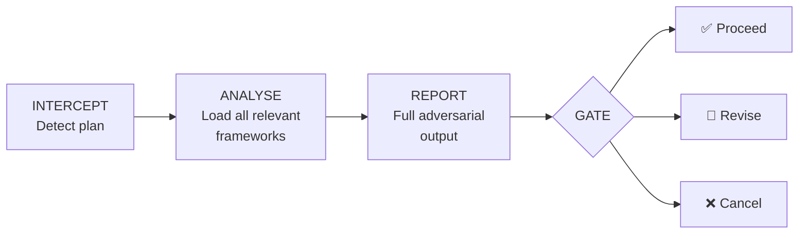
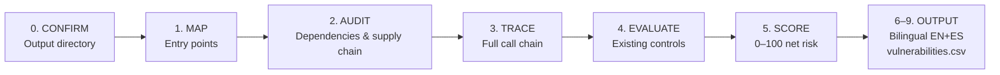
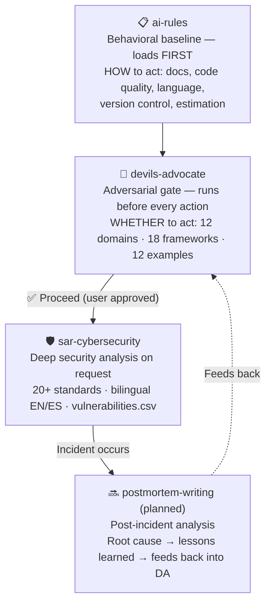

# 🛠️ carrilloapps/skills

> Agent skills for AI coding agents — adversarial analysis, security assessment, quality gates, and engineering best practices.
> Compatible with **GitHub Copilot, Claude Code, Cursor, Windsurf, Cline, Codex, Gemini CLI** and 40+ more.

[](LICENSE)
[](https://skills.sh/carrilloapps/skills)
[](scripts/validate.sh)
[](#available-skills)
[](https://github.com/carrilloapps/skills)
[](https://x.com/carrilloapps)

---

## Available Skills

| Skill | Description | Version | Install |
|-------|-------------|---------|---------|
| [🔴 **devils-advocate**](skills/devils-advocate/) | Mandatory adversarial risk gate — intercepts every plan before execution, blocks all actions until you explicitly approve | [](CHANGELOG.md) | `npx skills add carrilloapps/skills@devils-advocate` |
| [🛡️ **sar-cybersecurity**](skills/sar-cybersecurity/) | Automated Security Assessment Report (SAR) generator — deep cybersecurity analysis mapped to 20+ compliance standards | [](CHANGELOG.md) | `npx skills add carrilloapps/skills@sar-cybersecurity` |
| [📋 **ai-rules**](skills/ai-rules/) | Personal behavioral rules for AI tools — documentation discipline, secure practices, code quality, version control, and structured estimation | [](CHANGELOG.md) | `npx skills add carrilloapps/skills@ai-rules` |
| 🔜 **postmortem-writing** | Post-incident analysis — structured postmortem reports with root cause analysis, timeline reconstruction, and lessons learned | *Planned* | — |

---

## Quick Install

```bash
# Install all skills at once
npx skills add carrilloapps/skills

# Install a specific skill
npx skills add carrilloapps/skills@devils-advocate
npx skills add carrilloapps/skills@sar-cybersecurity
```

### Target a specific agent

```bash
npx skills add carrilloapps/skills@devils-advocate -a github-copilot
npx skills add carrilloapps/skills@sar-cybersecurity -a claude-code
npx skills add carrilloapps/skills@devils-advocate -a cursor
npx skills add carrilloapps/skills@sar-cybersecurity -a windsurf
```

### Global install (all your projects)

```bash
npx skills add carrilloapps/skills -g
```

### Keeping skills up to date

```bash
npx skills check     # Check for newer versions
npx skills update    # Update all installed skills
```

---

## Skill Details

### 🔴 [Devil's Advocate](skills/devils-advocate/) · [](skills/devils-advocate/README.md)

> The mandatory adversarial analysis gate for 40+ AI coding agents — runs first, before any action.

AI tools are increasingly capable of executing complex, multi-step operations — creating files, calling APIs, running migrations, deploying services. Devil's Advocate adds the adversarial voice that asks: **"Should we?"**

**How it works:**



**Protocol stack:**

| Protocol | Trigger | Effect |
|----------|---------|--------|
| ⚡ Immediate Report | First 🟠 High or 🔴 Critical finding | Flash alert + context request mid-sweep |
| 🛑 Handbrake | Any 🔴 Critical finding | Full stop + specialist escalation |
| 📄 Full Report | After context or `continue` | Structured adversarial analysis |
| 🚦 Gate | After full report | Waits for ✅ / 🔁 / ❌ |

**12 domains covered:**

| Domain | Framework |
|--------|-----------|
| Architecture | Distributed systems, coupling, CAP theorem, API design |
| Security | STRIDE threat model, supply chain, insider threats |
| Performance | Bottlenecks, scalability limits, anti-patterns |
| Developer / Code | Testing gaps, CI/CD risks, dependency management |
| Data & Analytics | Pipeline reliability, PII governance, ML bias |
| Product | Feature validation, launch risk, regulatory compliance |
| UX / Design | Dark patterns, WCAG accessibility, cognitive load |
| Strategy | Build vs. buy, vendor risk, Type 1/2 decisions |
| AI Optimization | Context window budget, instruction conflicts, hallucination risk |
| Version Control | Branch protection, secrets-in-repo, force push hazards |
| Vulnerability Patterns | DB, API, business logic, infrastructure & cloud patterns |
| General Analysis | 5-step analysis: attack surfaces, FMEA, edge cases |

**Includes:** 18 domain & protocol frameworks · 2 structured checklists · 12 real-world examples · Building Protocol for code quality enforcement

→ Full documentation: [`skills/devils-advocate/README.md`](skills/devils-advocate/README.md)

---

### 🛡️ [SAR Cybersecurity](skills/sar-cybersecurity/) · [](skills/sar-cybersecurity/README.md)

> Automated Security Assessment Report (SAR) generator — deep cybersecurity analysis mapped to 20+ compliance standards.

Transforms any AI agent into a senior cybersecurity expert that produces professional, bilingual (EN/ES) Security Assessment Reports with full compliance standard mapping.

**How it works:**



**Assessment coverage:**

| Category | What is analyzed |
|----------|-----------------|
| Injection Patterns | SQL, NoSQL operator, Regex/ReDoS, Mass Assignment, GraphQL abuse, ORM/ODM-specific |
| Storage & Exfiltration | S3/GCS/Azure Blob, secrets in source, file uploads, logging, message queues, CDN, IaC |
| Database Access | SQL (PostgreSQL, MySQL), NoSQL (MongoDB, DynamoDB), Redis — index verification, bounded queries |
| Compliance Mapping | 20+ standards: ISO 27001, NIST, OWASP, PCI-DSS, GDPR, MITRE ATT&CK, and more |

**Key features:**
- Scores based on **net effective risk** (after controls), not isolated code
- Progressive context loading — modular architecture prevents context window saturation
- Read-only operation — writes only to the user-configured output directory (default: `docs/security/`), never modifies source code
- 8 canonical edge cases with reference outputs for consistent scoring behavior

**Includes:** 6 protocol & domain frameworks · 8 canonical edge case examples · Progressive context loading with all relevant frameworks per assessment

→ Full documentation: [`skills/sar-cybersecurity/README.md`](skills/sar-cybersecurity/README.md)

---

### 📋 [AI Rules](skills/ai-rules/) · [](skills/ai-rules/README.md)

> Personal behavioral rules for AI tools — documentation discipline, secure practices, code quality, and structured estimation across any project.

Defines the baseline behavioral contract that all AI agents must follow. Works as a cross-cutting layer beneath Devil's Advocate.

**Core rules:**

| Area | What it enforces |
|---|---|
| Security | No reading secrets, no dangerous commands, no unanalyzed DB queries |
| Documentation storage | All memory and docs go into `docs/` — shared across Claude Code, Copilot, Gemini, OpenCode, and others |
| Documentation format | Native Markdown, no emoji, cross-references over duplication, professional diagramming tools |
| Code quality | SOLID · KISS · DRY, mandatory `docs/elementals.md` to prevent duplicate components |
| Version control | Conventional Commits, focused commits, living `AGENTS.md` |
| Estimation | Confidence % · effort by capacity mode · pivot potential · risk factors |

→ Full documentation: [`skills/ai-rules/README.md`](skills/ai-rules/README.md)

---

## How Skills Work Together



**Layer roles:**

| Skill | Role | When |
|-------|------|------|
| `ai-rules` | Behavioral baseline | Session start, always first |
| `devils-advocate` | Execution gate | Before every action |
| `sar-cybersecurity` | Deep security analysis | On security assessment request |
| `postmortem-writing` | Incident learning loop | After incidents (planned) |

Use ai-rules as the behavioral foundation for every session, Devil's Advocate as the adversarial gate for every decision, SAR Cybersecurity for deep security assessments, and (when available) Postmortem Writing after incidents to close the feedback loop.

---

## Compatible Agents

Works with every agent supported by the [skills.sh](https://skills.sh) ecosystem:

| Agent | `--agent` flag | Agent | `--agent` flag |
|-------|---------------|-------|---------------|
| GitHub Copilot | `github-copilot` | Goose | `goose` |
| Claude Code | `claude-code` | Continue | `continue` |
| Cursor | `cursor` | Amp / Kimi CLI | `amp` |
| Windsurf | `windsurf` | Antigravity | `antigravity` |
| Cline | `cline` | Augment | `augment` |
| OpenAI Codex | `codex` | Droid | `droid` |
| Gemini CLI | `gemini-cli` | Kilo Code | `kilo` |
| OpenCode | `opencode` | Kiro CLI | `kiro-cli` |
| Roo Code | `roo` | OpenHands | `openhands` |
| Trae / Trae CN | `trae` | Zencoder | `zencoder` |

> Over **40 agents** supported. Run `npx skills add --list` for the full list.

---

## Repository Structure

```
carrilloapps/skills/
├── AGENTS.md                         ← AI agent entry point (loads DA gate)
├── CHANGELOG.md                      ← version history
├── LICENSE                           ← MIT
├── README.md                         ← this file
├── scripts/
│   └── validate.sh                   ← CI quality gate (49 checks)
└── skills/
    ├── devils-advocate/              ← npx skills add carrilloapps/skills@devils-advocate
    │   ├── SKILL.md                  ← always loaded by agents
    │   ├── README.md                 ← full documentation
    │   ├── metadata.json             ← skill metadata
    │   ├── frameworks/               ← 18 domain & protocol frameworks
    │   ├── checklists/               ← 2 structured risk checklists
    │   └── examples/                 ← 12 real-world analysis examples
    ├── sar-cybersecurity/            ← npx skills add carrilloapps/skills@sar-cybersecurity
    │   ├── SKILL.md                  ← always loaded (~115 lines, progressive loading)
    │   ├── README.md                 ← full documentation
    │   ├── metadata.json             ← skill metadata
    │   ├── frameworks/               ← 6 protocol & domain frameworks (on-demand)
    │   └── examples/                 ← 8 canonical edge case examples
    └── ai-rules/                     ← npx skills add carrilloapps/skills@ai-rules
        ├── SKILL.md                  ← always loaded by agents
        ├── README.md                 ← documentation
        └── metadata.json             ← skill metadata
```

Each skill is self-contained and independently installable via `@<skill-name>`.

---

## Quality Gate

Every change is validated against **49 automated checks** before merging:

```bash
bash scripts/validate.sh
```

Checks include: version consistency, fence balance, index completeness, stale text detection, framework file resolution, example Gate blocks, token budget compliance, and more.

---

## Contributing

Contributions are welcome! See [CONTRIBUTING.md](.github/CONTRIBUTING.md) for:

- How to add new skills, frameworks, or examples
- Quality standards and PR process
- Version cascade checklist

Please read [CODE_OF_CONDUCT.md](.github/CODE_OF_CONDUCT.md) before contributing.

Security issues → [SECURITY.md](.github/SECURITY.md). Do not open a public issue for security concerns.

---

## License

[MIT](LICENSE) — free to use, modify, and distribute. Attribution appreciated.

---

## Changelog

See [CHANGELOG.md](CHANGELOG.md) for the full version history.

---

## Author

**José Carrillo** — [carrillo.app](https://carrillo.app)

[](https://carrillo.app)
[](https://github.com/carrilloapps)
[](https://x.com/carrilloapps)
[](https://linkedin.com/in/carrilloapps)
[](mailto:m@carrillo.app)
