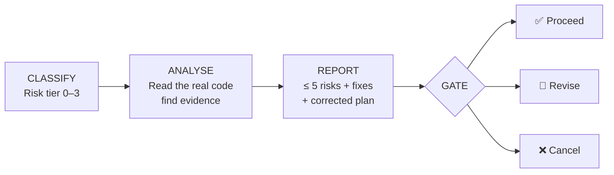
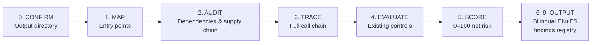
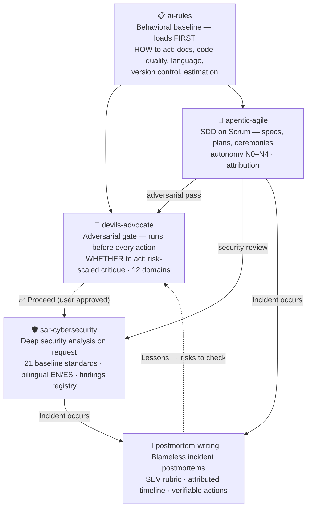

# 🛠️ carrilloapps/skills

> Agent skills for AI coding agents — adversarial analysis, spec-driven delivery, security assessment, incident postmortems, and engineering best practices.
> Compatible with **Claude Code, Antigravity (`agy`), Grok Build, GitHub Copilot, Cursor, Codex, Gemini CLI, Windsurf / Devin Desktop, Cline, Kiro, OpenCode** and 70+ agents in total.

[](LICENSE)
[](https://skills.sh/carrilloapps/skills)
[](.github/workflows/validate.yml)
[](#available-skills)
[](https://github.com/carrilloapps/skills)
[](https://x.com/carrilloapps)

---

## Available Skills

| Skill | Description | Version | Install |
|-------|-------------|---------|---------|
| [🔴 **devils-advocate**](skills/devils-advocate/) | Adversarial pre-execution gate — risk-scaled, evidence-based critique that returns a corrected plan and waits for your approval | [](CHANGELOG.md) | `npx skills add carrilloapps/skills@devils-advocate` |
| [🛡️ **sar-cybersecurity**](skills/sar-cybersecurity/) | Automated Security Assessment Report (SAR) generator — deep cybersecurity analysis mapped to 21 baseline compliance standards | [](CHANGELOG.md) | `npx skills add carrilloapps/skills@sar-cybersecurity` |
| [📋 **ai-rules**](skills/ai-rules/) | Personal behavioral rules for AI tools — documentation discipline, secure practices, code quality, version control, and structured estimation | [](CHANGELOG.md) | `npx skills add carrilloapps/skills@ai-rules` |
| [🔁 **agentic-agile**](skills/agentic-agile/) | Spec-driven development on Scrum with agentic agility — gated specs and plans, ceremonies, autonomy levels, attribution, transcripts and MCP integrations by capability | [](CHANGELOG.md) | `npx skills add carrilloapps/skills@agentic-agile` |
| [📓 **postmortem-writing**](skills/postmortem-writing/) | Blameless incident postmortems — deterministic SEV1–SEV4 rubric, attributed timeline, contributing factors, verifiable actions, and lessons that feed devils-advocate | [](CHANGELOG.md) | `npx skills add carrilloapps/skills@postmortem-writing` |

---

## Quick Install

```bash
npx skills add carrilloapps/skills                      # all 5 skills, every agent detected here
npx skills add carrilloapps/skills@agentic-agile        # one skill
npx skills add carrilloapps/skills -s devils-advocate -s ai-rules   # pick several
npx skills add carrilloapps/skills -a claude-code -a grok           # pick agents (repeatable)
npx skills add carrilloapps/skills -a '*'               # every supported agent
npx skills add carrilloapps/skills -g                   # global: all your projects
npx skills add carrilloapps/skills -a '*' -y            # non-interactive (CI)
```

Update with `npx skills check` and `npx skills update`; remove with `npx skills remove <skill> [-g] [-a <id>]`.

---

## Install per Tool

Pick your tool below for the exact command, where the files land, and which instruction file the agent always reads. Paths come from the [`skills` CLI supported-agents table](https://github.com/vercel-labs/skills) (CLI 1.7.0, checked 2026-10-06); a first-hand install was verified for Claude Code, Antigravity and Codex. ⚠️ marks a path not re-verified in the vendor's own docs.

Two things apply to every agent:

1. The CLI writes one canonical copy and symlinks the agents that use their own folder, so several agents share a single up-to-date copy. `--copy` writes real copies instead.
2. Nothing is installed on your `PATH` and nothing runs on its own: the agent reads `SKILL.md`, and any script is proposed to you with the exact command before it runs.

### Terminal and CLI agents

<details>
<summary><b>Claude Code</b> — <code>-a claude-code</code></summary>

```bash
npx skills add carrilloapps/skills -a claude-code        # this project
npx skills add carrilloapps/skills -a claude-code -g     # every project
```

| | |
|---|---|
| Project path | `.claude/skills/<skill>` → symlink to `.agents/skills/<skill>` (observed with CLI 1.7.0) |
| Global path | `~/.claude/skills/` |
| Always-on file | `CLAUDE.md` (may import `@AGENTS.md`) |
| Optional guard | [`integrations/claude-code/`](integrations/claude-code/) — a plugin that blocks side-effecting tool calls until you approve |

Install the guard from the marketplace:

```text
/plugin marketplace add carrilloapps/skills
/plugin install devils-advocate-guard@carrilloapps-skills
```

</details>

<details>
<summary><b>Antigravity CLI</b> (<code>agy</code>) — <code>-a antigravity-cli</code></summary>

```bash
npx skills add carrilloapps/skills -a antigravity-cli
npx skills add carrilloapps/skills -a antigravity-cli -g
```

| | |
|---|---|
| Project path | `.agents/skills/` |
| Global path | `~/.gemini/antigravity-cli/skills/` |
| Always-on file | `GEMINI.md`, `AGENTS.md`, `.agents/rules/*.md` ⚠️ |
| Optional guard | [`integrations/antigravity/`](integrations/antigravity/) — experimental |

The binary is `agy` ⚠️ (third-party source); install it from [antigravity.google](https://antigravity.google/docs/cli/features/). Antigravity has **two** ids: use `antigravity-cli` for the CLI and `antigravity` for the IDE — installing both is fine, they share `.agents/skills/`.

</details>

<details>
<summary><b>OpenAI Codex CLI</b> — <code>-a codex</code></summary>

```bash
npx skills add carrilloapps/skills -a codex
npx skills add carrilloapps/skills -a codex -g
```

| | |
|---|---|
| Project path | `.agents/skills/` (found from the cwd, its parents, and the repo root) |
| Global path | `~/.codex/skills/` |
| Always-on file | `AGENTS.md` |
| Optional guard | [`integrations/codex/`](integrations/codex/) |

</details>

<details>
<summary><b>Gemini CLI</b> — <code>-a gemini-cli</code></summary>

```bash
npx skills add carrilloapps/skills -a gemini-cli
npx skills add carrilloapps/skills -a gemini-cli -g
```

| | |
|---|---|
| Project path | `.agents/skills/` (takes precedence over `.gemini/skills/`) |
| Global path | `~/.gemini/skills/` |
| Always-on file | `GEMINI.md` ⚠️ (`context.fileName` can add `AGENTS.md`) |
| Optional guard | [`integrations/gemini-cli/`](integrations/gemini-cli/) |

</details>

<details>
<summary><b>Grok Build</b> — <code>-a grok</code></summary>

```bash
npx skills add carrilloapps/skills -a grok
npx skills add carrilloapps/skills -a grok -g
```

| | |
|---|---|
| Project path | `.grok/skills/` |
| Global path | `~/.grok/skills/` |
| Always-on file | ⚠️ not documented in the CLI table — check your Grok Build docs |
| Optional guard | — |

</details>

<details>
<summary><b>Cline</b> — <code>-a cline</code></summary>

```bash
npx skills add carrilloapps/skills -a cline
npx skills add carrilloapps/skills -a cline -g
```

| | |
|---|---|
| Project path | `.agents/skills/` (the CLI); Cline's own docs mention `.clinerules/skills/` ⚠️ |
| Global path | `~/.agents/skills/` |
| Always-on file | `.clinerules/` |
| Optional guard | [`integrations/cline/`](integrations/cline/) — installs under `.clinerules/hooks/` |

</details>

<details>
<summary><b>OpenCode</b> — <code>-a opencode</code></summary>

```bash
npx skills add carrilloapps/skills -a opencode
npx skills add carrilloapps/skills -a opencode -g
```

| | |
|---|---|
| Project path | `.agents/skills/` |
| Global path | `~/.config/opencode/skills/` |
| Always-on file | `AGENTS.md` ⚠️ |
| Optional guard | [`integrations/opencode/`](integrations/opencode/) — a plugin; the only guard that does not need Node on `PATH` |

</details>

<details>
<summary><b>Kiro</b> (IDE and CLI) — <code>-a kiro-cli</code></summary>

```bash
npx skills add carrilloapps/skills -a kiro-cli
npx skills add carrilloapps/skills -a kiro-cli -g
```

| | |
|---|---|
| Project path | `.kiro/skills/` |
| Global path | `~/.kiro/skills/` |
| Always-on file | `.kiro/steering/*.md` |
| Optional guard | [`integrations/kiro/`](integrations/kiro/) — experimental |

The default agent loads `.kiro/skills/` on its own. Only a **custom** agent needs the skills added to `resources` in `.kiro/agents/<agent>.json`:

```json
{ "resources": ["skill://.kiro/skills/**/SKILL.md"] }
```

</details>

<details>
<summary><b>Amp · Replit · Universal</b> — <code>-a amp</code> · <code>-a replit</code> · <code>-a universal</code></summary>

```bash
npx skills add carrilloapps/skills -a amp
npx skills add carrilloapps/skills -a replit -g
```

| | |
|---|---|
| Project path | `.agents/skills/` |
| Global path | `~/.config/agents/skills/` |
| Always-on file | `AGENTS.md` ⚠️ |
| Optional guard | — |

These three ids share the same universal layout, so one install serves any tool that reads `.agents/skills/`.

</details>

### IDE and editor agents

<details>
<summary><b>Antigravity IDE</b> — <code>-a antigravity</code></summary>

```bash
npx skills add carrilloapps/skills -a antigravity
npx skills add carrilloapps/skills -a antigravity -g
```

| | |
|---|---|
| Project path | `.agents/skills/` |
| Global path | `~/.gemini/antigravity/skills/` ⚠️ (see note) |
| Always-on file | `GEMINI.md`, `AGENTS.md`, `.agents/rules/*.md` ⚠️ |
| Optional guard | — (IDE hook support unverified; the CLI adapter is [`integrations/antigravity/`](integrations/antigravity/)) |

If a global install is not picked up, also copy the skill folder to `~/.gemini/skills/`: a Google Developer Expert reports that path works when the documented one does not ⚠️ ([source](https://dev.to/gde/configuring-mcp-servers-and-skills-for-antigravity-cli-and-ide-2bh0)). Project installs are unaffected.

</details>

<details>
<summary><b>Cursor</b> — <code>-a cursor</code></summary>

```bash
npx skills add carrilloapps/skills -a cursor
npx skills add carrilloapps/skills -a cursor -g
```

| | |
|---|---|
| Project path | `.agents/skills/` (also reads `.cursor/skills/`) |
| Global path | `~/.cursor/skills/` |
| Always-on file | `.cursor/rules/*.mdc` with `alwaysApply: true`, `AGENTS.md` |
| Optional guard | [`integrations/cursor/`](integrations/cursor/) |

The skill folder name must equal the skill name — Cursor requires it.

</details>

<details>
<summary><b>GitHub Copilot</b> (VS Code, CLI, cloud agent) — <code>-a github-copilot</code></summary>

```bash
npx skills add carrilloapps/skills -a github-copilot
npx skills add carrilloapps/skills -a github-copilot -g
```

| | |
|---|---|
| Project path | `.agents/skills/` (also reads `.github/skills/`, `.claude/skills/`) |
| Global path | `~/.copilot/skills/` |
| Always-on file | `.github/copilot-instructions.md`, `.github/instructions/*.instructions.md`, `AGENTS.md` |
| Optional guard | [`integrations/copilot/`](integrations/copilot/) — one config covers the CLI and VS Code |

</details>

<details>
<summary><b>Windsurf / Devin Desktop</b> — <code>-a windsurf</code> · <code>-a devin</code></summary>

```bash
npx skills add carrilloapps/skills -a windsurf
npx skills add carrilloapps/skills -a devin -g
```

| | |
|---|---|
| Project path | `.devin/skills/` (preferred) · `.windsurf/skills/` (legacy, still read; where the CLI installs) · `.agents/skills/` |
| Global path | `~/.codeium/windsurf/skills/` · `~/.config/devin/skills/` |
| Always-on file | rules files, `AGENTS.md` |
| Optional guard | [`integrations/windsurf/`](integrations/windsurf/) |

Windsurf is now **Devin Desktop**. `-a devin` targets Devin for Terminal (`.devin/skills/`).

</details>

<details>
<summary><b>Roo Code</b> — <code>-a roo</code></summary>

```bash
npx skills add carrilloapps/skills -a roo
npx skills add carrilloapps/skills -a roo -g
```

| | |
|---|---|
| Project path | `.roo/skills/` |
| Global path | `~/.roo/skills/` |
| Always-on file | `.roo/rules/`, `~/.roo/rules/` |
| Optional guard | [`integrations/roo/`](integrations/roo/) — advisory rule only; no blocking hook was found |

</details>

<details>
<summary><b>Zed · Warp · Kimi Code CLI · Dexto · Loaf · Pi · Sarvam Code</b> — one id each, shared layout</summary>

```bash
npx skills add carrilloapps/skills -a zed        # or: warp · kimi-code-cli · dexto · loaf · pi · sarvam-code
npx skills add carrilloapps/skills -a warp -g
```

| | |
|---|---|
| Project path | `.agents/skills/` |
| Global path | `~/.agents/skills/` |
| Always-on file | `AGENTS.md` ⚠️ |
| Optional guard | — |

</details>

### Every other supported agent

<details>
<summary>Full list of <code>-a</code> ids (70+ agents)</summary>

The command is always the same — swap the id:

```bash
npx skills add carrilloapps/skills -a <id>
```

`adal` · `aider-desk` · `astrbot` · `augment` · `autohand-code` · `bob` · `codearts-agent` · `codebuddy` ·
`codemaker` · `codestudio` · `command-code` · `continue` · `cortex` · `crush` · `deepagents` · `droid` ·
`eve` · `firebender` · `forgecode` · `fx` · `goose` · `hermes-agent` · `iflow-cli` · `inference-sh` ·
`jazz` · `junie` · `kilo` · `kimchi` · `kode` · `lingma` · `mcpjam` · `minimax-code` · `mistral-vibe` ·
`moxby` · `mux` · `neovate` · `ona` · `openclaw` · `openhands` · `pochi` · `posit-assistant` ·
`promptscript` · `qoder` · `qoder-cn` · `qwen-code` · `reasonix` · `rovodev` · `tabnine-cli` ·
`terramind` · `tinycloud` · `trae` · `trae-cn` · `zcode` · `zencoder` · `zenflow`

Install paths for these come from the [`skills` CLI supported-agents table](https://github.com/vercel-labs/skills) ⚠️ — they are not re-verified here. `npx skills add --list` lists the **skills** in a repository, not the agents.

</details>

<details>
<summary>My tool is not listed — manual install</summary>

Any agent that reads a skills folder works without the CLI. Clone the repository and copy (or symlink) the skill folder, **keeping the folder name equal to the skill name**:

```bash
git clone https://github.com/carrilloapps/skills.git skills-src
cp -r skills-src/skills/agentic-agile .agents/skills/          # Linux · macOS · Git Bash · WSL
```

```powershell
git clone https://github.com/carrilloapps/skills.git skills-src
Copy-Item -Recurse skills-src\skills\agentic-agile .agents\skills\   # Windows PowerShell
```

If your agent has no skills folder at all, point its always-on instruction file at the skill:

```markdown
Before acting, follow `.agents/skills/devils-advocate/SKILL.md`.
```

Equivalent CLI command, when the agent is supported: `npx skills add carrilloapps/skills@<skill> -a <id> --copy`.

</details>

**Deeper reference** — per-agent matrix with every path and caveat, the `.memory/` convention, and guard installation: [`docs/INSTALL.md`](docs/INSTALL.md).

---

## Skill Details

<details>
<summary><b>🔴 Devil's Advocate</b> — An adversarial pre-execution gate for 70+ AI coding agents — short, evidence-based critiques that change the plan</summary>

**Install** `npx skills add carrilloapps/skills@devils-advocate` · [Skill folder](skills/devils-advocate/) · [Full documentation](skills/devils-advocate/README.md) · [](skills/devils-advocate/README.md)

AI tools are increasingly capable of executing complex, multi-step operations — creating files, calling APIs, running migrations, deploying services. Devil's Advocate adds the adversarial voice that asks: **"Should we?"**

**How it works:**


```mermaid
flowchart LR
    A[CLASSIFY\nRisk tier 0–3] --> B[ANALYSE\nRead the real code\nfind evidence]
    B --> C[REPORT\n≤ 5 risks + fixes\n+ corrected plan]
    C --> D{GATE}
    D --> E["✅ Proceed"]
    D --> F["🔁 Revise"]
    D --> G["❌ Cancel"]
```

**Depth scales with risk:**

| Tier | When | Output |
|------|------|--------|
| 0 — Pass | Read-only or trivial reversible edits | Nothing, or one line |
| 1 — Quick check | Contained, reversible changes | 3–8 lines + one-line gate |
| 2 — Full critique | Production, data, auth, PII, git history, architecture/vendor decisions | ≤ 5 evidence-backed risks, better option, corrected plan, gate |
| 3 — Critical stop | 🔴 Critical risk that depends on facts only you have | 2–4 targeted questions, then the report |

**12 domain frameworks** (+ 6 protocol and optional files — output format, critical stop, pre-mortem, building protocol, capabilities, Docker lab — = 18):

| Domain | Framework |
|--------|-----------|
| Architecture | Distributed systems, coupling, CAP theorem, API design |
| Security | STRIDE threat model, supply chain, insider threats |
| Performance | Bottlenecks, scalability limits, anti-patterns |
| Developer / Code | Testing gaps, CI/CD risks, dependency management |
| Data & Analytics | Pipeline reliability, PII governance, ML bias |
| Product | Feature validation, launch risk, regulatory compliance |
| UX / Design | Dark patterns, WCAG accessibility, cognitive load |
| Strategy | Build vs. buy, vendor risk, Type 1/2 decisions |
| AI Optimization | Context window budget, instruction conflicts, hallucination risk |
| Version Control | Branch protection, secrets-in-repo, force push hazards |
| Vulnerability Patterns | DB, API, business logic, infrastructure & cloud patterns |
| General Analysis | 5-step analysis: attack surfaces, FMEA, edge cases |

**Includes:** 18 frameworks (domain, protocol, optional capabilities, Docker lab) · 2 internal checklists · 4 reference examples (one per tier) · Building Protocol for code · vendored `lab-probe` script

→ Full documentation: [`skills/devils-advocate/README.md`](skills/devils-advocate/README.md)

</details>

---

<details>
<summary><b>🛡️ SAR Cybersecurity</b> — Automated Security Assessment Report (SAR) generator — deep cybersecurity analysis mapped to 21 baseline compliance standards</summary>

**Install** `npx skills add carrilloapps/skills@sar-cybersecurity` · [Skill folder](skills/sar-cybersecurity/) · [Full documentation](skills/sar-cybersecurity/README.md) · [](skills/sar-cybersecurity/README.md)

Transforms any AI agent into a senior cybersecurity expert that produces professional, bilingual (EN/ES) Security Assessment Reports with full compliance standard mapping.

**How it works:**


```mermaid
flowchart LR
    A["0. CONFIRM\nOutput directory"] --> B
    B["1. MAP\nEntry points"] --> C["2. AUDIT\nDependencies & supply chain"]
    C --> D["3. TRACE\nFull call chain"]
    D --> E["4. EVALUATE\nExisting controls"]
    E --> F["5. SCORE\n0–100 net risk"]
    F --> G["6–9. OUTPUT\nBilingual EN+ES\nfindings registry"]
```

**Assessment coverage:**

| Category | What is analyzed |
|----------|-----------------|
| Injection Patterns | SQL, NoSQL operator, Regex/ReDoS, Mass Assignment, GraphQL abuse, ORM/ODM-specific |
| Storage & Exfiltration | S3/GCS/Azure Blob, secrets in source, file uploads, logging, message queues, CDN, IaC |
| Database Access | SQL (PostgreSQL, MySQL), NoSQL (MongoDB, DynamoDB), Redis — index verification, bounded queries |
| Compliance Mapping | 21 baseline standards (plus an expanded reference): ISO/IEC 27001:2022, NIST CSF 2.0, OWASP Top 10:2025, PCI-DSS, GDPR, MITRE ATT&CK, CWE Top 25, and more |

**Key features:**

- **Deterministic, auditable scoring** — net effective risk (after controls) with a visible arithmetic line per finding, plus a CVSS v4.0 vector
- **Actionable findings** — confidence level, attack scenario, before/after fix diff, how to verify the fix, and effort (S/M/L)
- **Remediation roadmap**, attack chains, and a mandatory *Out of Scope & Limitations* section; dashboard shows measured metrics only
- Read-only operation — writes only the reports (default `docs/security/` in a private repository, `.memory/local/sar/reports/` in a public one) and the findings registry (`.memory/sar/findings.json`, or `.memory/local/sar/` when public); optional SARIF 2.1.0 export on request
- Optional tools (OSV-Scanner, Gitleaks, Semgrep CE, zefer-cli) and a Docker lab (stack-detected scanners incl. NoSQL injection, SonarQube CE, DefectDojo) — suggested, pinned, and run only after approval

**Includes:** 9 protocol & domain frameworks · 11 reference examples · Progressive context loading with all relevant frameworks per assessment

→ Full documentation: [`skills/sar-cybersecurity/README.md`](skills/sar-cybersecurity/README.md)

</details>

---

<details>
<summary><b>📋 AI Rules</b> — Personal behavioral rules for AI tools — documentation discipline, secure practices, code quality, and structured estimation across any project</summary>

**Install** `npx skills add carrilloapps/skills@ai-rules` · [Skill folder](skills/ai-rules/) · [Full documentation](skills/ai-rules/README.md) · [](skills/ai-rules/README.md)

Defines the baseline behavioral contract that all AI agents must follow. Works as a cross-cutting layer beneath Devil's Advocate.

**Core rules:**

| Area | What it enforces |
|---|---|
| Security | Never reproduce or transmit secrets (redact when reporting), no dangerous commands, schema-checked and bounded DB queries |
| Documentation storage | Team-facing docs in `docs/` (versioned); shared skill state in `.memory/<skill>/` (versioned); agent-private state in `.memory/local/` (ignored — Git/Jujutsu, Mercurial, Fossil, SVN instruction) |
| Documentation format | Native Markdown, no decorative emoji, cross-references over duplication, Mermaid diagrams |
| Code quality | SOLID · KISS · DRY, `docs/elementals.md` to prevent duplicate components (updated only when elements change) |
| Version control | Explicit approval before every VCS write, Conventional Commits, focused commits, `AGENTS.md` suggested on approval |
| Estimation | Confidence (High/Medium/Low + reason) · effort by capacity mode · pivot potential · risk factors |

→ Full documentation: [`skills/ai-rules/README.md`](skills/ai-rules/README.md)

</details>

---

<details>
<summary><b>🔁 Agentic Agile</b> — Spec-driven development (SDD) on Scrum, run by agents with explicit autonomy limits. Covers everything GitHub Spec Kit and AI Unified Process lead in (constitution, requirement IDs and traceability, clarify, analyze, converge, brownfield baseline) and adds a verified team operating system, Scrum, autonomy levels, attribution, transcripts, and deterministic validators in CI</summary>

**Install** `npx skills add carrilloapps/skills@agentic-agile` · [Skill folder](skills/agentic-agile/) · [Full documentation](skills/agentic-agile/README.md) · [](skills/agentic-agile/README.md)

| Area | What it provides |
|---|---|
| Structure first (Phase 0) | `check-structure` must pass — the team's operating system in `plans/agile/` complete and confirmed — before any spec or plan is created |
| SDD | Phase −1 constitution (versioned MUST/SHOULD articles) → four gated phases: Spec (`FR-###`/`SC-###`, P1–P3, Gherkin, clarifications with attribution) → Design (8 elements, constitution check, domain model, contracts, process) → `tasks.md` (`T###`, `[P]`, no cycles) → Implementation (converge loop) → Verification (evidence matrix, ✅/⚠️/❌ verdict) |
| Gherkin | Full en/es grammar (Rule/Regla, Background/Antecedentes, Scenario Outline/Esquema, Examples, tags, data tables, doc strings); every scenario needs Given/When/Then and an `Origin:`; QA test cases in Gherkin; results need evidence |
| Scrum | Refinement, planning (capacity, Fibonacci), daily and weekly health, review, KPI close (gate zero, seven phases), retro, quarterly review, executive summary, postmortem, decision records |
| Delivery | Plan → tickets with exact-payload approval, PR conformance against the spec (unmapped change = scope expansion), changelog by initiative |
| Agentic agility | Autonomy levels N0–N4, epistemic labels, mandatory attribution, anti-anchoring estimates, adversarial pass (delegates to Devil's Advocate) |
| Integrations | Capability slots (tracker, docs, observability, transcripts, warehouse, chat, code graph) checked before use — never invented |
| Layout | `specs/<initiative>/` and `plans/` (team operating system in `plans/agile/`, sprints, initiatives, decisions, drafts) versioned; raw transcripts only in `.memory/local/` |
| Traceability and analysis | `trace` (requirement → scenario → task → ticket → test → verdict), `analyze` (deterministic cross-artifact checks, CRITICAL–LOW), `baseline` (brownfield: only new findings fail), `import-speckit` (migrate GitHub Spec Kit projects) |
| Scripts | `aa <intent>` single entry point (specify · clarify · plan · tasks · verify · trace · analyze · converge · …), `init --preset scrum\|kanban\|regulated`, `check-structure` (`--scorecard`), `check-spec` (`--all`, `--tickets`), `trace`, `analyze`, `baseline`, `audit-agile`, `doctor`, `import-speckit`, `transcript-normalize`, `lab-probe` — twin `.sh` + `.ps1` with parity tests (Linux, macOS, Windows) and an end-to-end example validated in CI |

→ Full documentation: [`skills/agentic-agile/README.md`](skills/agentic-agile/README.md)

</details>

---

<details>
<summary><b>📓 Postmortem Writing</b> — Blameless incident postmortems: a deterministic severity rubric, an attributed timeline, contributing factors instead of a single root cause, and actions a reader can verify</summary>

**Install** `npx skills add carrilloapps/skills@postmortem-writing` · [Skill folder](skills/postmortem-writing/) · [Full documentation](skills/postmortem-writing/README.md) · [](skills/postmortem-writing/README.md)

| Area | What it provides |
|---|---|
| Active-incident gate | While an incident is live the agent only collects attributed evidence into a draft timeline — no report is written until the system is stable |
| Severity | Five dimensions (user impact, data, duration, blast radius, regulatory); severity is the **highest** matching dimension, and every report prints the rubric line so a reader can re-derive it. `[unknown]` never silently lowers it; near misses are SEV4 with a counterfactual |
| Timeline | One row per event with its evidence (log line, alert id, commit, deploy, or an attributed role and time); `[unknown]` replaces guesses; a period without evidence is an explicit gap row; clock skew recorded, never normalized away |
| Causes | Contributing factors with condition, evidence, and what removing them would have changed; Confidence (Confirmed / Probable / Possible) on every causal claim; a blameless rewriting table that turns person-shaped input into structural causes; mandatory detection gap and *What went well* |
| Actions | `prevent` / `detect` / `mitigate`, each tracing to a factor, with an owner **role**, a due date, and a verification step; a missing field is reported `incomplete`. The skill records state and never closes or reassigns an action |
| Metrics | Time to detect / mitigate / resolve computed only from timeline rows that carry evidence; anything else is `not measured`. Trends need three closed incidents |
| Output | Bilingual EN + ES reports, ISO-dated `YYYY-MM-DD_SEVn_<slug>_{EN,ES}.md`; an incident exposing an unfixed vulnerability goes to `.memory/local/postmortems/` instead of the versioned folder |
| Registry | `.memory/postmortem-writing/incidents.json` with team-managed `status`, action `state` and `reviewOn`; permanent ids, entries never deleted, plus a Registry Snapshot in every report |
| Evidence collection | Read-only `journalctl`, `dmesg`, OOM, container, Kubernetes and `git log -L` commands proposed verbatim and run only after you approve that exact command; output treated as untrusted. `git blame` is deliberately absent — the analysis never needs "who" |
| Handoffs | Lessons export with trigger conditions for Devil's Advocate; a security cause references the SAR finding id instead of re-scoring it |

→ Full documentation: [`skills/postmortem-writing/README.md`](skills/postmortem-writing/README.md)

</details>

---

## How Skills Work Together


```mermaid
flowchart TD
    AR["📋 ai-rules\nBehavioral baseline — loads FIRST\nHOW to act: docs, code quality, language,\nversion control, estimation"]
    DA["🔴 devils-advocate\nAdversarial gate — runs before every action\nWHETHER to act: risk-scaled critique · 12 domains"]
    SAR["🛡️ sar-cybersecurity\nDeep security analysis on request\n21 baseline standards · bilingual EN/ES · findings registry"]
    AA["🔁 agentic-agile\nSDD on Scrum — specs, plans, ceremonies\nautonomy N0–N4 · attribution"]
    PM["📓 postmortem-writing\nBlameless incident postmortems\nSEV rubric · attributed timeline · verifiable actions"]

    AR --> DA
    AR --> AA
    AA -- "adversarial pass" --> DA
    AA -- "security review" --> SAR
    DA -- "✅ Proceed (user approved)" --> SAR
    SAR -- "Incident occurs" --> PM
    AA -- "Incident occurs" --> PM
    PM -. "Lessons → risks to check" .-> DA
```

**Layer roles:**

| Skill | Role | When |
|-------|------|------|
| `ai-rules` | Behavioral baseline | Always, loaded first — no session-start questionnaire |
| `devils-advocate` | Execution gate | Before each action, at the depth its risk tier requires |
| `sar-cybersecurity` | Deep security analysis | On security assessment request |
| `agentic-agile` | SDD + Scrum lifecycle | Specs, plans, ceremonies, work items |
| `postmortem-writing` | Incident learning loop | After an incident, outage, data issue, or near miss |

Use ai-rules as the behavioral foundation for every session, Devil's Advocate as the risk-scaled gate before actions, Agentic Agile to specify, plan, and deliver work (it delegates its adversarial pass to Devil's Advocate and security reviews to SAR), SAR Cybersecurity for deep security assessments, and Postmortem Writing after incidents to close the loop — its lessons become risks Devil's Advocate checks before similar changes. Every skill is independently installable; missing companions fall back to a minimal built-in behavior.

---

## Project Layout (what the skills create in your project)

<details>
<summary>Directory layout the skills create</summary>

Everything is written inside the project — never into global agent directories (`~/.claude`, `~/.gemini`, `~/.codex`, …) without your explicit approval of that exact path.

```text
specs/<initiative>/        SDD specs, designs, verification (versioned)          ← agentic-agile
plans/                     team operating system, sprints, initiatives,
                           decisions, drafts (versioned)                         ← agentic-agile
docs/                      team docs, project-context.md, elementals.md,
                           SAR reports in private repositories (versioned)       ← ai-rules, SAR
.memory/<skill>/           shared skill state, e.g. sar/findings.json (versioned)
.memory/devsecops/         Docker lab: compose files, tool configs, images.lock (versioned)
.memory/.gitignore         versioned; ignores only local/, *.local.*, *.recovered.json
.memory/local/             private: credentials, tokens, scan results, transcripts,
                           capability decisions, SAR output of public repos (never versioned)
```

</details>

---

## Optional Capabilities and Docker Lab

<details>
<summary>Optional tools, Docker lab, and credentials</summary>

Each skill may suggest optional tools from its `frameworks/capabilities.md` — **at most once**, pinned to an exact version from an official registry, installed project-locally (`npm i -D --save-exact`, `.memory/local/bin`, `.memory/local/venv`), and only after you approve the exact command. Without them every skill still works.

When Docker is available, `scripts/lab-probe` (`.sh` / `.ps1`, vendored in every skill) detects Docker, Compose, RAM, CPUs, disk, and `vm.max_map_count`, matches the project's stack, and suggests lab tools **most critical first** within the resources available — if only one fits, it is the most critical one.

| Skill | Lab tools (one-shot, read-only, digest-pinned) |
|-------|-----------------------------------------------|
| sar-cybersecurity | Gitleaks, Semgrep (incl. NoSQL-injection rules), OSV-Scanner, Checkov, Hadolint, njsscan, Bandit, gosec, Kubescape, Squawk, Spectral, Syft/Grype; dashboards SonarQube CE and DefectDojo; local-only DAST (ZAP, Nuclei); Trivy opt-in only |
| devils-advocate | lizard, jscpd, dependency-cruiser, golangci-lint, actionlint, helm, sqlfluff; PgHero dashboard |
| ai-rules | markdownlint-cli2, Vale, lychee (`--offline`) |

Dashboards bind to `127.0.0.1` only and share **one** generated credential (`admin` + a 20-character password created once per machine in `.memory/local/devsecops/credentials.env`, never printed, never versioned). Scanners never see `.memory/local/`. Details: each skill's `frameworks/docker-lab.md`.

</details>

---

## Multi-OS Scripts

<details>
<summary>Script parity and shells</summary>

Every script ships as a POSIX `.sh` **and** a PowerShell `.ps1` (Windows PowerShell 5.1 and pwsh 7) with identical flags, output, exit codes, and side effects — no runtime dependencies, no network, no installs. Shared scripts live in `shared/` and are vendored into each skill (`bash shared/sync.sh`, `--check` in CI). Parity is tested in `tests/scripts/` on Ubuntu and Windows.

</details>

---

## Repository Structure

<details>
<summary>Full repository tree</summary>

Ordered as on disk: hidden folders, folders, then files — each group alphabetical.

```text
carrilloapps/skills/
├── .claude-plugin/
│   └── marketplace.json              ← Claude Code marketplace (guard plugin)
├── .github/
│   ├── ISSUE_TEMPLATE/               ← bug report · feature request
│   ├── workflows/                    ← validate.yml (validate, guard tests, parity, e2e, skills-audit) · snyk-agent-scan.yml (manual)
│   └── CODEOWNERS · CODE_OF_CONDUCT.md · CONTRIBUTING.md · PULL_REQUEST_TEMPLATE.md · SECURITY.md · copilot-instructions.md
├── .memory/
│   ├── .gitignore                    ← ignores local/, *.local.*, *.recovered.json only
│   └── devsecops/                    ← Docker lab used on this repo (compose, configs, images.lock)
├── docs/
│   └── INSTALL.md                    ← per-agent install matrix (single source)
├── integrations/                     ← optional guards per agent (installed separately, Node ≥ 18)
│   ├── core/                         ← shared deterministic classifier + tests
│   ├── <agent>/                      ← antigravity, claude-code, cline, codex, copilot, cursor,
│   │                                    gemini-cli, kiro, opencode, roo, windsurf
│   ├── README.md                     ← per-agent enforcement matrix
│   ├── docgraph-agent-mode.md        ← feature spec for docgraph
│   └── sync-core.mjs                 ← vendors core/classifier.mjs into every adapter
├── scripts/
│   ├── audit-skills.sh · .ps1        ← local skills.sh-equivalent audit (+ audit-skills.container.sh)
│   └── validate.sh                   ← quality gate (also in CI)
├── shared/
│   ├── scripts/                      ← canonical lab-probe (.sh / .ps1)
│   └── sync.sh · sync.ps1            ← vendor shared scripts into every skill (--check in CI)
├── skills/
│   ├── agentic-agile/                ← SKILL.md · README.md · metadata.json
│   │   ├── examples/                 ← 9 reference examples (incl. end-to-end, validated in CI)
│   │   ├── frameworks/               ← 20 frameworks + lab-catalog.tsv
│   │   ├── presets/                  ← kanban/ · regulated/ (scrum = templates/)
│   │   ├── scripts/                  ← 12 scripts × (.sh / .ps1): aa, analyze, audit-agile, baseline,
│   │   │                                check-spec, check-structure, doctor, import-speckit, init,
│   │   │                                lab-probe, trace, transcript-normalize
│   │   └── templates/                ← 35 templates
│   ├── ai-rules/                     ← SKILL.md · README.md · metadata.json
│   │   ├── frameworks/               ← capabilities.md, docker-lab.md + lab-catalog.tsv
│   │   └── scripts/                  ← lab-probe (.sh / .ps1, vendored)
│   ├── devils-advocate/              ← SKILL.md · README.md · metadata.json
│   │   ├── checklists/               ← 2 internal checklists
│   │   ├── examples/                 ← 4 reference examples (one per tier)
│   │   ├── frameworks/               ← 18 frameworks + lab-catalog.tsv
│   │   └── scripts/                  ← lab-probe (.sh / .ps1, vendored)
│   └── sar-cybersecurity/            ← SKILL.md · README.md · metadata.json
│       ├── examples/                 ← 11 reference examples
│       ├── frameworks/               ← 9 frameworks + lab-catalog.tsv
│       └── scripts/                  ← lab-probe (.sh / .ps1, vendored)
├── tests/
│   └── scripts/                      ← cases.tsv, fixtures/, expected/ goldens,
│                                        run-parity.sh · .ps1, run-e2e.sh
├── .gitattributes · .gitignore
├── AGENTS.md                         ← AI agent entry point (CLAUDE.md imports it)
├── CHANGELOG.md                      ← version history
├── CLAUDE.md                         ← @AGENTS.md
├── LICENSE                           ← MIT
└── README.md                         ← this file
```

Each skill is self-contained and independently installable via `@<skill-name>`.

</details>

---

## Quality Gates

<details>
<summary>Local commands, CI jobs, and the pre-publish checklist</summary>

The commands to run before every commit — `validate.sh`, the `.sh`/`.ps1` parity tests and the agentic-agile end-to-end example, the guard tests, and the shared-script sync check — are listed once in [`AGENTS.md` → *Commands*](AGENTS.md#commands). CI runs all of them (`validate`, `scripts-parity`, `skills-audit` jobs).

### Before publishing

1. Run the quality gates ([`AGENTS.md` → *Commands*](AGENTS.md#commands)).
2. Run the local skills.sh-equivalent audit (needs Docker; nothing leaves the machine; any finding fails):

   ```bash
   bash scripts/audit-skills.sh        # or: pwsh scripts/audit-skills.ps1
   ```

   It runs `agentskills validate` (Agent Skills spec) and Cisco `skill-scanner` (offline analyzers) in a digest-pinned container. CI runs the same checks in the `skills-audit` job and uploads SARIF to code scanning.
3. Optionally run the manual **Snyk agent-scan** workflow (the engine skills.sh uses; it uploads skill content to Snyk and needs the `SNYK_TOKEN` secret).
4. After publishing, check each skill's page on [skills.sh](https://skills.sh/carrilloapps/skills) — Socket and Gen Agent Trust Hub run only there.

### Optional: enforce the gate at the harness level

Skill instructions cannot guarantee that an agent follows them. [`integrations/`](integrations/) provides optional guards that hook into each agent's pre-tool event and classify every tool call deterministically before it runs (one shared classifier: no AI, no network, no writes). Read-only calls pass; writes, side-effecting commands, and git writes ask for confirmation or are blocked, depending on what the agent's hooks support.

Adapters exist for Claude Code, GitHub Copilot, Cursor, Gemini CLI, OpenAI Codex CLI, Windsurf / Devin Desktop, Cline, OpenCode, Kiro, Antigravity CLI (`agy`) and Roo Code; the per-agent matrix (status, hook event, decision mapping, failure behavior) is maintained only in [`integrations/README.md`](integrations/README.md).

Guards are installed separately (Node.js ≥ 18) and are never pulled in by `npx skills add`. Claude Code users can install from the marketplace: `/plugin marketplace add carrilloapps/skills`, then `/plugin install devils-advocate-guard@carrilloapps-skills`. Details: [`integrations/README.md`](integrations/README.md).

</details>

---

## Contributing

Contributions are welcome! See [CONTRIBUTING.md](.github/CONTRIBUTING.md) for:

1. How to add skills, frameworks, templates, examples, and scripts
2. Quality standards and PR process
3. Version cascade checklist

Please read [CODE_OF_CONDUCT.md](.github/CODE_OF_CONDUCT.md) before contributing.

Security issues → [SECURITY.md](.github/SECURITY.md). Do not open a public issue for security concerns.

---

## License

[MIT](LICENSE) — free to use, modify, and distribute. Attribution appreciated.

---

## Changelog

See [CHANGELOG.md](CHANGELOG.md) for the full version history.

---

## Author

**José Carrillo** — [carrillo.app](https://carrillo.app)

[](https://carrillo.app)
[](https://github.com/carrilloapps)
[](https://x.com/carrilloapps)
[](https://linkedin.com/in/carrilloapps)
[](mailto:m@carrillo.app)
