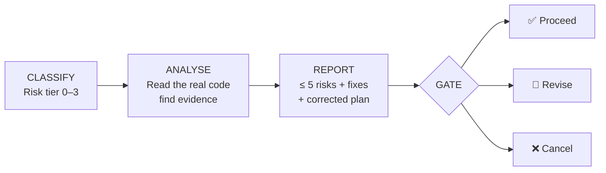
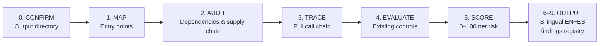
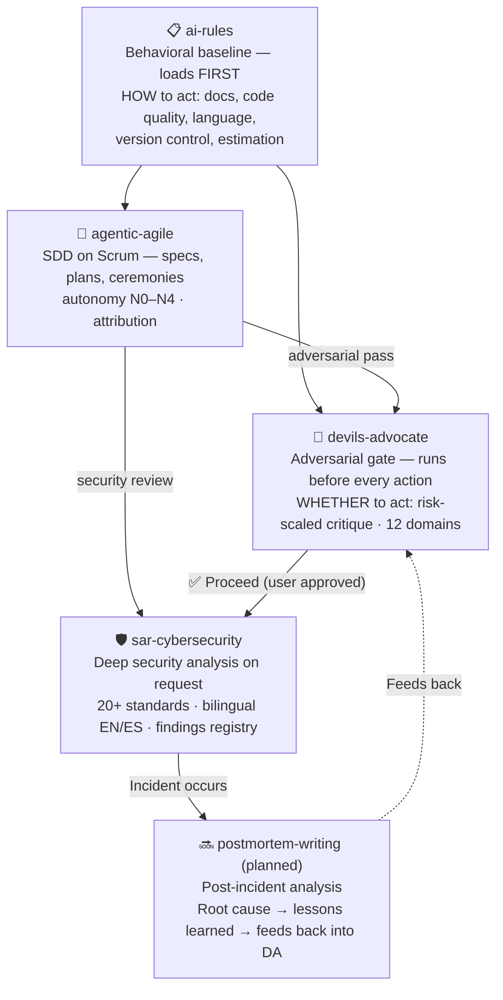

# 🛠️ carrilloapps/skills

> Agent skills for AI coding agents — adversarial analysis, security assessment, quality gates, and engineering best practices.
> Compatible with **Claude Code, Antigravity, GitHub Copilot, Cursor, Codex, Gemini CLI, Windsurf / Devin Desktop, Cline, Kiro, OpenCode** and 70+ agents in total.

[](LICENSE)
[](https://skills.sh/carrilloapps/skills)
[](.github/workflows/validate.yml)
[](#available-skills)
[](https://github.com/carrilloapps/skills)
[](https://x.com/carrilloapps)

---

## Available Skills

| Skill | Description | Version | Install |
|-------|-------------|---------|---------|
| [🔴 **devils-advocate**](skills/devils-advocate/) | Adversarial pre-execution gate — risk-scaled, evidence-based critique that returns a corrected plan and waits for your approval | [](CHANGELOG.md) | `npx skills add carrilloapps/skills@devils-advocate` |
| [🛡️ **sar-cybersecurity**](skills/sar-cybersecurity/) | Automated Security Assessment Report (SAR) generator — deep cybersecurity analysis mapped to 20+ compliance standards | [](CHANGELOG.md) | `npx skills add carrilloapps/skills@sar-cybersecurity` |
| [📋 **ai-rules**](skills/ai-rules/) | Personal behavioral rules for AI tools — documentation discipline, secure practices, code quality, version control, and structured estimation | [](CHANGELOG.md) | `npx skills add carrilloapps/skills@ai-rules` |
| [🔁 **agentic-agile**](skills/agentic-agile/) | Spec-driven development on Scrum with agentic agility — gated specs and plans, ceremonies, autonomy levels, attribution, transcripts and MCP integrations by capability | [](CHANGELOG.md) | `npx skills add carrilloapps/skills@agentic-agile` |
| 🔜 **postmortem-writing** | Post-incident analysis — structured postmortem reports with root cause analysis, timeline reconstruction, and lessons learned | *Planned* | — |

---

## Quick Install

```bash
# All skills, every agent detected in the current project
npx skills add carrilloapps/skills

# One skill
npx skills add carrilloapps/skills@devils-advocate

# Specific agents (repeat -a) · every agent (-a '*') · global (-g)
npx skills add carrilloapps/skills@sar-cybersecurity -a antigravity -a claude-code
npx skills add carrilloapps/skills -a '*'
npx skills add carrilloapps/skills -g
```

Keep up to date with `npx skills check` / `npx skills update`.

**Per-agent paths, always-on files, manual install, and optional guards → [`docs/INSTALL.md`](docs/INSTALL.md).**

---

## Skill Details

### 🔴 [Devil's Advocate](skills/devils-advocate/) · [](skills/devils-advocate/README.md)

> An adversarial pre-execution gate for 70+ AI coding agents — short, evidence-based critiques that change the plan.

AI tools are increasingly capable of executing complex, multi-step operations — creating files, calling APIs, running migrations, deploying services. Devil's Advocate adds the adversarial voice that asks: **"Should we?"**

**How it works:**


```mermaid
flowchart LR
    A[CLASSIFY\nRisk tier 0–3] --> B[ANALYSE\nRead the real code\nfind evidence]
    B --> C[REPORT\n≤ 5 risks + fixes\n+ corrected plan]
    C --> D{GATE}
    D --> E["✅ Proceed"]
    D --> F["🔁 Revise"]
    D --> G["❌ Cancel"]
```

**Depth scales with risk:**

| Tier | When | Output |
|------|------|--------|
| 0 — Pass | Read-only or trivial reversible edits | Nothing, or one line |
| 1 — Quick check | Contained, reversible changes | 3–8 lines + one-line gate |
| 2 — Full critique | Production, data, auth, PII, git history, architecture/vendor decisions | ≤ 5 evidence-backed risks, better option, corrected plan, gate |
| 3 — Critical stop | 🔴 Critical risk that depends on facts only you have | 2–4 targeted questions, then the report |

**12 domains covered:**

| Domain | Framework |
|--------|-----------|
| Architecture | Distributed systems, coupling, CAP theorem, API design |
| Security | STRIDE threat model, supply chain, insider threats |
| Performance | Bottlenecks, scalability limits, anti-patterns |
| Developer / Code | Testing gaps, CI/CD risks, dependency management |
| Data & Analytics | Pipeline reliability, PII governance, ML bias |
| Product | Feature validation, launch risk, regulatory compliance |
| UX / Design | Dark patterns, WCAG accessibility, cognitive load |
| Strategy | Build vs. buy, vendor risk, Type 1/2 decisions |
| AI Optimization | Context window budget, instruction conflicts, hallucination risk |
| Version Control | Branch protection, secrets-in-repo, force push hazards |
| Vulnerability Patterns | DB, API, business logic, infrastructure & cloud patterns |
| General Analysis | 5-step analysis: attack surfaces, FMEA, edge cases |

**Includes:** 18 frameworks (domain, protocol, optional capabilities, Docker lab) · 2 internal checklists · 4 reference examples (one per tier) · Building Protocol for code · vendored `lab-probe` script

→ Full documentation: [`skills/devils-advocate/README.md`](skills/devils-advocate/README.md)

---

### 🛡️ [SAR Cybersecurity](skills/sar-cybersecurity/) · [](skills/sar-cybersecurity/README.md)

> Automated Security Assessment Report (SAR) generator — deep cybersecurity analysis mapped to 20+ compliance standards.

Transforms any AI agent into a senior cybersecurity expert that produces professional, bilingual (EN/ES) Security Assessment Reports with full compliance standard mapping.

**How it works:**


```mermaid
flowchart LR
    A["0. CONFIRM\nOutput directory"] --> B
    B["1. MAP\nEntry points"] --> C["2. AUDIT\nDependencies & supply chain"]
    C --> D["3. TRACE\nFull call chain"]
    D --> E["4. EVALUATE\nExisting controls"]
    E --> F["5. SCORE\n0–100 net risk"]
    F --> G["6–9. OUTPUT\nBilingual EN+ES\nfindings registry"]
```

**Assessment coverage:**

| Category | What is analyzed |
|----------|-----------------|
| Injection Patterns | SQL, NoSQL operator, Regex/ReDoS, Mass Assignment, GraphQL abuse, ORM/ODM-specific |
| Storage & Exfiltration | S3/GCS/Azure Blob, secrets in source, file uploads, logging, message queues, CDN, IaC |
| Database Access | SQL (PostgreSQL, MySQL), NoSQL (MongoDB, DynamoDB), Redis — index verification, bounded queries |
| Compliance Mapping | 20+ standards: ISO 27001, NIST, OWASP, PCI-DSS, GDPR, MITRE ATT&CK, and more |

**Key features:**

- **Deterministic, auditable scoring** — net effective risk (after controls) with a visible arithmetic line per finding, plus a CVSS v4.0 vector
- **Actionable findings** — confidence level, attack scenario, before/after fix diff, how to verify the fix, and effort (S/M/L)
- **Remediation roadmap**, attack chains, and a mandatory *Out of Scope & Limitations* section; dashboard shows measured metrics only
- Read-only operation — writes only the reports (default `docs/security/` in a private repository, `.memory/local/sar/reports/` in a public one) and the findings registry (`.memory/sar/findings.json`, or `.memory/local/sar/` when public); optional SARIF 2.1.0 export on request
- Optional tools (OSV-Scanner, Gitleaks, Semgrep CE, zefer-cli) and a Docker lab (stack-detected scanners incl. NoSQL injection, SonarQube CE, DefectDojo) — suggested, pinned, and run only after approval

**Includes:** 9 protocol & domain frameworks · 11 reference examples · Progressive context loading with all relevant frameworks per assessment

→ Full documentation: [`skills/sar-cybersecurity/README.md`](skills/sar-cybersecurity/README.md)

---

### 📋 [AI Rules](skills/ai-rules/) · [](skills/ai-rules/README.md)

> Personal behavioral rules for AI tools — documentation discipline, secure practices, code quality, and structured estimation across any project.

Defines the baseline behavioral contract that all AI agents must follow. Works as a cross-cutting layer beneath Devil's Advocate.

**Core rules:**

| Area | What it enforces |
|---|---|
| Security | Never reproduce or transmit secrets (redact when reporting), no dangerous commands, schema-checked and bounded DB queries |
| Documentation storage | Team-facing docs in `docs/` (versioned); shared skill state in `.memory/<skill>/` (versioned); agent-private state in `.memory/local/` (ignored — Git/Jujutsu, Mercurial, Fossil, SVN instruction) |
| Documentation format | Native Markdown, no decorative emoji, cross-references over duplication, Mermaid diagrams |
| Code quality | SOLID · KISS · DRY, `docs/elementals.md` to prevent duplicate components (updated only when elements change) |
| Version control | Explicit approval before every VCS write, Conventional Commits, focused commits, `AGENTS.md` suggested on approval |
| Estimation | Confidence (High/Medium/Low + reason) · effort by capacity mode · pivot potential · risk factors |

→ Full documentation: [`skills/ai-rules/README.md`](skills/ai-rules/README.md)

---

### 🔁 [Agentic Agile](skills/agentic-agile/) · [](skills/agentic-agile/README.md)

> Spec-driven development (SDD) on Scrum, run by agents with explicit autonomy limits. Covers everything GitHub Spec Kit and AI Unified Process lead in (constitution, requirement IDs and traceability, clarify, analyze, converge, brownfield baseline) and adds a verified team operating system, Scrum, autonomy levels, attribution, transcripts, and deterministic validators in CI.

| Area | What it provides |
|---|---|
| Structure first (Phase 0) | `check-structure` must pass — the team's operating system in `plans/agile/` complete and confirmed — before any spec or plan is created |
| SDD | Phase −1 constitution (versioned MUST/SHOULD articles) → four gated phases: Spec (`FR-###`/`SC-###`, P1–P3, Gherkin, clarifications with attribution) → Design (8 elements, constitution check, domain model, contracts, process) → `tasks.md` (`T###`, `[P]`, no cycles) → Implementation (converge loop) → Verification (evidence matrix, ✅/⚠️/❌ verdict) |
| Gherkin | Full en/es grammar (Rule/Regla, Background/Antecedentes, Scenario Outline/Esquema, Examples, tags, data tables, doc strings); every scenario needs Given/When/Then and an `Origin:`; QA test cases in Gherkin; results need evidence |
| Scrum | Refinement, planning (capacity, Fibonacci), daily and weekly health, review, KPI close (gate zero, seven phases), retro, quarterly review, executive summary, postmortem, decision records |
| Delivery | Plan → tickets with exact-payload approval, PR conformance against the spec (unmapped change = scope expansion), changelog by initiative |
| Agentic agility | Autonomy levels N0–N4, epistemic labels, mandatory attribution, anti-anchoring estimates, adversarial pass (delegates to Devil's Advocate) |
| Integrations | Capability slots (tracker, docs, observability, transcripts, warehouse, chat, code graph) checked before use — never invented |
| Layout | `specs/<initiative>/` and `plans/` (team operating system in `plans/agile/`, sprints, initiatives, decisions, drafts) versioned; raw transcripts only in `.memory/local/` |
| Traceability and analysis | `trace` (requirement → scenario → task → ticket → test → verdict), `analyze` (deterministic cross-artifact checks, CRITICAL–LOW), `baseline` (brownfield: only new findings fail), `import-speckit` (migrate GitHub Spec Kit projects) |
| Scripts | `aa <intent>` single entry point (specify · clarify · plan · tasks · verify · trace · analyze · converge · …), `init --preset scrum\|kanban\|regulated`, `check-structure` (`--scorecard`), `check-spec` (`--all`, `--tickets`), `trace`, `analyze`, `baseline`, `audit-agile`, `doctor`, `import-speckit`, `transcript-normalize`, `lab-probe` — twin `.sh` + `.ps1` with parity tests (Linux, macOS, Windows) and an end-to-end example validated in CI |

→ Full documentation: [`skills/agentic-agile/README.md`](skills/agentic-agile/README.md)

---

## How Skills Work Together


```mermaid
flowchart TD
    AR["📋 ai-rules\nBehavioral baseline — loads FIRST\nHOW to act: docs, code quality, language,\nversion control, estimation"]
    DA["🔴 devils-advocate\nAdversarial gate — runs before every action\nWHETHER to act: risk-scaled critique · 12 domains"]
    SAR["🛡️ sar-cybersecurity\nDeep security analysis on request\n20+ standards · bilingual EN/ES · findings registry"]
    AA["🔁 agentic-agile\nSDD on Scrum — specs, plans, ceremonies\nautonomy N0–N4 · attribution"]
    PM["🔜 postmortem-writing (planned)\nPost-incident analysis\nRoot cause → lessons learned → feeds back into DA"]

    AR --> DA
    AR --> AA
    AA -- "adversarial pass" --> DA
    AA -- "security review" --> SAR
    DA -- "✅ Proceed (user approved)" --> SAR
    SAR -- "Incident occurs" --> PM
    PM -. "Feeds back" .-> DA
```

**Layer roles:**

| Skill | Role | When |
|-------|------|------|
| `ai-rules` | Behavioral baseline | Always, loaded first — no session-start questionnaire |
| `devils-advocate` | Execution gate | Before each action, at the depth its risk tier requires |
| `sar-cybersecurity` | Deep security analysis | On security assessment request |
| `agentic-agile` | SDD + Scrum lifecycle | Specs, plans, ceremonies, work items |
| `postmortem-writing` | Incident learning loop | After incidents (planned) |

Use ai-rules as the behavioral foundation for every session, Devil's Advocate as the risk-scaled gate before actions, Agentic Agile to specify, plan, and deliver work (it delegates its adversarial pass to Devil's Advocate and security reviews to SAR), SAR Cybersecurity for deep security assessments, and (when available) Postmortem Writing after incidents to close the feedback loop. Every skill is independently installable; missing companions fall back to a minimal built-in behavior.

---

## Compatible Agents

Works with the **70+ agents** supported by the [`skills` CLI](https://github.com/vercel-labs/skills), including:

| Agent | `-a` id | Agent | `-a` id |
|-------|---------|-------|---------|
| Claude Code | `claude-code` | Gemini CLI | `gemini-cli` |
| Antigravity IDE | `antigravity` | Cline | `cline` |
| Antigravity CLI (`agy`) | `antigravity-cli` | Roo Code | `roo` |
| GitHub Copilot | `github-copilot` | OpenCode | `opencode` |
| Cursor | `cursor` | Kiro | `kiro-cli` |
| Windsurf / Devin Desktop | `windsurf` | Amp | `amp` |
| OpenAI Codex CLI | `codex` | Replit | `replit` |

Full matrix (project and global paths, always-on instruction files, guards, manual install): [`docs/INSTALL.md`](docs/INSTALL.md). `npx skills add --list` lists the skills in a repository, not the agents.

---

## Project Layout (what the skills create in your project)

Everything is written inside the project — never into global agent directories (`~/.claude`, `~/.gemini`, `~/.codex`, …) without your explicit approval of that exact path.

```text
specs/<initiative>/        SDD specs, designs, verification (versioned)          ← agentic-agile
plans/                     team operating system, sprints, initiatives,
                           decisions, drafts (versioned)                         ← agentic-agile
docs/                      team docs, project-context.md, elementals.md,
                           SAR reports in private repositories (versioned)       ← ai-rules, SAR
.memory/<skill>/           shared skill state, e.g. sar/findings.json (versioned)
.memory/devsecops/         Docker lab: compose files, tool configs, images.lock (versioned)
.memory/.gitignore         versioned; ignores only local/, *.local.*, *.recovered.json
.memory/local/             private: credentials, tokens, scan results, transcripts,
                           capability decisions, SAR output of public repos (never versioned)
```

---

## Optional Capabilities and Docker Lab

Each skill may suggest optional tools from its `frameworks/capabilities.md` — **at most once**, pinned to an exact version from an official registry, installed project-locally (`npm i -D --save-exact`, `.memory/local/bin`, `.memory/local/venv`), and only after you approve the exact command. Without them every skill still works.

When Docker is available, `scripts/lab-probe` (`.sh` / `.ps1`, vendored in every skill) detects Docker, Compose, RAM, CPUs, disk, and `vm.max_map_count`, matches the project's stack, and suggests lab tools **most critical first** within the resources available — if only one fits, it is the most critical one.

| Skill | Lab tools (one-shot, read-only, digest-pinned) |
|-------|-----------------------------------------------|
| sar-cybersecurity | Gitleaks, Semgrep (incl. NoSQL-injection rules), OSV-Scanner, Checkov, Hadolint, njsscan, Bandit, gosec, Kubescape, Squawk, Spectral, Syft/Grype; dashboards SonarQube CE and DefectDojo; local-only DAST (ZAP, Nuclei); Trivy opt-in only |
| devils-advocate | lizard, jscpd, dependency-cruiser, golangci-lint, actionlint, helm, sqlfluff; PgHero dashboard |
| ai-rules | markdownlint-cli2, Vale, lychee (`--offline`) |

Dashboards bind to `127.0.0.1` only and share **one** generated credential (`admin` + a 20-character password created once per machine in `.memory/local/devsecops/credentials.env`, never printed, never versioned). Scanners never see `.memory/local/`. Details: each skill's `frameworks/docker-lab.md`.

---

## Multi-OS Scripts

Every script ships as a POSIX `.sh` **and** a PowerShell `.ps1` (Windows PowerShell 5.1 and pwsh 7) with identical flags, output, exit codes, and side effects — no runtime dependencies, no network, no installs. Shared scripts live in `shared/` and are vendored into each skill (`bash shared/sync.sh`, `--check` in CI). Parity is tested in `tests/scripts/` on Ubuntu and Windows.

---

## Repository Structure

```text
carrilloapps/skills/
├── AGENTS.md                         ← AI agent entry point (CLAUDE.md imports it)
├── CHANGELOG.md                      ← version history
├── LICENSE                           ← MIT
├── README.md                         ← this file
├── .claude-plugin/marketplace.json   ← Claude Code marketplace (guard plugin)
├── .github/workflows/                ← validate.yml (validate, guard tests, parity, skills-audit) · snyk-agent-scan.yml (manual)
├── .memory/devsecops/                ← Docker lab used on this repo (compose, configs, images.lock); .memory/local/ is ignored
├── docs/INSTALL.md                   ← per-agent install matrix (single source)
├── integrations/                     ← optional guards per agent (installed separately, Node ≥ 18)
│   ├── core/                         ← shared deterministic classifier (+ tests)
│   ├── sync-core.mjs                 ← vendors core/classifier.mjs into every adapter
│   └── <agent>/                      ← claude-code, copilot, cursor, gemini-cli, codex, windsurf,
│                                        cline, kiro, antigravity, opencode, roo
├── scripts/
│   ├── validate.sh                   ← quality gate (also in CI)
│   └── audit-skills.sh / .ps1        ← local skills.sh-equivalent audit (agentskills validate + skill-scanner)
├── shared/                           ← canonical shared scripts (lab-probe) + sync.sh / sync.ps1
├── tests/scripts/                    ← .sh / .ps1 parity tests (cases.tsv, fixtures, golden outputs)
└── skills/
    ├── devils-advocate/              ← SKILL.md · README.md · metadata.json
    │   ├── frameworks/               ← 18 frameworks + lab-catalog.tsv
    │   ├── checklists/               ← 2 internal checklists
    │   ├── examples/                 ← 4 reference examples (one per tier)
    │   └── scripts/                  ← lab-probe (.sh / .ps1, vendored)
    ├── sar-cybersecurity/            ← SKILL.md · README.md · metadata.json
    │   ├── frameworks/               ← 9 protocol & domain frameworks + lab-catalog.tsv
    │   ├── examples/                 ← 11 reference examples
    │   └── scripts/                  ← lab-probe (.sh / .ps1, vendored)
    ├── ai-rules/                     ← SKILL.md · README.md · metadata.json
    │   ├── frameworks/               ← capabilities.md, docker-lab.md + lab-catalog.tsv
    │   └── scripts/                  ← lab-probe (.sh / .ps1, vendored)
    └── agentic-agile/                ← SKILL.md · README.md · metadata.json
        ├── frameworks/               ← 13 frameworks (SDD, Gherkin, Scrum, KPIs, delivery, …) + lab-catalog.tsv
        ├── templates/                ← 29 templates (structure, specs, ceremonies, reports, delivery)
        ├── examples/                 ← 7 reference examples
        └── scripts/                  ← 7 scripts × (.sh / .ps1)
```

Each skill is self-contained and independently installable via `@<skill-name>`.

---

## Quality Gates

Run before every commit (all are also run in CI):

1. `bash scripts/validate.sh` — version cascade (`metadata.version`), fences, indexes, safeguards, `.memory/` convention, install hygiene, Docker lab pinning, numbered options, script twins, PowerShell ASCII safety, SAR scoring arithmetic, and more.
2. `bash tests/scripts/run-parity.sh` (or `pwsh tests/scripts/run-parity.ps1`) — every `.sh` / `.ps1` pair produces identical output and exit codes; `bash tests/scripts/run-e2e.sh` validates the agentic-agile end-to-end example in every available shell.
3. `node --test integrations/core/core.test.mjs integrations/*/test/*.test.mjs` and `node integrations/sync-core.mjs --check` — guard classifier and adapters.
4. `bash shared/sync.sh --check` — vendored shared scripts identical in every skill.

### Before publishing

1. Run all quality gates above.
2. Run the local skills.sh-equivalent audit (needs Docker; nothing leaves the machine; any finding fails):

   ```bash
   bash scripts/audit-skills.sh        # or: pwsh scripts/audit-skills.ps1
   ```

   It runs `agentskills validate` (Agent Skills spec) and Cisco `skill-scanner` (offline analyzers) in a digest-pinned container. CI runs the same checks in the `skills-audit` job and uploads SARIF to code scanning.
3. Optionally run the manual **Snyk agent-scan** workflow (the engine skills.sh uses; it uploads skill content to Snyk and needs the `SNYK_TOKEN` secret).
4. After publishing, check each skill's page on [skills.sh](https://skills.sh/carrilloapps/skills) — Socket and Gen Agent Trust Hub run only there.

### Optional: enforce the gate at the harness level

Skill instructions cannot guarantee that an agent follows them. [`integrations/`](integrations/) provides optional guards that hook into each agent's pre-tool event and classify every tool call deterministically before it runs (one shared classifier: no AI, no network, no writes). Read-only calls pass; writes, side-effecting commands, and git writes ask for confirmation or are blocked, depending on what the agent's hooks support.

| Agent | Guard |
|-------|-------|
| Claude Code, GitHub Copilot, Cursor, Gemini CLI, OpenAI Codex CLI, Windsurf / Devin Desktop, Cline, OpenCode | Stable |
| Kiro, Antigravity CLI (`agy`) | Experimental |
| Roo Code | Advisory rule (no blocking hook) |

Guards are installed separately (Node.js ≥ 18) and are never pulled in by `npx skills add`. Claude Code users can install from the marketplace: `/plugin marketplace add carrilloapps/skills`, then `/plugin install devils-advocate-guard@carrilloapps-skills`. Details: [`integrations/README.md`](integrations/README.md).

---

## Contributing

Contributions are welcome! See [CONTRIBUTING.md](.github/CONTRIBUTING.md) for:

1. How to add skills, frameworks, templates, examples, and scripts
2. Quality standards and PR process
3. Version cascade checklist

Please read [CODE_OF_CONDUCT.md](.github/CODE_OF_CONDUCT.md) before contributing.

Security issues → [SECURITY.md](.github/SECURITY.md). Do not open a public issue for security concerns.

---

## License

[MIT](LICENSE) — free to use, modify, and distribute. Attribution appreciated.

---

## Changelog

See [CHANGELOG.md](CHANGELOG.md) for the full version history.

---

## Author

**José Carrillo** — [carrillo.app](https://carrillo.app)

[](https://carrillo.app)
[](https://github.com/carrilloapps)
[](https://x.com/carrilloapps)
[](https://linkedin.com/in/carrilloapps)
[](mailto:m@carrillo.app)
