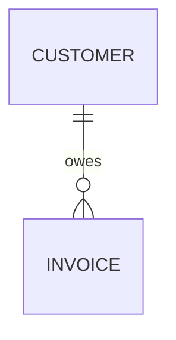
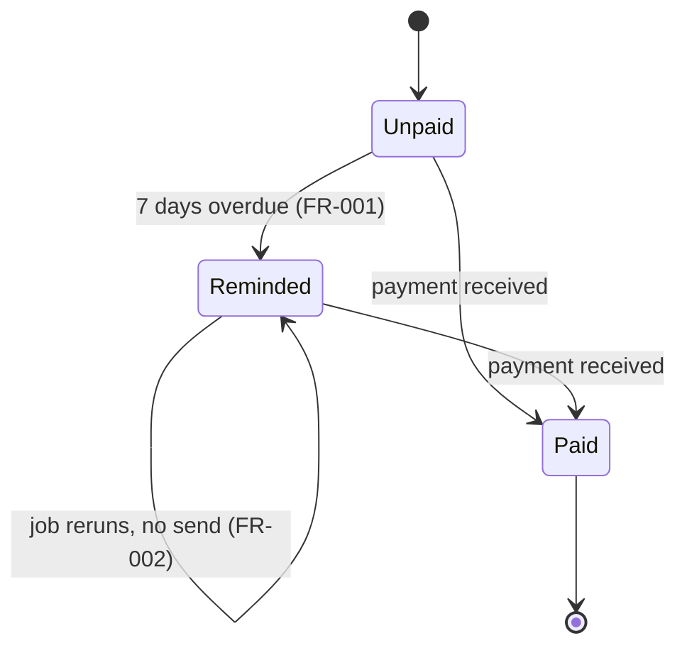
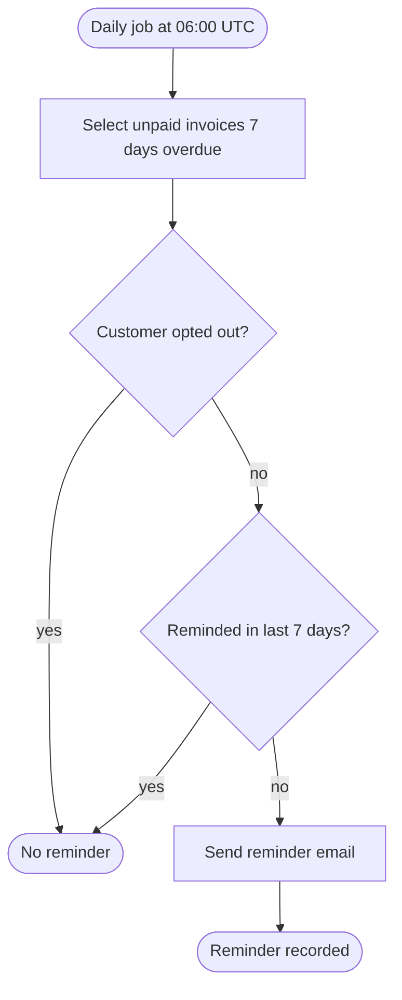

# Example: End-to-End — One Initiative Through the Whole Lifecycle

> ⚠️ **Example only** — a fictional mini project (an "overdue invoice reminders" feature). Each `### path` section below is one file of the project; none of it is real code to run.

**Skill version**: 1.0.1

Recreate the files under any folder (empty folders: `plans/drafts/`) and point the scripts at it with `--root <folder>`. Verified 2026-10-06 by `tests/scripts/run-e2e.sh` of the skills repository (bash, pwsh 7, Windows PowerShell 5.1): the extracted tree passes `check-structure --strict`, `check-spec --strict --tickets`, `check-spec --all`, `trace`, `analyze`, and `audit-agile`.

## The flow

| # | Step (intent) | What happened | File |
|---|---------------|---------------|------|
| 1 | `init` → `structure` | Team filled its operating system, including the engineering constitution; the gate opens | `plans/agile/*` |
| 2 | `specify` | Refinement transcript → `FR-001`–`FR-003` (P1, P1, P2), `SC-001`–`SC-002`, scenarios tagged `@FR-### @P#` | `specs/invoice-reminders/spec.md` |
| 3 | `clarify` | Two attributed answers (opt-out is absolute; UTC) in *Clarifications*; one non-blocking question left open | `spec.md` → Clarifications |
| 4 | spec quality | Nine checklist items, all traced, no ❌ | `requirements-checklist.md` |
| 5 | `plan` | Constitution check all ✅; 8 architecture elements; state machine; OpenAPI with `x-requirements`; process paths = E2E scenarios | `design.md`, `domain-model.md`, `process.md`, `contracts/openapi.yaml` |
| 6 | `tasks` | `T001`–`T010`: Setup → Foundational → P1 → P2 → Polish, `[P]` where independent, tests before code, estimates after the vote | `tasks.md` |
| 7 | `analyze` | No CRITICAL or HIGH finding before commitment | `plans/sprints/2026-S20/planning.md` |
| 8 | implement | Tests named after the requirement they verify | `tests/invoice-reminders.test.ts` |
| 9 | `trace` → `converge` | FR-001's "paid invoice" scenario had no test → convergence task `T011` (partial) | `tasks.md` → Phase 6 |
| 10 | `verify` | One row per scenario with `Req` and evidence; verdict ✅ | `verification.md` |
| 11 | close | KPIs (cycle time "not measurable", gate zero) and agentic indicators from the event log | `plans/sprints/2026-S20/report.md` |
| 12 | decide | Email-only first release, decided by the product owner, review date set | `plans/decisions/2026-10-03-reminder-channel.md` |

What to notice:

1. Nothing under `specs/` existed before the structure gate opened.
2. Every claim is attributed or labelled; the unknown (provider outage) stayed an open question instead of a guess.
3. Every requirement can be followed to a scenario, a task, a test name, and a verification row — no IDE plugin involved.
4. The estimate appears only after the team's vote.

Commands (from the project root; `<skill-dir>` is where the skill is installed, e.g. `.agents/skills/agentic-agile`; each only after approval; PowerShell: same flags with `.ps1`):

```bash
bash <skill-dir>/scripts/check-structure.sh --root <folder> --strict
bash <skill-dir>/scripts/check-spec.sh specs/invoice-reminders --root <folder> --strict --tickets
bash <skill-dir>/scripts/trace.sh specs/invoice-reminders --root <folder>
bash <skill-dir>/scripts/analyze.sh specs/invoice-reminders --root <folder>
bash <skill-dir>/scripts/audit-agile.sh --root <folder>
```

## Files

### `.memory/.gitignore`

```gitignore
# Managed by carrilloapps/skills — ignores agent-private paths only.
# Shared team state under .memory/<skill>/ stays versioned.
local/
*.local.*
*.recovered.json
```

### `plans/agile/methodology.md`

````markdown
# Methodology

> Filled by the team. Until filled, values below are **Proposed** defaults.
>
> When the team confirms this file, add a line `Confirmed by: <role or name> — <YYYY-MM-DD>` right below this note.

Confirmed by: Scrum master — 2026-10-01

## Cadence

1. Sprint length: 2 weeks
2. Sprint naming: `<YYYY>-S<NN>`
3. Quarter rhythm: 6 sprints and 1 buffer week

## Estimation

1. Scale: Fibonacci 1, 2, 3, 5, 8, 13
2. Split at: 13 · Forbidden in sprint: ≥ 20
3. Agent estimates: after the team votes (sealed before)

## Working agreements

1. Reviews within one working day

## Transcripts

1. Recording consent announced at the start of every session: yes
2. Retention of raw transcripts: deleted after the draft is refined
3. Classification: production-sensitive

## Language

See `language.md`.
````

### `plans/agile/definition-of-ready.md`

````markdown
# Definition of Ready

> Filled by the team. Until filled, items below are **Proposed** defaults. An item is Ready only when every mandatory line is ✅ **explicitly** — never by inference.
>
> When the team confirms this file, add a line `Confirmed by: <role or name> — <YYYY-MM-DD>` right below this note.

Confirmed by: Scrum master — 2026-10-01

## Mandatory

1. Problem and value stated, attributed to who asked
2. Acceptance criteria in Gherkin: happy path, negative path per failure mode, applicable edge cases
3. Out of scope explicit
4. Dependencies identified with an owner role
5. Estimated by the team, ≤ 13 points
6. Open questions that block the sprint: none

## Architectural (when the item changes code)

1. Bounded-context owner known
2. Public surface delta known
3. `specs/<initiative>/spec.md` passes `check-spec`

## Not Ready when

1. Any criterion is **Proposed** and nobody confirmed it
2. Two stakeholders contradict each other and it is unresolved
3. The item depends on data or a system nobody verified
````

### `plans/agile/definition-of-done.md`

````markdown
# Definition of Done

> Filled by the team. Until filled, items below are **Proposed** defaults. Closing an item against this list is a human decision (N0).
>
> When the team confirms this file, add a line `Confirmed by: <role or name> — <YYYY-MM-DD>` right below this note.

Confirmed by: Scrum master — 2026-10-01

## Code

1. Implements the spec without expanding it
2. Build, linters, unit tests green

## Review

1. Reviewed and approved per the team's review conventions

## Verification

1. `specs/<initiative>/verification.md` has a row per scenario with evidence
2. Verdict ✅, or ⚠️ with a dated follow-up

## Documentation

1. User-facing or operational docs updated, or `N/A — reason`

## Out of scope respected

1. Nothing outside the spec shipped silently

## Not Done when

1. Any scenario lacks evidence
2. A ⚠️ verdict has no follow-up plan
````

### `plans/agile/ceremonies.md`

````markdown
# Ceremonies

> Filled by the team. Durations below are **Proposed** defaults.
>
> When the team confirms this file, add a line `Confirmed by: <role or name> — <YYYY-MM-DD>` right below this note.

Confirmed by: Scrum master — 2026-10-01

| Ceremony | When | Duration | Facilitator (role) | Recorded? | Agent output |
|----------|------|----------|--------------------|-----------|--------------|
| Daily | Mon-Fri 09:30 | 15 min | Scrum master | yes | `plans/sprints/<…>/daily/<date>.md` |
| Refinement | Wednesday | 60 min | Scrum master | yes | `plans/initiatives/<i>/tickets/` |
| Planning | Wednesday | 90 min | Scrum master | yes | `plans/sprints/<…>/planning.md` |
| Review | Wednesday | 30–60 min | Scrum master | yes | `plans/sprints/<…>/review.md` |
| Retro | Wednesday | 60 min | Scrum master | yes | `plans/sprints/<…>/retro.md` |
````

### `plans/agile/team.md`

````markdown
# Team

> Filled by the team. Record only what the team chooses to record. Names are optional; roles are enough for the agent.
>
> When the team confirms this file, add a line `Confirmed by: <role or name> — <YYYY-MM-DD>` right below this note.

Confirmed by: Scrum master — 2026-10-01

| Role | Name (optional) | Areas owned | Usual capacity (days/sprint) | Notes |
|------|-----------------|-------------|------------------------------|-------|
| Product owner | | Backlog, billing rules | 2 | |
| Scrum master | | Ceremonies | 1 | |
| Developer | | Billing service | 8 | |
| QA | | Test automation | 6 | |

Time off and support load per sprint are recorded in the sprint's `planning.md`, not here.
````

### `plans/agile/capabilities.md`

````markdown
# Capabilities

> Filled by the team. Which tool fills each capability slot, and which third-party capabilities are authorized. Never put secrets here.
>
> When the team confirms this file, add a line `Confirmed by: <role or name> — <YYYY-MM-DD>` right below this note.

Confirmed by: Scrum master — 2026-10-01

## Slots

| Slot | Tool / MCP | Version | Config file (project-level) | Owning or enrichment |
|------|------------|---------|-----------------------------|----------------------|
| Tracker | GitHub Issues | | | owning |
| Docs | Repository docs | | | owning |
| Chat | none | | | enrichment |
| Observability | not applicable | | | enrichment |
| Transcript source | VTT files | | | owning (for drafts) |
| Warehouse / semantic layer | none | | | enrichment |
| Code graph | codegraph | | | enrichment |
| Doc / memory graph | none | | | enrichment |

## Authorized third-party capabilities (four questions)

| Name | Provider | Version | Data reached | Write permissions | Processing & retention | Internal owner | Approved on | Approved by | Review on |
|------|----------|---------|--------------|-------------------|------------------------|----------------|-------------|-------------|-----------|

## Team capability catalogue

| Capability | Have it? | Maturity | Procedure |
|------------|----------|----------|-----------|
| Conversation → work item | | | |
| Adversarial refinement | | | |
| Defect from a thread | | | |
| Sprint summary | | | |
| Estimation against history | | | |
| Blocker detection | | | |
| Changelog | | | |
| Decision record | | | |
````

### `plans/agile/kpi-directives.md`

````markdown
# KPI Directives

> Filled by the team. The agent computes only the KPIs defined here, with the counting rules written here.
>
> When the team confirms this file, add a line `Confirmed by: <role or name> — <YYYY-MM-DD>` right below this note.

| KPI | Definition | Counting rule | Source | Threshold (only after 2 baseline cycles) |
|-----|------------|---------------|--------|------------------------------------------|
| Velocity | Points done per sprint | Items meeting the DoD by sprint end | Tracker | — |
| Carry-over | Committed items not done | — | Tracker | — |
| Cycle time | Start → done, median | Working days | Tracker / events | — |

## Gate zero

A measure that is invalid or incomplete gets **no state** and **no number**: write `not measurable — <reason>`. Classify work by initiative, not by commit prefix.
````

### `plans/agile/language.md`

````markdown
# Language

> Filled by the team. Default: the language of the user's messages.
>
> When the team confirms this file, add a line `Confirmed by: <role or name> — <YYYY-MM-DD>` right below this note.

Confirmed by: Scrum master — 2026-10-01

1. Artifacts (specs, plans, drafts) language: en
2. Gherkin keyword language: en
3. Epistemic labels: Verified, Documented, Proposed
4. "No attribution" phrase: no attribution available
5. Identifiers in code and file names: English, kebab-case for files and folders

Keyword tables → the skill's `frameworks/gherkin.md`.
````

### `plans/agile/autonomy.md`

````markdown
# Autonomy

> Filled by the team. Defaults are **Proposed** until the team confirms them. A deviation is recorded here with its reason — never decided per conversation.
>
> When the team confirms this file, add a line `Confirmed by: <role or name> — <YYYY-MM-DD>` right below this note.

Confirmed by: Scrum master — 2026-10-01

## Levels per task

| Task | Level | Reason for deviation from default |
|------|-------|-----------------------------------|
| Transcribe and summarise sessions | N1 | |
| Draft a work item from a conversation | N2 | |
| Adversarial refinement | N2 | |
| Create a defect from a thread | N3 | |
| Sprint changelog | N3 | |
| Detect blockers and notify | N3 | |
| Order the backlog by impact | N2 | |
| Estimate (after the vote) | N2 | |
| Close or transition items | N0 | never delegated |
| Commit the sprint | N0 | never delegated |

## Adoption

**Current phase**: 1 Capture since 2026-10-01

| # | Precondition | Status | Owner (role) |
|---|--------------|--------|--------------|
| 1 | Transcription active in recurring ceremonies | met | |
| 2 | Programmatic access to transcripts | met | |
| 3 | Retention and classification policy | met | |
| 4 | Recording consent announced | met | |
| 5 | Pilot scope agreed | not met | |
| 6 | Third-party capabilities authorized | not met | |
| 7 | Baseline over two full cycles | not met | |
````

### `plans/agile/constitution.md`

````markdown
# Engineering constitution

> Filled by the team. The articles below are **Proposed** defaults until the team confirms them. MUST articles are gates: a design that violates one needs an amendment or a recorded, justified exception in its `design.md` *Constitution check*. SHOULD articles are strong defaults; deviations are justified in the same table.
>
> When the team confirms this file, add a line `Confirmed by: <role or name> — <YYYY-MM-DD>` right below this note.

Confirmed by: Tech lead — 2026-10-01

Version: 1.0.0

## Articles

### Article 1 — Simplicity (MUST)

The smallest design that satisfies the spec. No speculative features, layers, or configuration for values that never change. A new project, service, or package needs a written reason in `design.md`.

### Article 2 — Anti-abstraction (MUST)

Use the framework and standard library directly. No wrapper, interface, or factory with a single implementation unless a second one is already specified.

### Article 3 — Integration-first, contract-first (SHOULD)

Public surfaces are defined as contracts (`specs/<initiative>/contracts/`) before implementation, and tests exercise real boundaries (database, queue, HTTP) before mocks.

### Article 4 — Test-first (MUST)

Every scenario tagged `@FR-###` has a test that fails before the implementation and passes after it. A ✅ without evidence is not verified.

### Article 5 — The spec is the source of truth (MUST)

Specs live as long as the system: behavior changes start with a spec change, and the code is reconciled with the spec (`converge`), never the other way around silently.

### Article 6 — Observability (SHOULD)

New behavior is observable in production: structured logs, a metric or event per success criterion that is measurable at runtime, and an alert when a success criterion degrades.

### Article 7 — Security by default (MUST)

Least privilege, no secrets in code or artifacts, input validated at every trust boundary. Security review of specs and designs is delegated to `sar-cybersecurity` when installed.

### Article 8 — Human authority (MUST)

Committing the sprint, closing or transitioning items, final prioritisation, assessing people, and destructive edits of shared content are never delegated to an agent (N0).

## Amendments

| Version | Date | Change | Rationale | Decided by |
|---------|------|--------|-----------|------------|
| 1.0.0 | 2026-10-01 | Initial articles | Adopted the skill defaults at kickoff | Tech lead |

Versioning: MAJOR when a MUST article is removed or reversed · MINOR when an article is added or a SHOULD becomes MUST · PATCH for wording. Every amendment names who decided it.
````

### `plans/agile/hooks.md`

````markdown
# Phase hooks

> Filled by the team. Commands the agent **proposes** at each phase transition. The agent never runs them on its own: it shows the exact command and waits for approval (same gate as any other action). Copy to `plans/agile/hooks.md`.
>
> When the team confirms this file, add a line `Confirmed by: <role or name> — <YYYY-MM-DD>` right below this note.

Confirmed by: Tech lead — 2026-10-01

| # | Transition | Proposed command | Why | Blocking? |
|---|------------|------------------|-----|-----------|
| 1 | Before any artifact | `bash <skill-dir>/scripts/check-structure.sh --root .` | Phase 0 gate | yes |
| 2 | Spec → Design | `bash <skill-dir>/scripts/check-spec.sh specs/<initiative> --strict` | Spec complete, clarifications attributed | yes |
| 3 | Design → Tasks | `bash <skill-dir>/scripts/analyze.sh specs/<initiative>` | Cross-artifact consistency and constitution | yes on CRITICAL |
| 4 | Tasks → Implementation | `bash <skill-dir>/scripts/check-spec.sh specs/<initiative> --strict` | Tasks map to requirements, no dependency cycles | yes |
| 5 | Implementation → Verification | `bash <skill-dir>/scripts/trace.sh specs/<initiative>` | Every requirement has a scenario and a test | yes |
| 6 | Before closing the item | `bash <skill-dir>/scripts/audit-agile.sh --root .` | Hygiene of the team's system | no |

Rules:

1. A hook is a proposal, never an automatic action; "yes" in *Blocking?* means the phase does not advance while the command fails.
2. Only commands of installed skills or the project's own test/lint commands go here — no downloads, no installs.
3. Changing this file is a process change: propose → confirm → record in `plans/agile/metrics/events.jsonl`.
````

### `plans/agile/metrics/events.jsonl`

```json
{"ts":"2026-10-01T10:00:00Z","event":"structure_updated","item":"plans/agile","sprint":"2026-S20","actor":"Tech lead","meta":{"file":"all","confirmed_by":"Tech lead"}}
{"ts":"2026-10-02T15:00:00Z","event":"session_captured","item":"invoice-reminders/01","sprint":"2026-S20","actor":"agent","meta":{"source":"vtt"}}
{"ts":"2026-10-02T15:20:00Z","event":"draft_created","item":"invoice-reminders/01","sprint":"2026-S20","actor":"agent","meta":{}}
{"ts":"2026-10-03T11:05:00Z","event":"item_ready","item":"invoice-reminders/01","sprint":"2026-S20","actor":"Product owner","meta":{}}
{"ts":"2026-10-03T11:30:00Z","event":"question_resolved","item":"invoice-reminders/01","sprint":"2026-S20","actor":"Product owner","meta":{"id":1,"before_planning":true}}
```

### `specs/invoice-reminders/spec.md`

````markdown
# Spec: Overdue invoice reminders

**Initiative**: `invoice-reminders` · **Phase**: 1 — Spec · **Status**: Approved
**Plan**: [`plans/initiatives/invoice-reminders/overview.md`](../../plans/initiatives/invoice-reminders/overview.md)

This spec is the living source of truth for the behavior it describes (constitution Article 5): behavior changes start here, and the code is reconciled with it.

## 1.1 Problem

Customers forget overdue invoices and the finance team chases them by hand, about four hours a week (Product owner, refinement 2026-10-02). Stakeholders: finance team (fewer manual reminders), customers (a clear, single reminder), support (fewer "I never got a reminder" calls).

## Functional requirements

| ID | Requirement | Priority |
|----|-------------|----------|
| FR-001 | The system sends one reminder email when an invoice becomes 7 days overdue | P1 |
| FR-002 | The system never sends a second reminder for the same invoice within 7 days, even if the job runs again | P1 |
| FR-003 | A customer who opted out of reminders receives none | P2 |

## 1.2 Behavioral contract

```gherkin
# language: en
@invoice-reminders
Feature: Overdue invoice reminders

  Background:
    Given the reminder job runs daily at 06:00 UTC
      | invoice | customer | due date   | status |
      | INV-100 | C-1      | 2026-09-25 | unpaid |

  @happy @FR-001 @P1
  Scenario: Overdue invoice triggers a reminder
    # Origin: Product owner, refinement 2026-10-02
    Given today is 2026-10-02
    When the reminder job runs
    Then customer C-1 receives one reminder email for INV-100

  @negative @FR-002 @P1
  Scenario: Second run does not resend
    # Origin: Developer, refinement 2026-10-02
    Given a reminder for INV-100 was sent on 2026-10-02
    When the reminder job runs again on 2026-10-03
    Then no new reminder is sent for INV-100

  @negative @FR-001 @P1
  Scenario: Paid invoice gets no reminder
    # Origin: Product owner, refinement 2026-10-02
    Given INV-100 was paid on 2026-10-01
    When the reminder job runs on 2026-10-02
    Then no reminder is sent for INV-100

  @happy @FR-003 @P2
  Scenario: Opted-out customer gets no reminder
    # Origin: Support lead, clarification session 2026-10-03
    Given customer C-1 opted out of reminders
    When the reminder job runs on 2026-10-02
    Then no reminder is sent to C-1
```

Edge cases (category → scenario name or `N/A — reason`):

1. Empty / null input — no overdue invoices: covered by the job doing nothing; `N/A — no behavior to assert beyond zero emails`
2. Maximum input — `N/A — volume under 2,000 invoices per day (Verified, billing database count 2026-10-02)`
3. Boundary values — invoice exactly 7 days overdue: *Overdue invoice triggers a reminder*
4. Concurrency — two job instances: *Second run does not resend*
5. Partial failure — email provider down: open question 1
6. Idempotency / retries — *Second run does not resend*
7. Authorization — `N/A — job runs as a service account with no user input`
8. Time zone / locale — due dates are stored and compared in UTC (clarification 2)

## 1.3 Out of scope

1. SMS or push reminders — email only for this initiative.
2. A second reminder after 14 or 30 days.
3. Changing the invoice email template's design.

## 1.4 Success criteria

| ID | Criterion | Scenario(s) |
|----|-----------|-------------|
| SC-001 | 95% of invoices reaching 7 days overdue get a reminder within 24 hours | Overdue invoice triggers a reminder |
| SC-002 | Zero duplicate reminders per invoice per 7-day window | Second run does not resend |

## 1.5 Constraints & assumptions

| # | Item | State |
|---|------|-------|
| 1 | Emails go through the existing notification service | Verified (billing repository, notifications client) |
| 2 | Under 2,000 overdue invoices per day | Verified (billing database count 2026-10-02) |
| 3 | Customers can opt out from their profile | Documented (support handbook) |

## Clarifications

Answers recorded by the clarify protocol. Every answer names who confirmed it.

### Session 2026-10-03

1. Q: Should opted-out customers still receive reminders for invoices above a threshold? → A: No, opt-out is absolute — Confirmed by: Dana (Product owner)
2. Q: Which time zone defines "7 days overdue"? → A: UTC, as stored in billing — Confirmed by: Lee (Developer)

## Open questions

| # | Question | For | Blocks sprint? |
|---|----------|-----|----------------|
| 1 | Retry policy when the email provider is down for more than one job run | Product owner | No |

## Gate to Phase 2

1. ✅ No to-be-defined placeholders left — `check-spec --strict` passes
2. ✅ Every FR has a scenario tagged `@FR-###`; every SC maps to a scenario — `trace` summary in verification
3. ✅ Out of scope is explicit — section 1.3
4. ✅ No open question that blocks the sprint; every clarification is attributed — sections above
5. ✅ `requirements-checklist.md` fully traced, no ❌ — checklist
````

### `specs/invoice-reminders/requirements-checklist.md`

````markdown
# Requirements checklist: Overdue invoice reminders

**Initiative**: `invoice-reminders` · **Spec**: [`spec.md`](spec.md)

Unit tests for the spec's English: each item asks whether the **requirement** is well written — never whether the code works.

| ID | Question | Dimension | Ref | Status |
|----|----------|-----------|-----|--------|
| CHK001 | Is every functional requirement stated as observable behavior? | completeness | FR-001, FR-002, FR-003 | ✅ |
| CHK002 | Does "overdue" have an exact number and time zone? | clarity | FR-001, clarification 2 | ✅ |
| CHK003 | Do requirements and scenarios use the same terms (reminder, invoice, opt-out)? | consistency | FR-003 | ✅ |
| CHK004 | Is every success criterion measurable and mapped to a scenario? | measurability | SC-001, SC-002 | ✅ |
| CHK005 | Does every FR have at least one scenario tagged with its ID? | coverage | FR-001, FR-002, FR-003 | ✅ |
| CHK006 | Are the edge-case categories answered or marked N/A with a reason? | edge cases | 1.2 | ✅ |
| CHK007 | Are volume and delivery-time needs stated? | non-functional | SC-001, 1.5 | ✅ |
| CHK008 | Is every assumption labelled Verified / Documented / Proposed? | dependencies/assumptions | 1.5 | ✅ |
| CHK009 | Is the provider-outage behavior left as an explicit open question rather than assumed? | ambiguities/conflicts | Open questions | ✅ |
````

### `specs/invoice-reminders/design.md`

````markdown
# Design: Overdue invoice reminders

**Initiative**: `invoice-reminders` · **Phase**: 2 — Design · **Spec**: [`spec.md`](spec.md)
**Supporting artifacts**: [`domain-model.md`](domain-model.md) · [`contracts/openapi.yaml`](contracts/openapi.yaml) · [`process.md`](process.md) · [`tasks.md`](tasks.md)

## Constitution check

| Article | Status ✅/❌/⚠️ | Justification |
|---------|----------------|---------------|
| 1 — Simplicity | ✅ | One scheduled job and one table column; no new service |
| 2 — Anti-abstraction | ✅ | Uses the existing notifications client directly |
| 3 — Integration-first, contract-first | ✅ | `contracts/openapi.yaml` written before code; tests hit a real test database |
| 4 — Test-first | ✅ | Every scenario has a failing test task before its implementation task in `tasks.md` |
| 5 — Spec as source of truth | ✅ | Spec approved before tasks; changes go through Phase 1 |
| 6 — Observability | ✅ | Counter `reminders_sent_total` and alert when SC-001 drops below 95% |
| 7 — Security by default | ✅ | No new input surface; email address read from billing, never logged |
| 8 — Human authority | ✅ | The job sends reminders only; no item closing or prioritisation is automated |

## Architecture & Design

### 1. Architectural style

Layered monolith, as the billing service already is (`billing/src/` modules by feature).

### 2. Layers in scope

Changes: scheduler, billing domain, persistence. Must not change: public invoice API, notifications service.

### 3. Bounded-context owner

Billing owns invoices and the reminder rule; notifications only delivers.

### 4. Patterns to mirror

The existing nightly job `billing/src/jobs/late-fee.ts` (schedule, lock, metrics).

### 5. State model

`reminded_at` column on the invoice; the job selects unpaid invoices with `due_date + 7 days <= today` and `reminded_at` older than 7 days or empty, inside one transaction with a row lock, so two instances cannot both send.

### 6. Composition points

New `ReminderJob` registered next to the late-fee job; it calls the notifications client.

### 7. Public surface delta

| Surface | Added / Changed / Removed | Consumers affected |
|---------|---------------------------|--------------------|
| `GET /invoices/{id}` adds `remindedAt` | Added | Customer portal (optional field) |

### 8. Anti-violations

Single source of truth for the rule (billing only), no duplicated selection logic, stateless job instances with a database lock for multi-instance safety.

## Module / file map

| Path | Change |
|------|--------|
| `billing/src/jobs/reminder.ts` | New job |
| `billing/src/invoices/repository.ts` | Query for due reminders, update `reminded_at` |
| `billing/migrations/2026-10-03-reminded-at.sql` | New nullable column |

## Interfaces

`ReminderJob.run(today: Date): Promise<number>` returns the number of reminders sent.

## Data model changes

Nullable `reminded_at` timestamp on `invoices`; no backfill. Entities and states in `domain-model.md`.

## Rollout & rollback

1. Rollout: migration, then the job behind a flag enabled for 10% of customers for one week, then 100%.
2. Rollback: disable the flag (immediate); the column stays and is ignored.

## Gate to Phase 3

1. ✅ All 8 elements filled — sections above
2. ✅ Constitution check has no ❌ — table above
3. ✅ Rollback described — flag off
````

### `specs/invoice-reminders/domain-model.md`

````markdown
# Domain model: Overdue invoice reminders

**Initiative**: `invoice-reminders` · **Spec**: [`spec.md`](spec.md) · **Design**: [`design.md`](design.md)

## Entities

| Entity | Purpose | Key attributes | Owner (bounded context) | Req |
|--------|---------|----------------|-------------------------|-----|
| Invoice | Amount owed by a customer | id, customer_id, due_date: date, status, reminded_at: timestamp | Billing | FR-001, FR-002 |
| Customer | Who receives the reminder | id, email, reminders_opt_out: boolean | Billing | FR-003 |

## Relationships



## State machines



| Transition | Guard / rule | Scenario | Req |
|------------|--------------|----------|-----|
| Unpaid → Reminded | due_date + 7 days ≤ today (UTC), customer not opted out | Overdue invoice triggers a reminder | FR-001 |
| Reminded → Reminded | reminded_at within the last 7 days | Second run does not resend | FR-002 |

## Invariants

1. At most one reminder per invoice per 7-day window — FR-002
2. No reminder for an opted-out customer — FR-003

## Data ownership and retention

| Data | System of record | Retention | Sensitivity |
|------|------------------|-----------|-------------|
| Customer email | Billing | While the account exists | personal |
| reminded_at | Billing | With the invoice | internal |
````

### `specs/invoice-reminders/process.md`

````markdown
# Process: Overdue invoice reminders

**Initiative**: `invoice-reminders` · **Spec**: [`spec.md`](spec.md)



## Paths → end-to-end scenarios

| # | Path (node sequence) | Scenario in `spec.md` | Tags |
|---|----------------------|-----------------------|------|
| 1 | start → select → optout(no) → recent(no) → send → done | Overdue invoice triggers a reminder | `@e2e @FR-001 @P1` |
| 2 | start → select → optout(no) → recent(yes) → skip | Second run does not resend | `@e2e @FR-002 @P1` |
| 3 | start → select → optout(yes) → skip | Opted-out customer gets no reminder | `@e2e @FR-003 @P2` |

## Actors and systems

| Lane | Actor or system | Responsibility |
|------|-----------------|----------------|
| Scheduler | Billing job runner | Triggers the job daily |
| Billing | Billing service | Applies the rule and records `reminded_at` |
| Notifications | Notification service | Delivers the email |
````

### `specs/invoice-reminders/contracts/openapi.yaml`

```yaml
# Example only — fictional contract for the end-to-end example.
openapi: 3.1.0
info:
  title: Billing invoices (excerpt)
  version: 1.4.0
paths:
  /invoices/{id}:
    get:
      operationId: getInvoice
      x-requirements: [FR-001, FR-002]
      parameters:
        - name: id
          in: path
          required: true
          schema:
            type: string
      responses:
        "200":
          description: The invoice
          content:
            application/json:
              schema:
                $ref: "#/components/schemas/Invoice"
        "404":
          description: Not found
components:
  schemas:
    Invoice:
      type: object
      required: [id, customerId, dueDate, status]
      properties:
        id:
          type: string
        customerId:
          type: string
        dueDate:
          type: string
          format: date
        status:
          type: string
          enum: [unpaid, paid]
        remindedAt:
          type: [string, "null"]
          format: date-time
          description: Last reminder sent for this invoice (FR-002)
```

### `specs/invoice-reminders/tasks.md`

````markdown
# Tasks: Overdue invoice reminders

**Initiative**: `invoice-reminders` · **Spec**: [`spec.md`](spec.md) · **Design**: [`design.md`](design.md)

Estimates were added after the team's vote in sprint planning 2026-S20.

## Phase 1: Setup

| ID | P | Req | Task | Depends | Est | Status |
|----|---|-----|------|---------|-----|--------|
| T001 | | - | Add feature flag `invoice-reminders` | - | 1 | done |

## Phase 2: Foundational

| ID | P | Req | Task | Depends | Est | Status |
|----|---|-----|------|---------|-----|--------|
| T002 | [P] | FR-002 | Migration adding nullable `reminded_at` to invoices | T001 | 1 | done |
| T003 | [P] | FR-001 | Contract test for `remindedAt` in `GET /invoices/{id}` (contracts/openapi.yaml) | T001 | 2 | done |

## Phase 3: P1 — Send one reminder

| ID | P | Req | Task | Depends | Est | Status |
|----|---|-----|------|---------|-----|--------|
| T004 | [P] | FR-001 | Write failing test: overdue invoice triggers a reminder | T002 | 2 | done |
| T005 | [P] | FR-002 | Write failing test: second run does not resend | T002 | 2 | done |
| T006 | | FR-001 | Implement `ReminderJob` selection and send | T004 | 3 | done |
| T007 | | FR-002 | Implement row lock and `reminded_at` update | T005, T006 | 3 | done |

## Phase 4: P2 — Respect opt-out

| ID | P | Req | Task | Depends | Est | Status |
|----|---|-----|------|---------|-----|--------|
| T008 | | FR-003 | Write failing test: opted-out customer gets no reminder | T006 | 1 | done |
| T009 | | FR-003 | Filter opted-out customers in the selection | T008 | 1 | done |

## Phase 5: Polish

| ID | P | Req | Task | Depends | Est | Status |
|----|---|-----|------|---------|-----|--------|
| T010 | | FR-001 | Counter `reminders_sent_total` and alert below 95% within 24 hours | T007 | 2 | done |

## Phase 6: Convergence

| ID | P | Req | Task | Depends | Est | Status |
|----|---|-----|------|---------|-----|--------|
| T011 | | FR-001 | partial — test for a paid invoice was missing (trace gap) | T006 | 1 | done |
````

### `tests/invoice-reminders.test.ts`

```typescript
// Example only — fictional test file for the end-to-end example; not run by this repository.
// Each test name starts with the requirement ID it verifies, so `trace` can link it.
import { describe, it, expect } from "vitest";
import { runReminderJob, seed } from "./helpers.js";

describe("invoice reminders", () => {
  it("FR-001 overdue invoice triggers a reminder", async () => {
    await seed({ invoice: "INV-100", customer: "C-1", due: "2026-09-25", status: "unpaid" });
    const sent = await runReminderJob("2026-10-02");
    expect(sent).toEqual([{ invoice: "INV-100", customer: "C-1" }]);
  });

  it("FR-001 paid invoice gets no reminder", async () => {
    await seed({ invoice: "INV-100", customer: "C-1", due: "2026-09-25", status: "paid" });
    expect(await runReminderJob("2026-10-02")).toEqual([]);
  });

  it("FR-002 second run does not resend", async () => {
    await seed({ invoice: "INV-100", customer: "C-1", due: "2026-09-25", status: "unpaid" });
    await runReminderJob("2026-10-02");
    expect(await runReminderJob("2026-10-03")).toEqual([]);
  });

  it("FR-003 opted-out customer gets no reminder", async () => {
    await seed({ invoice: "INV-100", customer: "C-1", due: "2026-09-25", status: "unpaid", optOut: true });
    expect(await runReminderJob("2026-10-02")).toEqual([]);
  });
});
```

### `specs/invoice-reminders/verification.md`

````markdown
# Verification: Overdue invoice reminders

**Initiative**: `invoice-reminders` · **Phase**: 4 — Verification · **Spec**: [`spec.md`](spec.md)

## 4.1 Test matrix

| # | Scenario (from spec 1.2) | Req | Type | Result | Evidence |
|---|--------------------------|-----|------|--------|----------|
| 1 | Overdue invoice triggers a reminder | FR-001, SC-001 | integration | ✅ | `tests/invoice-reminders.test.js` "FR-001 overdue invoice triggers a reminder" · CI run 4182 · 2026-10-09T14:02Z · commit 3f9c2a1 |
| 2 | Second run does not resend | FR-002, SC-002 | integration | ✅ | `tests/invoice-reminders.test.js` "FR-002 second run does not resend" · CI run 4182 · commit 3f9c2a1 |
| 3 | Paid invoice gets no reminder | FR-001 | integration | ✅ | `tests/invoice-reminders.test.js` "FR-001 paid invoice gets no reminder" · CI run 4190 · commit 7d01e4b |
| 4 | Opted-out customer gets no reminder | FR-003 | integration | ✅ | `tests/invoice-reminders.test.js` "FR-003 opted-out customer gets no reminder" · CI run 4182 · commit 3f9c2a1 |

## 4.2 Edge-case battery

| # | Case | Found during | Result | Evidence |
|---|------|--------------|--------|----------|
| 1 | Two job instances start at the same second | Implementation (T007) | ✅ | Concurrency test with two workers, CI run 4182 |

## 4.3 Evidence notes

Tests run against the CI test database seeded with the Background table of the spec.

```text
RESULT: ✅
EVIDENCE: 2026-10-09T14:02Z · CI run 4182, job integration-tests · commit 3f9c2a1
```

## 4.4 Coverage

Changed code 94% line coverage; the uncovered branch is the provider-outage path, tracked as open question 1 of the spec. Requirement coverage from `trace`: 3 of 3 FR and 2 of 2 SC covered by a scenario, a task, and a passing test.

## 4.5 Verdict

**Verdict**: ✅ Done
````

### `plans/initiatives/invoice-reminders/overview.md`

````markdown
# Initiative: Overdue invoice reminders

**Slug**: `invoice-reminders` · **State**: Done · **Since**: 2026-10-02
**Spec**: [`specs/invoice-reminders/`](../../../specs/invoice-reminders/spec.md)

## Why

Finance chases overdue invoices by hand, about four hours a week (Product owner, refinement 2026-10-02).

## Work items

| # | Draft | Points | State |
|---|-------|--------|-------|
| 01 | [`tickets/01-send-overdue-reminder.md`](tickets/01-send-overdue-reminder.md) | 13 | Done |

## Decisions

1. [`plans/decisions/2026-10-03-reminder-channel.md`](../../decisions/2026-10-03-reminder-channel.md)

## Follow-ups

1. Retry policy for provider outages — spec open question 1, refinement on 2026-10-21
````

### `plans/initiatives/invoice-reminders/tickets/01-send-overdue-reminder.md`

````markdown
# Customers get one reminder when an invoice is 7 days overdue

**Type**: Story · **Initiative**: `invoice-reminders` · **Epic**: Collections automation
**Requirements**: FR-001, FR-002, FR-003 from `specs/invoice-reminders/spec.md` · **Priority**: P1 · **Tasks**: T001–T011 from `tasks.md`
**Origin**: refinement transcript 2026-10-02 · **Drafted by**: agent (N2) · **Date**: 2026-10-02

## Description

"We spend about four hours a week chasing overdue invoices by email" — Product owner @ 00:04:12. "It must never send twice if the job reruns" — Developer @ 00:11:40.

## Scope

1. One reminder email at 7 days overdue
2. No duplicate within 7 days
3. Respect customer opt-out

## Out of scope

1. SMS or push reminders
2. Further reminders after 14 or 30 days

## Acceptance criteria

```gherkin
# language: en
@invoice-reminders @FR-001 @P1
Scenario: Overdue invoice triggers a reminder
  # Origin: Product owner @ 00:04:12
  Given invoice INV-100 for customer C-1 is unpaid and due on 2026-09-25
  When the reminder job runs on 2026-10-02
  Then customer C-1 receives one reminder email for INV-100
```

## QA test cases

```gherkin
# language: en
@qa @negative @FR-002
Scenario: Second run does not resend
  # Origin: Developer @ 00:11:40
  Given a reminder for INV-100 was sent on 2026-10-02
  When the reminder job runs again on 2026-10-03
  Then no new reminder is sent for INV-100
```

Minimum: one happy path, one negative per failure mode, and the applicable edge cases. Edge categories not applicable: authorization — the job has no user input.

## Metrics

SC-001 and SC-002 of the spec, from the `reminders_sent_total` counter.

## Dependencies & risks

| # | Item | Owner (role) | State |
|---|------|--------------|-------|
| 1 | Notifications service quota | Developer | Verified |

## Tasks

| # | Task | Points (after the vote) |
|---|------|-------------------------|
| 1 | See `specs/invoice-reminders/tasks.md` T001–T011 | 13 |

## Estimate

Team vote: 13 (planning 2026-S20). Agent's sealed suggestion, revealed after the vote: 13.

## Readiness (from `plans/agile/definition-of-ready.md`)

1. ✅ Problem and value stated, attributed — Product owner @ 00:04:12
2. ✅ Acceptance criteria in Gherkin — scenarios above, confirmed in refinement
3. ✅ Out of scope explicit — section above
4. ✅ Dependencies identified with an owner role — table above
5. ✅ Estimated by the team, ≤ 13 points — 13
6. ✅ Open questions that block the sprint: none

## Open questions

| # | Question | For | Blocks sprint |
|---|----------|-----|---------------|
| 1 | Retry policy when the email provider is down | Product owner | No |

## Adversarial pass

1. Assumptions treated as settled: volume under 2,000 per day — verified against the billing database.
2. Contradictions with the current system: none found.
3. Ambiguous scope words: "overdue" — resolved as 7 days in UTC (clarification 2).
4. Missing roles or areas: support was not in refinement — opt-out confirmed with the support lead.
5. What is recorded if the flow fails: provider outage left as an open question.
6. Other: none.

---
**Epistemic state**: Documented (transcript) and Verified (database count); no Proposed criteria left.
**Nothing was written to the tracker.**
````

### `plans/sprints/2026-S20/planning.md`

````markdown
# Sprint 2026-S20 — Planning

**Dates**: 2026-10-01 → 2026-10-14 · **Goal (proposed by the Product owner)**: customers get one reliable reminder for overdue invoices

## Capacity

| Role | Usual (days) | Time off | Support load | Available |
|------|--------------|----------|--------------|-----------|
| Developer | 8 | 0 | 1 | 7 |
| QA | 6 | 1 | 0 | 5 |

## Commitment (decided by the team)

| # | Item | Points (team vote) | Owner (suggested by the agent, chosen by the team) |
|---|------|--------------------|---------------------------------------------------|
| 1 | `invoice-reminders` 01 — one reminder at 7 days overdue | 13 | Developer, QA |

`analyze` before commitment: no CRITICAL or HIGH finding. The P1 phase of `tasks.md` alone is shippable.
````

### `plans/sprints/2026-S20/report.md`

````markdown
# Sprint 2026-S20 — Report

**Goal**: customers get one reliable reminder for overdue invoices · **Outcome**: Met — verification verdict ✅

## Done

| # | Item | Points | Verification verdict |
|---|------|--------|---------------------|
| 1 | `invoice-reminders` 01 | 13 | ✅ [`verification.md`](../../../specs/invoice-reminders/verification.md) |

## Not done

| # | Item | Reason (attributed) | Next |
|---|------|---------------------|------|
| — | none | — | — |

## KPIs (as defined in `plans/agile/kpi-directives.md`)

| KPI | Value | Source | Note |
|-----|-------|--------|------|
| Velocity | 13 | Tracker | First sprint with the skill; no threshold yet |
| Carry-over | 0 | Tracker | |
| Cycle time | not measurable — fewer than two items finished | Events | Gate zero |

## Agentic indicators (from `plans/agile/metrics/events.jsonl`)

| # | Indicator | Value | Baseline cycles so far |
|---|-----------|-------|------------------------|
| 1 | Session → ready item | 1 day (2026-10-02 → 2026-10-03) | 1 |
| 2 | Open questions resolved before planning | 1 of 1 | 1 |

## Changelog

`invoice-reminders`: daily reminder job, no duplicates, opt-out respected (FR-001–FR-003).
````

### `plans/decisions/2026-10-03-reminder-channel.md`

````markdown
# Decision: Reminders go by email only for the first release

**Date**: 2026-10-03 · **State**: Accepted

## What

The first release sends reminders by email through the existing notification service; SMS is out of scope.

## Alternatives considered

1. Email and SMS together — doubles the provider work and needs consent handling not yet designed.
2. In-app banner only — customers who do not log in would never see it.

## Reason

Email reaches every customer today and the notification service already supports it (Verified, billing repository).

## Who decided

Dana (Product owner). Recorded from: clarification session 2026-10-03.

## Origin

Clarification session 2026-10-03, recorded in `specs/invoice-reminders/spec.md` → Clarifications.

## Review on

2027-01-15

## Consequences

SMS stays out of scope (spec 1.3); a later initiative can add it with its own spec.
````
