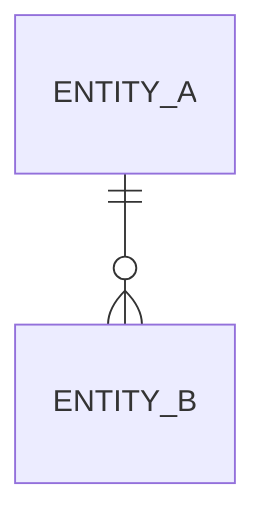
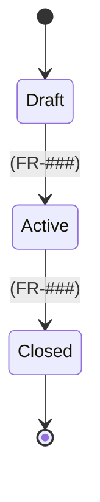

# Domain model: <Initiative title>

**Initiative**: `<initiative-kebab>` · **Spec**: [`spec.md`](spec.md) · **Design**: [`design.md`](design.md)

Every entity and state below traces to a requirement (`FR-###`) or is marked **Proposed**. Brownfield models reconstructed from code cite the file that proves each element.

## Entities

| Entity | Purpose | Key attributes | Owner (bounded context) | Req |
|--------|---------|----------------|-------------------------|-----|
| <Entity> | <why it exists> | <id, attribute: type, …> | <module/service> | <FR-###> |

## Relationships

## State machines

One diagram per entity whose lifecycle matters. Every transition maps to a scenario.

| Transition | Guard / rule | Scenario | Req |
|------------|--------------|----------|-----|
| Draft → Active | <rule> | <scenario name> | <FR-###> |

## Invariants

1. <rule that must always hold> — <FR-### or Proposed>

## Data ownership and retention

| Data | System of record | Retention | Sensitivity |
|------|------------------|-----------|-------------|
| <data> | <system> | <period> | public / internal / personal / secret |
