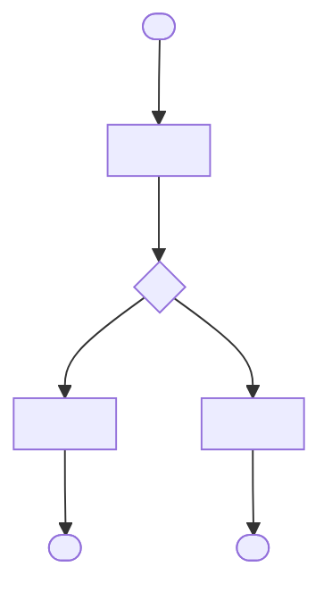

# Process: <Initiative title>

**Initiative**: `<initiative-kebab>` · **Spec**: [`spec.md`](spec.md)

The business process the initiative supports, as a Mermaid flowchart. Each path from start to an end node becomes one end-to-end scenario in `spec.md`, tagged with the requirements it exercises — no BPMN tool needed.

## Paths → end-to-end scenarios

| # | Path (node sequence) | Scenario in `spec.md` | Tags |
|---|----------------------|-----------------------|------|
| 1 | start → step1 → decision(yes) → step2 → done | <scenario name> | `@e2e @FR-### @P1` |
| 2 | start → step1 → decision(no) → alt → failed | <scenario name> | `@e2e @FR-### @P2` |

## Actors and systems

| Lane | Actor or system | Responsibility |
|------|-----------------|----------------|
| <lane> | <role or system> | <what it does in the flow> |
