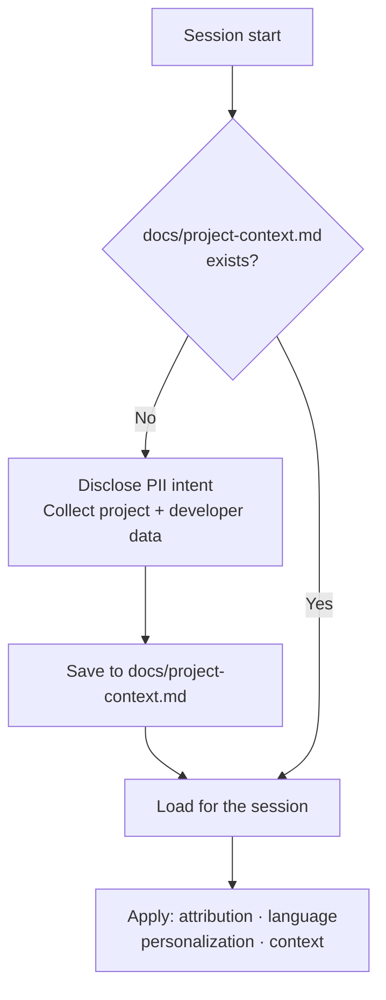

# 📋 ai-rules

> **Personal behavioral rules for AI tools — documentation discipline, secure practices, code quality, version control, and structured estimation across any project.**

[](LICENSE)
[](../../CHANGELOG.md)
[](https://skills.sh/carrilloapps/skills/ai-rules)
[](https://github.com/carrilloapps/skills)
[](https://x.com/carrilloapps)

---

ai-rules is an [agent skill](https://skills.sh) compatible with **40+ AI coding agents** — including GitHub Copilot, Claude Code, Cursor, Windsurf, Cline, Codex, Gemini CLI, OpenCode, Roo Code, and more — that establishes a behavioral baseline for every AI session in your projects.

It is not a linter. It is not a checklist. It is a behavioral contract that:

- **Initializes every session** — captures project and developer context before any work begins
- **Enforces documentation discipline** — everything goes to `docs/`, accessible to every AI tool
- **Defines the language layer** — `en_US` for all code identifiers, non-negotiable regardless of project or developer language
- **Prevents duplicate work** — `docs/elementals.md` is the living index of all project elements, checked before creating anything
- **Structures every recommendation** — Confidence %, effort by capacity mode, pivot potential, and explicit risk factors

---

## Quick Install

> **Before installing**: Review the source at [github.com/carrilloapps/skills](https://github.com/carrilloapps/skills) and verify the latest audit results at [skills.sh/audits](https://skills.sh/audits). The install command below fetches content from a remote repository — review before using in production or sensitive environments.

```bash
npx skills add carrilloapps/skills@ai-rules
```

### All install options

| Command | Effect |
|---------|--------|
| `npx skills add carrilloapps/skills@ai-rules` | Install to all detected agents in current project |
| `npx skills add carrilloapps/skills@ai-rules -g` | Install globally (available in every project) |
| `npx skills add carrilloapps/skills@ai-rules -a github-copilot` | Install to a specific agent only |
| `npx skills add carrilloapps/skills@ai-rules -a claude-code -a cursor` | Install to multiple specific agents |
| `npx skills add carrilloapps/skills@ai-rules --all` | Install to all agents, skip confirmations |
| `npx skills add carrilloapps/skills@ai-rules -g -y` | Global install, non-interactive (CI-friendly) |

Target a specific agent:

```bash
npx skills add carrilloapps/skills@ai-rules -a github-copilot
npx skills add carrilloapps/skills@ai-rules -a claude-code
npx skills add carrilloapps/skills@ai-rules -a cursor
npx skills add carrilloapps/skills@ai-rules -a windsurf
```

### Keeping it up to date

```bash
# Check if a newer version is available
npx skills check

# Update to the latest version
npx skills update
```

> See [skills.sh/carrilloapps/skills/ai-rules](https://skills.sh/carrilloapps/skills/ai-rules) for the canonical install command and latest release.

### Where files are installed

| Scope | Path |
|-------|------|
| Project (default) | `./<agent>/skills/ai-rules/SKILL.md` |
| Global (`-g`) | `~/<agent>/skills/ai-rules/SKILL.md` |

By default the CLI creates a **symlink** from each agent directory to a single canonical copy — one source of truth, easy to update. Use `--copy` if your environment does not support symlinks.

### CLI Reference — all commands

| Command | Description |
|---------|-------------|
| `npx skills add carrilloapps/skills@ai-rules` | Install to all detected agents (current project) |
| `npx skills add carrilloapps/skills@ai-rules -g` | Install globally (all projects) |
| `npx skills add carrilloapps/skills@ai-rules -a <agent>` | Install to a specific agent |
| `npx skills add carrilloapps/skills@ai-rules --all` | Install to all agents, skip prompts |
| `npx skills add carrilloapps/skills@ai-rules -g -y` | Global + non-interactive (CI-friendly) |
| `npx skills add carrilloapps/skills@ai-rules --copy` | Copy files instead of symlink |
| `npx skills list` | List all installed skills in current project |
| `npx skills list -g` | List globally installed skills |
| `npx skills find ai-rules` | Search the skills.sh directory |
| `npx skills check` | Check if a newer version is available |
| `npx skills update` | Update all installed skills to latest |
| `npx skills remove ai-rules` | Remove the skill from current project |
| `npx skills remove ai-rules -g` | Remove from global scope |
| `npx skills remove ai-rules -a <agent>` | Remove from a specific agent only |

---

## Compatible Agents

Works with every agent supported by the [skills.sh](https://skills.sh) ecosystem:

| Agent | `--agent` flag |
|-------|---------------|
| GitHub Copilot | `github-copilot` |
| Claude Code | `claude-code` |
| Cursor | `cursor` |
| Windsurf | `windsurf` |
| Cline | `cline` |
| OpenAI Codex | `codex` |
| Gemini CLI | `gemini-cli` |
| OpenCode | `opencode` |
| Roo Code | `roo` |
| Goose | `goose` |
| Continue | `continue` |
| Amp / Kimi CLI / Replit | `amp` |
| Antigravity | `antigravity` |
| Augment | `augment` |
| Droid | `droid` |
| Kilo Code | `kilo` |
| Kiro CLI | `kiro-cli` |
| OpenHands | `openhands` |
| Trae / Trae CN | `trae` |
| Zencoder | `zencoder` |
| + 20 more | `npx skills add --list` |

---

## What It Does

At session start, and throughout the project lifecycle, ai-rules enforces a consistent behavioral contract across every AI agent working in your project.

### Session Initialization

Before any work begins, the skill checks for `docs/project-context.md`. If it does not exist, it collects project and developer data — with explicit disclosure that the file may contain PII — then saves it for the session.



### Behavioral Rules

| Area | What it enforces |
|------|-----------------|
| **Security** | Never read secrets or tokens · never execute dangerous commands · never query a database without reviewing schema and indexes first |
| **Documentation storage** | All session memory, references, and generated assets go into `docs/` — shared across Claude Code, Copilot, Gemini, OpenCode, and others |
| **Documentation format** | Native Markdown · no emoji · Mermaid for diagrams · cross-references instead of duplication |
| **Language — code layer** | ALL code identifiers in `en_US`, non-negotiable (variables, functions, classes, DB columns, endpoints, env vars, test names) |
| **Language — docs layer** | Follows explicit user request, `docs/project-context.md` inference, or other skill directives |
| **Code quality** | SOLID · KISS · DRY · `docs/elementals.md` checked before creating any element |
| **Version control** | Conventional Commits · one logical change per commit · never force-push to protected branches · living `AGENTS.md` |
| **Estimation** | Confidence % · effort by capacity mode · pivot potential · explicit risk factors for every architectural recommendation |

### Execution Priority

| Layer | Role | When |
|-------|------|------|
| **ai-rules** (this skill) | Behavioral baseline — defines HOW to act | Session start, loads first |
| **Devil's Advocate** | Execution gate — defines WHETHER to act | Before each action |

These layers do not conflict. ai-rules establishes the session context; Devil's Advocate governs individual actions within that context. In any conflict between an ai-rules rule and a Devil's Advocate finding, Devil's Advocate has analytical precedence.

---

## Session Files

The skill manages two persistent files across sessions:

### `docs/project-context.md`

Created once at session initialization. Contains project metadata (name, description, stage, stack) and developer identity (name, email, role, organization). Used for authorship attribution, documentation language detection, and agent personalization. May contain PII — add to `.gitignore` if appropriate.

### `docs/elementals.md`

The living index of all project elements. Updated after every action that adds, modifies, or removes any element. Checked before creating any component, function, constant, or type to prevent duplication.

```markdown
# Project Elementals
> Source of truth for all AI tools. Updated after every change.
> Project: [name] — Last updated: YYYY-MM-DD

## Components
| Name | Path | Description | Status |

## Functions / Services
| Name | Path | Parameters | Description |

## Constants / Configuration
| Name | Path | Type | Description |

## Types / Interfaces / Schemas
| Name | Path | Description |
```

Status values: `Active` · `Beta` · `Experimental` · `Deprecated` · `Deprecated → renamed to [X]`

---

## Estimation Model

Every architectural decision, library choice, migration, feature implementation, or security change requires a four-field structured estimate:

| Field | What it means |
|-------|--------------|
| **Confidence** (0–100%) | Based on available evidence, known constraints, and identified unknowns. States what would raise or lower this number. |
| **Effort** | Story points or clock hours by capacity mode (1 SP ≈ half a day of focused solo work at mid-level, before multiplier) |
| **Pivot potential** | High — swap any time, low cost · Medium — rework of specific components · Low — architectural commitment, reversal expensive |
| **Risk factors** | Specific, actionable conditions that could reduce confidence. Examples: "no test coverage on this module," "external API with no SLA," "single developer with domain knowledge." Vague risk factors are not actionable. |

**Capacity modes:**

| Mode | Multiplier | Description |
|------|-----------|-------------|
| Solo | 1× | No AI assistance |
| AI-assisted | 3–5× | AI handles boilerplate, search, scaffolding |
| AI-augmented team | 5–10× | Multiple agents with human review |

---

## Skill Structure

```
skills/ai-rules/
├── SKILL.md          # Core behavioral contract (always loaded in full)
├── README.md         # This documentation
└── metadata.json     # Skill metadata for skills.sh
```

ai-rules is intentionally compact — it defines behavioral guidelines and document templates, not executable code or on-demand analysis frameworks. The entire skill loads on every session start; there is no progressive loading because there is nothing to defer.

---

## Companion Skills

| Skill | Relationship |
|-------|-------------|
| [🔴 **devils-advocate**](../devils-advocate/) | ai-rules is the behavioral baseline; Devil's Advocate gates every action. Load ai-rules first, then Devil's Advocate. In analytical conflicts, Devil's Advocate takes precedence. |
| [🛡️ **sar-cybersecurity**](../sar-cybersecurity/) | ai-rules provides the documentation conventions and language rules that SAR reports follow. Output directory, language layer, and elementals index all apply during SAR assessments. |
| 🔜 **postmortem-writing** | Post-incident reports follow ai-rules documentation and language conventions. Planned. |

---

## Contributing

Contributions are welcome! See [CONTRIBUTING.md](https://github.com/carrilloapps/skills/blob/main/.github/CONTRIBUTING.md) for:

- How to propose new behavioral rules or estimation improvements
- Quality standards and PR process

Please read [CODE_OF_CONDUCT.md](https://github.com/carrilloapps/skills/blob/main/.github/CODE_OF_CONDUCT.md) before contributing.

---

## Security

For vulnerability reports (harmful, misleading, or exploitable guidance), see [SECURITY.md](https://github.com/carrilloapps/skills/blob/main/.github/SECURITY.md). Do not open a public issue for security concerns.

---

## License

[MIT](LICENSE) — free to use, modify, and distribute. Attribution appreciated.

---

## Changelog

See [CHANGELOG.md](../../CHANGELOG.md) for the full version history.

---

*Built for teams that want AI tools to behave — consistently, predictably, and without surprises.*

---

## Author

**José Carrillo** — [carrillo.app](https://carrillo.app)

[](https://carrillo.app)
[](https://github.com/carrilloapps)
[](https://x.com/carrilloapps)
[](https://linkedin.com/in/carrilloapps)
[](mailto:m@carrillo.app)
