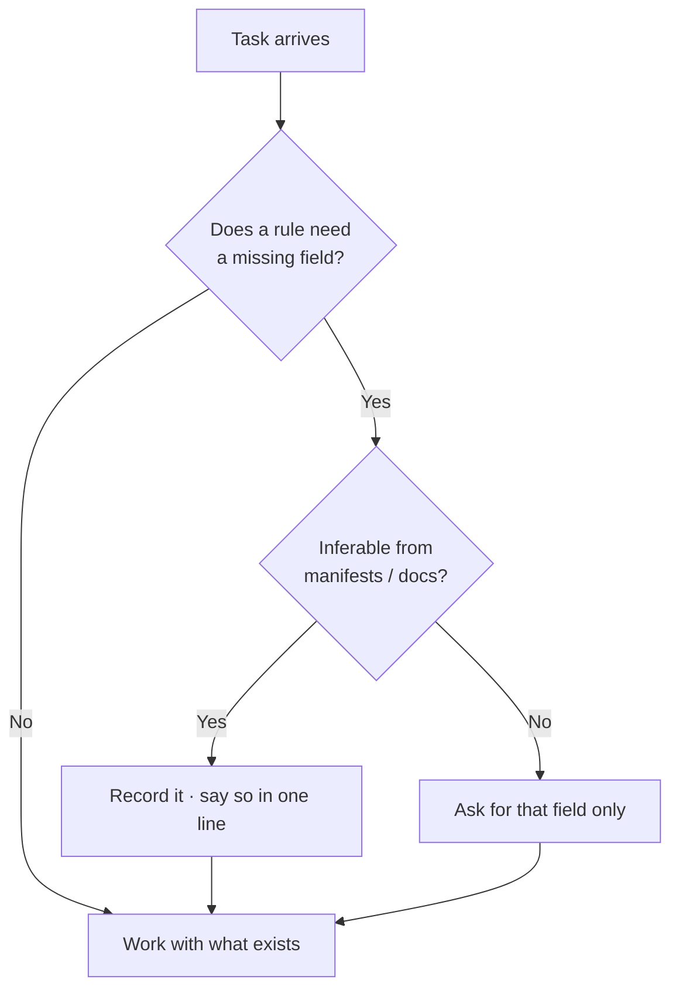

# 📋 ai-rules

> **Personal behavioral rules for AI tools — documentation discipline, secure practices, code quality, version control, and structured estimation across any project.**

[](../../LICENSE)
[](../../CHANGELOG.md)
[](https://skills.sh/carrilloapps/skills/ai-rules)
[](https://github.com/carrilloapps/skills)
[](https://x.com/carrilloapps)

---

ai-rules is an [agent skill](https://skills.sh) compatible with **70+ AI coding agents** — including GitHub Copilot, Claude Code, Cursor, Windsurf, Cline, Codex, Gemini CLI, OpenCode, Roo Code, and more — that establishes a behavioral baseline for every AI session in your projects.

It is not a linter. It is not a checklist. It is a behavioral contract that:

- **Never interrupts to set up** — reads project context when present, asks for one missing field only when a rule needs it, never asks for name or email
- **Keeps everything inside the project** — `specs/`, `plans/`, `docs/`, `.memory/` in an ordered layout; never global agent directories (`~/.claude`, `~/.gemini`, …) without your explicit approval
- **Defines the language layer** — `en_US` for all code identifiers, non-negotiable regardless of project or developer language
- **Prevents duplicate work** — `docs/elementals.md` is the living index of all project elements, checked before creating anything
- **Structures every recommendation** — qualitative confidence with its reason, effort by capacity mode, pivot potential, and explicit risk factors
- **Keeps agent-private state out of version control** — `.memory/local/` is ignored (Git/Jujutsu, Mercurial, Fossil, SVN instruction) while shared team state under `.memory/<skill>/` stays versioned
- **Suggests optional tools, never installs on its own** — local-only documentation graph (`@carrilloapps/docgraph`) and multi-agent sync (`skill-rules`), pinned and one at a time with explicit approval

---

## Quick Install

> **Before installing**: review the source at [github.com/carrilloapps/skills](https://github.com/carrilloapps/skills) and the latest audit results at [skills.sh/audits](https://skills.sh/audits).

```bash
npx skills add carrilloapps/skills@ai-rules                          # agents detected in this project
npx skills add carrilloapps/skills@ai-rules -a antigravity -a cursor # specific agents
npx skills add carrilloapps/skills@ai-rules -a '*'                   # every supported agent
npx skills add carrilloapps/skills@ai-rules -g                       # global (all projects)
```

Update with `npx skills update`; remove with `npx skills remove ai-rules`.

Works with **70+ agents** — Claude Code, Antigravity (IDE and `agy` CLI), GitHub Copilot, Cursor, Codex, Gemini CLI, Windsurf / Devin Desktop, Cline, Roo Code, OpenCode, Kiro, and more. Per-agent `-a` ids, project and global paths, always-on instruction files, manual install, and optional guards: **[`docs/INSTALL.md`](../../docs/INSTALL.md)**.

---

## What It Does

Throughout the project lifecycle, ai-rules enforces a consistent behavioral contract across every AI agent working in your project — without adding stop-and-wait rounds of its own.

### Lazy Project Context

There is no session-start questionnaire. Context files are read silently when present; a missing field is asked for only when a rule needs it, one field at a time, and never during read-only work. Name and email are never asked — authorship comes from the version control configuration.


```mermaid
flowchart TD
    A[Task arrives] --> B{Does a rule need\na missing field?}
    B -- No --> E[Work with what exists]
    B -- Yes --> C{Inferable from\nmanifests / docs?}
    C -- Yes --> D[Record it · say so in one line]
    C -- No --> F[Ask for that field only]
    D --> E
    F --> E
```

### Behavioral Rules

| Area | What it enforces |
|------|-----------------|
| **Security** | Never reproduce, log, or transmit secrets (redact when reporting) · never execute dangerous commands · check schema and indexes and bound result sets before any query |
| **Documentation storage** | Team-facing docs go into `docs/` (versioned); agent-private state goes into `.memory/local/` (never versioned) |
| **Documentation format** | Native Markdown · no decorative emoji (skill-defined report formats excepted) · Mermaid for diagrams · cross-references instead of duplication |
| **Language — code layer** | ALL code identifiers in `en_US`, non-negotiable (variables, functions, classes, DB columns, endpoints, env vars, test names) |
| **Language — docs layer** | Explicit request → `docs/project-context.md` → existing docs → language of the user's message; never stops to ask |
| **Code quality** | SOLID · KISS · DRY · `docs/elementals.md` checked before creating an element, updated only when elements are created, renamed, or removed |
| **Version control** | Explicit approval before every VCS write · commit authorization state machine (`REQUESTED → … → RELEASED`, each transition approved; hotfixes end with a forward-port offer) · Conventional Commits · one logical change per commit · never force-push to protected branches · `AGENTS.md` suggested, created only on approval |
| **Estimation** | Confidence (High/Medium/Low + reason) · effort by capacity mode · pivot potential · explicit risk factors for every architectural recommendation |

### Execution Priority

| Layer | Role | When |
|-------|------|------|
| **ai-rules** (this skill) | Behavioral baseline — defines HOW to act | Always, as context (loads first) |
| **Devil's Advocate** | Execution gate — defines WHETHER to act | Before each action, at the depth its risk tier requires |

These layers do not conflict. ai-rules defines how work is done; Devil's Advocate governs whether each action happens. Risk findings from Devil's Advocate are never overridden by ai-rules. Conflicts with any other skill get a one-line note and the more specific rule wins — no extra stop.

---

## Project Files

| File | Contents | Versioned? |
|------|----------|-----------|
| `docs/project-context.md` | Project name, description, stage, stack, documentation language — no personal data | Yes |
| `docs/elementals.md` | Index of project code elements | Yes |
| `.memory/local/ai-rules/developer.md` | Current developer's role and preferences | **No** — agent-private |
| `.memory/local/ai-rules/capabilities.json` | Which optional tools were suggested, declined, or installed | **No** — agent-private |

### `.memory/` — shared vs. private state

Shared team state lives in `.memory/<skill>/` and **is versioned**. Agent-private state lives in `.memory/local/` (plus `*.local.*` and `*.recovered.json`) and is kept out of version control with file writes only:

| VCS | Rule applied |
|-----|-------------|
| Git / Jujutsu | `.memory/.gitignore` with `local/`, `*.local.*`, `*.recovered.json` (the project's own `.gitignore` is not edited) |
| Mercurial | `^\.memory/local/`, `^\.memory/.*\.local\.`, `^\.memory/.*\.recovered\.json$` appended to `.hgignore` |
| Fossil | `.memory/local/*`, `.memory/*.local.*`, `.memory/*.recovered.json` appended to `.fossil-settings/ignore-glob` |
| Subversion | The user is told once to run `svn propset svn:ignore local .memory` |

### Optional capabilities

See [`frameworks/capabilities.md`](frameworks/capabilities.md): detection, pinned versions, per-agent MCP config, and the one-suggestion-per-tool protocol. Nothing is installed without the user's explicit approval of the exact command.

**docgraph in agent mode** — docgraph searches locally (provider pinned to `local`, no remote sources, no API keys); the agent you are using reranks and summarizes the results with its own model, so it runs on your existing agent subscription. MCP sampling is not used (deprecated in the 2026-07-28 MCP spec); the upstream proposal is in [`integrations/docgraph-agent-mode.md`](../../integrations/docgraph-agent-mode.md).

**Docker lab (optional)** — with Docker available, [`frameworks/docker-lab.md`](frameworks/docker-lab.md) runs documentation linters offline in one-shot, read-only containers: markdownlint-cli2 v0.23.3, Vale v3.24.0 (built-in style, no `vale sync`), and lychee 0.24.2 with `--offline` (online link checks only on request). Compose file in `.memory/devsecops/compose.docs.yaml`; results in `.memory/local/devsecops/results/`.

### `docs/elementals.md`

The living index of project code elements. Checked before creating any component, function, constant, or type to prevent duplication. Updated only when code elements are created, renamed, or removed — as part of the approved change, never during a read-only SAR assessment.

```markdown
# Project Elementals
> Source of truth for all AI tools. Updated when code elements change.
> Project: [name] — Last updated: YYYY-MM-DD

## Components
| Name | Path | Description | Status |

## Functions / Services
| Name | Path | Parameters | Description |

## Constants / Configuration
| Name | Path | Type | Description |

## Types / Interfaces / Schemas
| Name | Path | Description |
```

Status values: `Active` · `Beta` · `Experimental` · `Deprecated` · `Deprecated → renamed to [X]`

---

## Estimation Model

Every architectural decision, library choice, migration, feature implementation, or security change requires a four-field structured estimate:

| Field | What it means |
|-------|--------------|
| **Confidence** | `High` / `Medium` / `Low` plus its reason — what was verified and what would change it. No numeric percentages. |
| **Effort** | Story points or clock hours by capacity mode (1 SP ≈ half a day of focused solo work at mid-level, before multiplier) |
| **Pivot potential** | High — swap any time, low cost · Medium — rework of specific components · Low — architectural commitment, reversal expensive |
| **Risk factors** | Specific, actionable conditions that could reduce confidence. Examples: "no test coverage on this module," "external API with no SLA," "single developer with domain knowledge." Vague risk factors are not actionable. |

**Capacity modes:**

| Mode | Multiplier | Description |
|------|-----------|-------------|
| Solo | 1× | No AI assistance |
| AI-assisted | 3–5× | AI handles boilerplate, search, scaffolding |
| AI-augmented team | 5–10× | Multiple agents with human review |

---

## Skill Structure

```text
skills/ai-rules/
├── SKILL.md                 # Core behavioral contract (always loaded in full)
├── README.md                # This documentation
├── metadata.json            # Skill metadata for skills.sh
├── frameworks/
│   ├── capabilities.md      # Optional tools: docgraph (agent mode), skill-rules
│   ├── docker-lab.md        # Docker lab: markdownlint-cli2, Vale, lychee
│   ├── memory-convention.md # Owner of the .memory/ rule (versioned vs private, VCS ignore table, capabilities.json)
│   ├── project-files.md     # Templates: docs/project-context.md, docs/elementals.md
│   └── lab-catalog.tsv      # Lab tools with criticality and resources, read by scripts/lab-probe
└── scripts/                 # lab-probe.sh / lab-probe.ps1 (vendored from shared/)
```

The behavioral contract is loaded in full; the frameworks load only when an optional tool or the Docker lab is relevant.

### Safety

All six audit safeguards are stated in `SKILL.md` (untrusted input boundary, no arbitrary code execution, bounded autonomy, web search scoping, example code boundaries, report-only output).

---

## Companion Skills

| Skill | Relationship |
|-------|-------------|
| [🔴 **devils-advocate**](../devils-advocate/) | ai-rules is the behavioral baseline; Devil's Advocate gates actions at the depth their risk requires. Load ai-rules first, then Devil's Advocate. Devil's Advocate risk findings are never overridden by ai-rules. |
| [🔁 **agentic-agile**](../agentic-agile/) | Uses ai-rules for language, documentation, and storage; its specs and plans follow the project-local layout (`specs/`, `plans/`). |
| [🛡️ **sar-cybersecurity**](../sar-cybersecurity/) | ai-rules provides the code-identifier language rule. SAR's own report format and write restrictions take precedence inside an assessment; `docs/elementals.md` is never written during a SAR. Both share the `.memory/` convention. |
| 🔜 **postmortem-writing** | Post-incident reports follow ai-rules documentation and language conventions. Planned. |

---

## Contributing

Contributions are welcome! See [CONTRIBUTING.md](https://github.com/carrilloapps/skills/blob/main/.github/CONTRIBUTING.md) for:

- How to propose new behavioral rules or estimation improvements
- Quality standards and PR process

Please read [CODE_OF_CONDUCT.md](https://github.com/carrilloapps/skills/blob/main/.github/CODE_OF_CONDUCT.md) before contributing.

---

## Security

For vulnerability reports (harmful, misleading, or exploitable guidance), see [SECURITY.md](https://github.com/carrilloapps/skills/blob/main/.github/SECURITY.md). Do not open a public issue for security concerns.

---

## License

[MIT](../../LICENSE) — free to use, modify, and distribute. Attribution appreciated.

---

## Changelog

See [CHANGELOG.md](../../CHANGELOG.md) for the full version history.

---

*Built for teams that want AI tools to behave — consistently, predictably, and without surprises.*

---

## Author

**José Carrillo** — [carrillo.app](https://carrillo.app)

[](https://carrillo.app)
[](https://github.com/carrilloapps)
[](https://x.com/carrilloapps)
[](https://linkedin.com/in/carrilloapps)
[](mailto:m@carrillo.app)
