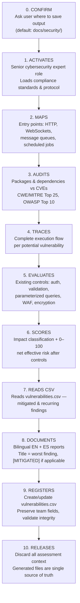

# 🛡️ SAR Cybersecurity

> **Automated Security Assessment Report (SAR) generator — deep cybersecurity analysis mapped to 20+ compliance standards.**

[](LICENSE)
[](../../CHANGELOG.md)
[](https://skills.sh/carrilloapps/skills/sar-cybersecurity)
[](https://github.com/carrilloapps/skills)
[](https://x.com/carrilloapps)

---

SAR Cybersecurity is an [agent skill](https://skills.sh) compatible with **40+ AI coding agents** — including GitHub Copilot, Claude Code, Cursor, Windsurf, Cline, Codex, Gemini CLI, OpenCode, Roo Code, and more — that transforms any AI agent into a senior cybersecurity expert capable of producing professional, bilingual Security Assessment Reports.

It is not a scanner. It is not a linter. It is a complete cybersecurity analysis engine that:

- **Analyzes step by step** — line-by-line, function-by-function, file-by-file code inspection
- **Traces full execution flows** — scores vulnerabilities based on net effective risk, not isolated code
- **Maps to 20+ standards** — ISO 27001, NIST, OWASP, PCI-DSS, GDPR, MITRE ATT&CK, and more
- **Covers all database engines** — SQL (PostgreSQL, MySQL), NoSQL (MongoDB, DynamoDB, Firestore), Redis, and more
- **Detects injection patterns** — SQL Injection, NoSQL Operator Injection, Regex/ReDoS, Mass Assignment, Field Injection, GraphQL abuse
- **Audits storage and data leakage** — S3/GCS/Azure Blob, secrets in source code, file uploads, logs, message queues, CDN caching, IaC misconfigurations
- **Audits dependencies and supply chain** — every package (direct and transitive), integrated skill, plugin, and MCP server is evaluated against known CVE databases, CWE/MITRE Top 25, OWASP Top 10 (A06, A08), and SANS/CIS Top 20 controls
- **Maps every finding to CWE IDs** — mandatory CWE/MITRE Top 25 cross-reference for all findings, not just dependency vulnerabilities
- **Quantitative Security Posture Dashboard** — every report includes coverage metrics (secure surface %, auth coverage %, input validation rate, parameterized query rate, dependency vulnerability rate, CWE Top 25 coverage, OWASP Top 10 alignment, compliance alignment) with raw counts — ready to use as OKRs
- **Produces bilingual reports** — EN (en_US) and ES (es_VE) cross-linked Markdown files
- **Respects read-only constraints** — writes only to the user-configured output directory (default: `docs/security/`), never modifies source code
- **Progressive context loading** — modular architecture with on-demand framework loading to prevent context window saturation

---

## Quick Install

```bash
npx skills add carrilloapps/skills@sar-cybersecurity
```

### All install options

| Command | Effect |
|---------|--------|
| `npx skills add carrilloapps/skills@sar-cybersecurity` | Install to all detected agents in current project |
| `npx skills add carrilloapps/skills@sar-cybersecurity -g` | Install globally (available in every project) |
| `npx skills add carrilloapps/skills@sar-cybersecurity -a github-copilot` | Install to a specific agent only |
| `npx skills add carrilloapps/skills@sar-cybersecurity -a claude-code -a cursor` | Install to multiple specific agents |
| `npx skills add carrilloapps/skills@sar-cybersecurity --all` | Install to all agents, skip confirmations |
| `npx skills add carrilloapps/skills@sar-cybersecurity -g -y` | Global install, non-interactive (CI-friendly) |

Target a specific agent:

```bash
npx skills add carrilloapps/skills@sar-cybersecurity -a github-copilot
npx skills add carrilloapps/skills@sar-cybersecurity -a claude-code
npx skills add carrilloapps/skills@sar-cybersecurity -a cursor
npx skills add carrilloapps/skills@sar-cybersecurity -a windsurf
```

### Keeping it up to date

```bash
# Check if a newer version is available
npx skills check

# Update to the latest version
npx skills update
```

> See [skills.sh/carrilloapps/skills/sar-cybersecurity](https://skills.sh/carrilloapps/skills/sar-cybersecurity) for the canonical install command and latest release.

### Where files are installed

| Scope | Path |
|-------|------|
| Project (default) | `./<agent>/skills/sar-cybersecurity/SKILL.md` |
| Global (`-g`) | `~/<agent>/skills/sar-cybersecurity/SKILL.md` |

By default the CLI creates a **symlink** from each agent directory to a single canonical copy — one source of truth, easy to update. Use `--copy` if your environment does not support symlinks.

### CLI Reference — all commands

| Command | Description |
|---------|-------------|
| `npx skills add carrilloapps/skills@sar-cybersecurity` | Install to all detected agents (current project) |
| `npx skills add carrilloapps/skills@sar-cybersecurity -g` | Install globally (all projects) |
| `npx skills add carrilloapps/skills@sar-cybersecurity -a <agent>` | Install to a specific agent |
| `npx skills add carrilloapps/skills@sar-cybersecurity --all` | Install to all agents, skip prompts |
| `npx skills add carrilloapps/skills@sar-cybersecurity -g -y` | Global + non-interactive (CI-friendly) |
| `npx skills add carrilloapps/skills@sar-cybersecurity --copy` | Copy files instead of symlink |
| `npx skills list` | List all installed skills in current project |
| `npx skills list -g` | List globally installed skills |
| `npx skills find sar-cybersecurity` | Search the skills.sh directory |
| `npx skills check` | Check if a newer version is available |
| `npx skills update` | Update all installed skills to latest |
| `npx skills remove sar-cybersecurity` | Remove the skill from current project |
| `npx skills remove sar-cybersecurity -g` | Remove from global scope |
| `npx skills remove sar-cybersecurity -a <agent>` | Remove from a specific agent only |

---

## Compatible Agents

Works with every agent supported by the [skills.sh](https://skills.sh) ecosystem:

| Agent | `--agent` flag |
|-------|---------------|
| GitHub Copilot | `github-copilot` |
| Claude Code | `claude-code` |
| Cursor | `cursor` |
| Windsurf | `windsurf` |
| Cline | `cline` |
| OpenAI Codex | `codex` |
| Gemini CLI | `gemini-cli` |
| OpenCode | `opencode` |
| Roo Code | `roo` |
| Goose | `goose` |
| Continue | `continue` |
| Amp / Kimi CLI / Replit | `amp` |
| Antigravity | `antigravity` |
| Augment | `augment` |
| Droid | `droid` |
| Kilo Code | `kilo` |
| Kiro CLI | `kiro-cli` |
| OpenHands | `openhands` |
| Trae / Trae CN | `trae` |
| Zencoder | `zencoder` |
| + 20 more | `npx skills add --list` |

---

## What It Does

When you ask for a security analysis, vulnerability assessment, or SAR, the skill:



### Progressive Context Loading

The skill uses a modular architecture to prevent AI context window saturation:

- **SKILL.md** (~115 lines) — always loaded: core rules, constraints, analysis protocol, Index
- **Protocol files** (free) — `output-format.md`, `scoring-system.md`, `dependency-supply-chain.md` — loaded automatically for every assessment
- **Domain frameworks** — `compliance-standards.md`, `database-access-protocol.md`, `injection-patterns.md`, `storage-exfiltration.md` — loaded on demand based on assessment scope; all 4 are available with no artificial cap
- **Examples** (10 canonical edge cases) — loaded on demand as reference outputs for correct scoring, tracing, and formatting

All files are cross-referenced with internal Markdown links from the Index section in SKILL.md.

### Trigger Phrases

The skill activates automatically on any of these patterns:

- "audit my code" / "run a security check"
- "generate a SAR" / "security assessment"
- "check for vulnerabilities" / "find security issues"
- "is this code secure?" / "security review"
- Uploading source code, config files, or architecture diagrams with a security question

### Output

Every assessment produces **exactly two linked Markdown files** plus an **updated CSV index**, saved to the output directory confirmed with the user before analysis begins (default: `docs/security/`):

```
<output-dir>/[DD-MM-YYYY]_[SHORT-TITLE]_EN.md   ← English (en_US)
<output-dir>/[DD-MM-YYYY]_[SHORT-TITLE]_ES.md   ← Spanish (es_VE)
<output-dir>/vulnerabilities.csv                 ← Living registry of all findings
```

The `[SHORT-TITLE]` is derived from the **worst (highest-scoring) vulnerability** found. For example, a SAR where the top finding is a SQL Injection on `/api/users` (score 92) produces:

```
<output-dir>/12-03-2026_SQLI-API-USERS_EN.md
<output-dir>/12-03-2026_SQLI-API-USERS_ES.md
```

Each file contains:

```markdown
# [Report Title] — [LANG]
> 🌐 Also available in: [link to counterpart]
## Table of Contents
## Executive Summary
## Scope & Methodology
## Findings (ordered 100 → 51, then warnings 50 → 1)
### [SCORE] — [Finding Title]
  - Description
  - Affected Component(s)
  - Evidence / Code Reference
  - Standards Violated
  - MITRE ATT&CK Technique (if applicable)
  - Score Justification (exploitation complexity, impact scope, data sensitivity factors)
  - Suggested Mitigation Actions
## Mitigated Findings  (from vulnerabilities.csv, if any have Status: Mitigated)
### [MITIGATED] — [ID] [Title] (was: [Score] [Label])
## Risk Matrix
## Compliance Gap Summary
## Appendix
```

---

## Vulnerabilities Registry

Every SAR generation creates or updates `vulnerabilities.csv` in the output directory — a persistent CSV (11 columns) that tracks **every finding ever reported** across all assessments:

```csv
ID,Type,Score,Label,Title,Detection Date,Mitigation Date,Status,Assignee,Priority,Existing Mitigation
F01,Finding,92,Critical,SQL Injection in /api/users endpoint,2026-03-12,,Pending,,P0 - Immediate,No
F02,Finding,85,High,express@4.17.1 CVE-2024-12345 (XSS),2026-03-12,,Pending,,P1 - Urgent,Helmet only
W01,Warning,45,Low,Missing rate limiting on public API,2026-03-12,,Pending,,P3 - Scheduled,No
```

**Key rules**:
- `F01, F02...` for Findings (score > 50), `W01, W02...` for Warnings (score <= 50)
- Sorted by status group (open findings, open warnings, mitigated), then by Score descending within each group
- Agent writes new entries with `Status: Pending` — never overwrites team-managed fields (`Mitigation Date`, `Assignee`, `Status` if not `Pending`)
- `Existing Mitigation` reflects controls **already in the code**, not suggested remediation
- Rows are **never deleted** — IDs are permanent
- Status lifecycle (team-managed): `Pending` → `In Development` → `Processing` → `In QA` → `In Staging` → `Mitigated`
- Findings with `Status: Mitigated` appear in the SAR under a `## Mitigated Findings` section with `[MITIGATED]` label

---

## Criticality Scoring

| Score | Label | Action Required |
|-------|-------|-----------------|
| 90–100 | Critical | Immediate remediation |
| 70–89 | High | Urgent remediation |
| 50–69 | Medium | Planned remediation |
| 25–49 | Low/Warning | Monitor and log |
| 1–24 | Informational | Optional improvement |
| 0 | None | No action needed |

**Key scoring rules:**
- Vulnerability unreachable via any public-facing surface → **capped at 40**
- Vulnerability mitigated by upstream validation/guard/middleware → **downgraded to 25–49** (warning)
- Only findings **> 50** appear as primary content; items 1–50 appear as warnings/informational notes
- **Multi-factor scoring**: every reachable, unmitigated finding is scored using three dimensions — Exploitation Complexity (auth, keys, chaining), Impact Scope (single record vs. enumeration), and Data Sensitivity (public data vs. PII vs. credentials)
- **Mandatory score justification**: every finding must list the specific factors that raised or lowered its score
- **Differentiated scoring**: two findings of the same vulnerability type with different prerequisites/impact **must** receive different scores
- **Confidentiality primacy**: data exfiltration findings (unauthorized data extraction) always score higher than availability-only findings (DoS/service disruption with no data exposure). Availability-only findings **cap at 49** and are delegated to performance/infrastructure tooling
- **Impact classification**: every finding is classified as data exfiltration, integrity violation, dual-vector, or availability-only before scoring

---

## Security Posture Dashboard

Every SAR includes a **quantitative Security Posture Dashboard** with measurable metrics that serve as OKRs for the assessed system:

| Metric | What it measures |
|--------|-----------------|
| **Assessment Coverage** | Endpoints/components analyzed vs. total discovered |
| **Secure Surface** | Endpoints with no findings above 50 (primary threshold) |
| **Critical / High / Medium Exposure** | Percentage of surface at each severity level |
| **Auth Coverage** | Endpoints with authentication enforced |
| **Input Validation Coverage** | Endpoints with input validation vs. endpoints accepting user input |
| **Parameterized Query Rate** | DB queries using parameterized statements vs. total DB queries |
| **Secrets Hygiene** | Secrets in a secrets manager vs. total secrets discovered |
| **Encryption Coverage** | Data stores with encryption at rest vs. total data stores |
| **Compliance Alignment** | Standards with zero critical gaps vs. total applicable standards |
| **Mean Finding Score** | Average score across all primary findings (> 50) |
| **Remediation Priority Index** | Critical + High findings as percentage of total primary findings |
| **CWE/MITRE Top 25 Coverage** | CWE Top 25 categories with zero findings vs. 25 total |
| **OWASP Top 10 Alignment** | OWASP Top 10 categories with zero critical gaps vs. 10 total |

All metrics show both percentage and raw count (e.g., `62% (30/48)`) and include a rating symbol (good, needs improvement, critical). Conditional metrics (cloud storage, CORS, rate limiting, logging, dependencies, RBAC) are included when the assessment scope covers them.

---

## Compliance Standards Coverage

Every finding is mapped to all applicable standards from a baseline of **22+ frameworks**:

| Standard | Domain |
|----------|--------|
| ISO/IEC 27001 | ISMS establishment, implementation, certification |
| ISO/IEC 27002 | Security controls catalog and best practices |
| NIST CSF | Identify · Protect · Detect · Respond · Recover |
| NIST SP 800-53 | Comprehensive security & privacy controls |
| CIS Controls | Prioritized defensive actions (formerly SANS Top 20) |
| COBIT | IT governance aligned with business objectives |
| OWASP Top 10 | Critical web & API security risks |
| SOC 2 | Trust Services Criteria (security, availability, integrity, confidentiality, privacy) |
| ISO/IEC 27017 | Cloud-specific information security controls |
| CSA STAR | Cloud provider security posture assessment |
| FedRAMP | US government cloud authorization |
| PCI-DSS | Payment card data protection |
| HIPAA | Healthcare data confidentiality and integrity |
| SOX | Financial IT controls and electronic records integrity |
| ISA/IEC 62443 | OT/ICS cybersecurity for critical infrastructure |
| GDPR | EU personal data privacy and security by design |
| ISO/IEC 27701 | Privacy Information Management System (PIMS) |
| FIPS 140-3 | Cryptographic module security validation |
| MITRE ATT&CK | Threat modeling via real-world adversary techniques |
| NIST SP 800-171 | Protecting Controlled Unclassified Information (CUI) |
| CWE/MITRE Top 25 | Most dangerous software weaknesses — mandatory CWE mapping for every finding |


These are the **minimum baseline** — the agent applies additional standards as expert judgment dictates.

---

## Operating Constraints

| Constraint | Rule |
|------------|------|
| Write outside the output directory | Never |
| Modify source code, configs, env files | Never |
| Commit, push, or deploy | Never |
| Score before tracing full flow | Never |
| Duplicate documented content | Never — use internal anchor links |
| DB query without index check | Never |
| DB query result set | Maximum 50 rows |
| Technical names in target language | Never — always keep in original English |
| Skip dependency/package audit | Never — all packages and skills must be evaluated |
| Finding without CWE identifier | Never — every finding must map to CWE ID(s) |
| Skip integrated skills evaluation | Never — all skills/plugins must pass permission and provenance checks |
| SAR title from worst finding | Always — filename and heading reflect the #1 finding |
| Update `vulnerabilities.csv` after every SAR | Always — add new with `Pending`, update recurring scores |
| Overwrite team-managed CSV fields | Never — `Mitigation Date`, `Assignee`, `Status` (if not `Pending`) are team-owned |
| Show mitigated findings in SAR | Always — `[MITIGATED]` section when CSV has mitigated entries |
| Delete rows from `vulnerabilities.csv` | Never — rows are permanent, IDs are never reassigned |
| Retain assessment context after completion | Never — discard context, read from generated files if needed |
| Generate both EN + ES files | Always (unless user requests single-language), cross-linked |

---

## Analysis Protocol

0. **Confirm Output Directory** — Ask the user where to save SAR files and the vulnerabilities registry. Default: `docs/security/`. Accept any path — including MCP-accessible locations or paths outside the project root. Use default if the user does not respond or the context is automated.
1. **Map Entry Points** — HTTP endpoints, WebSockets, message queues, scheduled jobs, public API surface
2. **Audit Dependencies & Supply Chain** — Inventory all packages (direct + transitive), audit against NVD/GitHub Advisories/OSV, evaluate integrated skills/plugins for permissions and provenance, map to CWE/MITRE Top 25, OWASP Top 10 (A06, A08), and SANS/CIS Controls (2, 7, 16)
3. **Trace Execution Flows** — Complete call chain from entry point before scoring
4. **Evaluate Existing Controls** — Auth middleware, input validation, parameterized queries, WAF, encryption — **plus** exploitation prerequisites: authentication, API keys, rate limits, network exposure, chaining requirements
5. **Score and Document** — Classify impact type (data exfiltration, integrity, dual-vector, availability-only), apply multi-factor net effective risk (exploitation complexity + impact scope + data sensitivity), mandatory score justification with impact classification, CWE ID(s), standards mapping, MITRE ATT&CK technique, actionable mitigation
6. **Read Vulnerabilities Registry** — Read existing `vulnerabilities.csv` in the output directory to identify mitigated and recurring findings before writing the report
7. **Write Output Files** — Bilingual EN + ES, cross-linked, zero redundancy. Title derived from worst finding. Include `[MITIGATED]` section if applicable. Save to the output directory confirmed in Step 0.
8. **Update Vulnerabilities Registry** — Create or update `vulnerabilities.csv` in the output directory with all findings. Add new with `Pending`, update recurring scores, preserve team-managed fields. Validate CSV integrity after writing.
9. **Release Context** — Discard all assessment context from the conversation. Generated files in the output directory are the single source of truth. If follow-up is needed, read from the output directory.

---

## Edge Cases

The skill handles these canonical scenarios correctly:

### Unreachable Vulnerable Function
A raw SQL query exists but is never called by any endpoint → **Score ≤ 40** (Low/Warning). Recommend parameterized queries and dead code removal.

### Effective Inline Validation Without Formal Structure
No Pipe, Guard, or Schema exists, but inline logic prevents unauthorized access → **Score 25–49** (Warning). Recommend formalizing into a testable, auditable validation component.

### Apparently Insecure System
A route appears to lack authentication → **Trace the full lifecycle** (reverse proxy, API gateway, WAF, middleware chain) before scoring. Score based on net effective security posture, not isolated code.

### NoSQL Operator Injection
Unvalidated request body passed directly to database query methods — attacker sends an operator object instead of a scalar to bypass authentication filters and extract all records → **Score 85–95** (Critical) if no input sanitization middleware or strict schema validation exists. Trace all middleware and schema configuration before scoring.

### Regex Injection / ReDoS
Unsanitized user input passed to regex constructor without escaping metacharacters — if the attacker can use wildcard or pattern manipulation to **enumerate data**, score as a primary finding (**72–90**). If the only exploitable vector is catastrophic backtracking (nested-quantifier patterns) causing CPU exhaustion with **no data exposure**, cap at **49** (availability-only). Typically systemic — count all occurrences. Recommend centralized safe regex utility.

### Mass Assignment via Unfiltered Body
Database update method receives unfiltered request body without field allowlist → **Score 75–90** (High–Critical) depending on sensitive fields exposed (privilege, admin status, financial data). Recommend field-picking utility.

### Public Cloud Storage Bucket
Cloud storage bucket with public-read ACL or wildcard-principal policy containing sensitive data → **Score 90–100** (Critical). Activate public-access-block settings, enforce encryption, enable access logging.

### Secrets in Source Control
Environment files, API keys, or credentials committed to version control → **Score 85–95** (Critical) even in current HEAD. Historically committed secrets score 60–75 (Medium–High). Rotate immediately, purge history, adopt a secrets management service.

### Vulnerable Dependency with Critical CVE
Direct dependency with a Critical CVE (CVSS >= 9.0) whose vulnerable function is called by the application → **Score 85–95** (Critical). If the vulnerable function is never called (unreachable), cap at ≤ 40 per the unreachable rule. Recommend immediate upgrade to patched version.

### Integrated Skill with Excessive Permissions
An integrated skill/plugin requests write access to files, reads secrets, or makes undocumented network calls beyond its stated purpose → **Score 60–80** (Medium–High). Recommend permission restriction, provenance verification, and version pinning.

### Missing Lock File or Unpinned Dependencies
No lock file committed to version control, or production dependencies use broad version ranges (`^`, `~`, `*`) → **Score 55–70** (Medium). Non-reproducible builds enable automatic introduction of compromised versions. Recommend exact pinning and lock file commitment.

---

## Database Access Protocol

When DB access is available:
1. **Verify indexes first** before any query (SQL: `pg_indexes` / `SHOW INDEX`; MongoDB: `getIndexes()` + `explain()`; DynamoDB: `describe-table`)
2. **Build optimized queries** using available indexes with bounded result sets
3. **Extract minimum data** — never dump full tables or collections (max 50 rows/documents)
4. **Redis**: never `KEYS *` — use `SCAN` with cursor and `COUNT` limit

Missing indexes on tables/collections reachable via user-controlled paths are documented as a DoS vector finding.

---

## Injection Pattern Coverage

The skill actively scans for all injection families across all database engines:

| Category | Examples | Engines |
|----------|----------|---------|
| SQL Injection | String concatenation, template literals, `.rawQuery()` | PostgreSQL, MySQL, SQLite, SQL Server |
| NoSQL Operator Injection | Operator objects in query filters, unvalidated request body as query, field name injection | MongoDB, Couchbase, Firestore |
| Regex Injection / ReDoS | Unescaped user input in regex constructor, regex-based database queries, catastrophic backtracking | All engines |
| Mass Assignment | Unfiltered request body passed to database update/create methods | All ORMs/ODMs |
| GraphQL Abuse | Introspection in production, unbounded depth, batch abuse, resolver injection | GraphQL APIs |
| ORM/ODM-Specific | Mongoose `strict: false`, Sequelize `literal()`, Prisma `$queryRaw()`, Knex `.raw()` | Per-framework |

---

## Dependency & Supply Chain Security

Every assessment includes mandatory evaluation of the full dependency and supply chain:

| Category | What is checked |
|----------|-----------------|
| Direct dependencies | Version audit, CVE lookup (NVD, GitHub Advisories, OSV), CVSS scoring, fix availability |
| Transitive dependencies | Same audit as direct — transitive CVEs are equally exploitable |
| Integrated skills/plugins | Permission scope, data access, write capability, provenance, version pinning |
| Version pinning | Exact versions vs. ranges, lock file presence and integrity |
| Supply chain attacks | Dependency confusion, typosquatting, maintainer trust, provenance attestation |
| Container images | Known CVEs, SHA pinning vs. tag mutability |
| CI/CD dependencies | Action/step pinning, permissions granted |

All findings are mapped to:
- **CWE/MITRE Top 25** — mandatory CWE ID(s) for every finding
- **OWASP Top 10** — A06 (Vulnerable and Outdated Components), A08 (Software and Data Integrity Failures)
- **SANS/CIS Top 20** — CIS Controls 2, 7, 16, 18

---

## Storage and Data Exfiltration Coverage

Beyond databases and injection, the skill audits all data storage layers:

| Category | What is checked |
|----------|-----------------|
| Cloud Object Storage | S3, GCS, Azure Blob, MinIO, R2 — public access, bucket policies, encryption, CORS, pre-signed URLs, access logging |
| Secrets & Env Variables | Hardcoded secrets in source, `.env` in git, secrets in Docker layers, CI/CD log leakage, secrets manager usage |
| File Uploads | MIME validation, path traversal, same-origin XSS, size limits, malware scanning, predictable URLs |
| Logging & Observability | PII in logs, secrets in logs, public log files, stack traces in responses, missing audit trails |
| Message Queues | SQS, SNS, Kafka, RabbitMQ — PII in payloads, permissive policies, DLQ monitoring, replay attacks |
| CDN & Caching | Sensitive data caching, missing `Vary` headers, origin bypass, stale security headers |
| Infrastructure as Code | Secrets in templates, overly permissive IAM, open security groups, unencrypted resources, public subnets |

---

## Tool Usage

| Tool / Feature | SAR Usage |
|----------------|-----------|
| MCP Servers | Access repositories, CI/CD configs, cloud infrastructure definitions |
| Skills | Specialized analysis modules (dependency trees, config parsing) |
| Sub-Agents | Delegate parallel analysis (e.g., one agent per microservice) |
| ai-context | Maintain full codebase context across large multi-file sessions |
| Web Search | Look up CVEs, NVD, MITRE CVE database, patch advisories |
| Code Analysis | Step-by-step, line-by-line, function-by-function, file-by-file inspection |
| Doc Verification | Read all READMEs, API specs, architecture docs, and compliance documents |

---

## Skill Structure

```
skills/sar-cybersecurity/
├── SKILL.md                              # Core skill definition (always loaded)
├── README.md                             # This documentation
├── metadata.json                         # Skill metadata for skills.sh
├── frameworks/                           # On-demand analysis frameworks
│   ├── output-format.md                  # [Protocol] SAR output specification
│   ├── scoring-system.md                 # [Protocol] Criticality scoring (0–100)
│   ├── compliance-standards.md           # [Domain] 20 baseline standards + expanded reference
│   ├── database-access-protocol.md       # [Domain] SQL, NoSQL, Redis inspection protocol
│   ├── injection-patterns.md             # [Domain] 6 injection families across all engines
│   ├── storage-exfiltration.md           # [Domain] 7 storage/exfiltration categories
│   └── dependency-supply-chain.md       # [Protocol] CWE/MITRE Top 25, OWASP Top 10, SANS/CIS Top 20, supply chain
├── examples/                             # Reference SAR outputs (load on demand)
    ├── unreachable-vulnerability.md      # Case A — Dead code, score ≤ 40
    ├── runtime-validation.md             # Case B — Inline validation, score 25–49
    ├── full-flow-evaluation.md           # Case C — Infrastructure-layer auth
    ├── nosql-operator-injection.md       # Case D — NoSQL operator injection, score 92
    ├── regex-redos-injection.md          # Case E — Regex data enumeration (82) + ReDoS secondary
    ├── mass-assignment.md                # Case F — IDOR + privilege escalation, score 88
    ├── public-cloud-bucket.md            # Case G — Public S3 with PII, score 97
    ├── secrets-in-source-control.md      # Case H — 12 secrets in git, score 93
    ├── sql-injection-comparison.md       # Case I — Same vuln type, different scores (92 vs 55)
    └── recurring-assessment.md          # Case J — Second SAR, mitigated finding, CSV update flow
# Output directory (user-configured in Step 0, default: docs/security/):
# <output-dir>/
# ├── vulnerabilities.csv                # Persistent registry (11 columns, sorted by status group then Score desc)
# ├── [DD-MM-YYYY]_[WORST-VULN]_EN.md   # SAR report (English)
# └── [DD-MM-YYYY]_[WORST-VULN]_ES.md   # SAR report (Spanish)
```

---

## Companion Skills

| Skill | Relationship |
|-------|-------------|
| [🔴 **devils-advocate**](../devils-advocate/) | Run Devil's Advocate first as an adversarial gate, then use SAR Cybersecurity for deep security-specific analysis |
| 🔜 **postmortem-writing** | After an incident, use Postmortem Writing to document root cause analysis and feed lessons learned back into future SAR assessments |

---

## Contributing

Contributions are welcome! See [CONTRIBUTING.md](https://github.com/carrilloapps/skills/blob/main/.github/CONTRIBUTING.md) for:

- How to propose new compliance standard mappings or edge case scenarios
- Quality standards and PR process

Please read [CODE_OF_CONDUCT.md](https://github.com/carrilloapps/skills/blob/main/.github/CODE_OF_CONDUCT.md) before contributing.

---

## Security

For vulnerability reports (harmful, misleading, or exploitable guidance), see [SECURITY.md](https://github.com/carrilloapps/skills/blob/main/.github/SECURITY.md). Do not open a public issue for security concerns.

---

## License

[MIT](LICENSE) — free to use, modify, and distribute. Attribution appreciated.

---

## Changelog

See [CHANGELOG.md](../../CHANGELOG.md) for the full version history.

---

*Built for people who take security seriously — before shipping, not after the breach.*

---

## Author

**José Carrillo** — [carrillo.app](https://carrillo.app)

[](https://carrillo.app)
[](https://github.com/carrilloapps)
[](https://x.com/carrilloapps)
[](https://linkedin.com/in/carrilloapps)
[](mailto:m@carrillo.app)
