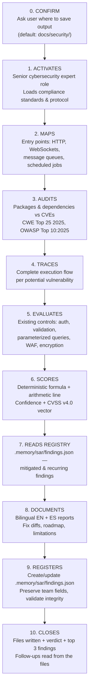

# 🛡️ SAR Cybersecurity

> **Automated Security Assessment Report (SAR) generator — deep cybersecurity analysis mapped to 21 baseline compliance standards.**

[](../../LICENSE)
[](../../CHANGELOG.md)
[](https://skills.sh/carrilloapps/skills/sar-cybersecurity)
[](https://github.com/carrilloapps/skills)
[](https://x.com/carrilloapps)

---

SAR Cybersecurity is an [agent skill](https://skills.sh) compatible with **70+ AI coding agents** — including GitHub Copilot, Claude Code, Cursor, Windsurf, Cline, Codex, Gemini CLI, OpenCode, Roo Code, and more — that transforms any AI agent into a senior cybersecurity expert capable of producing professional, bilingual Security Assessment Reports.

It is not a scanner. It is not a linter. It is a complete cybersecurity analysis engine that:

- **Analyzes step by step** — line-by-line, function-by-function, file-by-file code inspection
- **Traces full execution flows** — scores vulnerabilities based on net effective risk, not isolated code
- **Deterministic, auditable scoring** — every score shows its arithmetic line (`Base 80 +5 (enumeration) +5 (PII) = 90 → Final 90`); two auditors get the same number. Each primary finding also carries a CVSS v4.0 vector for interoperability
- **Fix-ready findings** — every finding includes Confidence (Confirmed / Probable / Possible), a non-weaponized attack scenario, a before/after fix diff, how to verify the fix, and effort (S/M/L)
- **Remediation roadmap and attack chains** — findings ordered into this week / this sprint / this quarter; combined attack paths show the cheapest link to break
- **Honest limits** — mandatory Out of Scope & Limitations section; unmeasured metrics are `N/A`, never estimated
- **Maps to 21 baseline standards** (plus an expanded reference) — ISO/IEC 27001:2022, NIST CSF 2.0, OWASP Top 10:2025, PCI-DSS, GDPR, MITRE ATT&CK, CWE Top 25, and more
- **Covers all database engines statically** — SQL (PostgreSQL, MySQL), NoSQL (MongoDB, DynamoDB, Firestore), Redis, and more — from schemas, migrations, grants, and query code; never by connecting to a live database
- **Detects injection patterns** — SQL Injection, NoSQL Operator Injection, Regex/ReDoS, Mass Assignment, Field Injection, GraphQL abuse
- **Audits storage and data leakage** — S3/GCS/Azure Blob, secrets in source code, file uploads, logs, message queues, CDN caching, IaC misconfigurations
- **Audits dependencies and supply chain** — every package, integrated skill, plugin, and MCP server; CVEs are reported only when verified during the assessment against official advisory sources (never from memory), mapped to the 2025 CWE Top 25, OWASP Top 10:2025 (A03, A08), and CIS Controls v8.1
- **Maps every finding to CWE IDs** and to **current-edition** control IDs (ISO/IEC 27001:2022, NIST CSF 2.0, OWASP Top 10:2025)
- **Measured Security Posture Dashboard** — coverage metrics (secure surface, auth coverage, input validation, parameterized queries, secrets hygiene, dependency vulnerability rate) with raw counts — only what was actually counted
- **Optional SARIF 2.1.0 export** — on request, a `.sarif.json` report file for code-scanning tools
- **Produces bilingual reports** — EN (en_US) and ES (es_VE) cross-linked Markdown files
- **Respects read-only constraints** — writes only to the user-configured output directory (default: `docs/security/`), never modifies source code
- **Progressive context loading** — modular architecture with on-demand framework loading to prevent context window saturation

---

## Quick Install

> **Before installing**: review the source at [github.com/carrilloapps/skills](https://github.com/carrilloapps/skills) and the latest audit results at [skills.sh/audits](https://skills.sh/audits).

```bash
npx skills add carrilloapps/skills@sar-cybersecurity                          # agents detected in this project
npx skills add carrilloapps/skills@sar-cybersecurity -a antigravity -a cursor # specific agents
npx skills add carrilloapps/skills@sar-cybersecurity -a '*'                   # every supported agent
npx skills add carrilloapps/skills@sar-cybersecurity -g                       # global (all projects)
```

Update with `npx skills update`; remove with `npx skills remove sar-cybersecurity`.

Works with **70+ agents** — Claude Code, Antigravity (IDE and `agy` CLI), GitHub Copilot, Cursor, Codex, Gemini CLI, Windsurf / Devin Desktop, Cline, Roo Code, OpenCode, Kiro, and more. Per-agent `-a` ids, project and global paths, always-on instruction files, manual install, and optional guards: **[`docs/INSTALL.md`](../../docs/INSTALL.md)**.

---

## What It Does

When you ask for a security analysis, vulnerability assessment, or SAR, the skill:


```mermaid
flowchart TD
    A["0. CONFIRM\nAsk user where to save output\n(default: docs/security/)"] --> B
    B["1. ACTIVATES\nSenior cybersecurity expert role\nLoads compliance standards & protocol"] --> C
    C["2. MAPS\nEntry points: HTTP, WebSockets,\nmessage queues, scheduled jobs"] --> D
    D["3. AUDITS\nPackages & dependencies vs CVEs\nCWE Top 25 2025, OWASP Top 10:2025"] --> E
    E["4. TRACES\nComplete execution flow\nper potential vulnerability"] --> F
    F["5. EVALUATES\nExisting controls: auth, validation,\nparameterized queries, WAF, encryption"] --> G
    G["6. SCORES\nDeterministic formula + arithmetic line\nConfidence + CVSS v4.0 vector"] --> H
    H["7. READS REGISTRY\n.memory/sar/findings.json —\nmitigated & recurring findings"] --> I
    I["8. DOCUMENTS\nBilingual EN + ES reports\nFix diffs, roadmap, limitations"] --> J
    J["9. REGISTERS\nCreate/update .memory/sar/findings.json\nPreserve team fields, validate integrity"] --> K
    K["10. CLOSES\nFiles written + verdict + top 3 findings\nFollow-ups read from the files"]
```

### Progressive Context Loading

The skill uses a modular architecture to prevent AI context window saturation:

- **SKILL.md** (~200 lines) — always loaded: core rules, constraints, analysis protocol, Index
- **Protocol files** (free) — `output-format.md`, `scoring-system.md`, `dependency-supply-chain.md` — loaded automatically for every assessment
- **Domain frameworks** — `compliance-standards.md`, `database-access-protocol.md`, `injection-patterns.md`, `storage-exfiltration.md` — loaded on demand based on assessment scope; all 4 are available with no artificial cap
- **Examples** (11 reference cases) — loaded on demand as reference outputs for correct scoring, tracing, and formatting

All files are cross-referenced with internal Markdown links from the Index section in SKILL.md.

### Trigger Phrases

The skill activates automatically on any of these patterns:

- "audit my code" / "run a security check"
- "generate a SAR" / "security assessment"
- "check for vulnerabilities" / "find security issues"
- "is this code secure?" / "security review"
- Uploading source code, config files, or architecture diagrams with a security question

### Output

Every assessment produces **two linked Markdown files** by default (one on request) in the output directory confirmed with the user before analysis begins — default `docs/security/` for a private repository, `.memory/local/sar/reports/` for a public one — and updates the **findings registry** at the project root:

```text
<output-dir>/[YYYY-MM-DD]_[SHORT-TITLE]_EN.md   ← English (en_US)
<output-dir>/[YYYY-MM-DD]_[SHORT-TITLE]_ES.md   ← Spanish (es_VE)
.memory/sar/findings.json                        ← Team registry (versioned) — private repositories
.memory/local/sar/findings.json                  ← Registry for public repositories (never versioned)
.memory/.gitignore                               ← Versioned; ignores agent-private paths only
```

The `[SHORT-TITLE]` is derived from the **worst (highest-scoring) vulnerability** found. For example, a SAR where the top finding is a SQL Injection on `/api/users` (score 90) produces:

```text
<output-dir>/2026-03-12_SQLI-API-USERS_EN.md
<output-dir>/2026-03-12_SQLI-API-USERS_ES.md
```

Each file contains:

```markdown
# [Report Title] — [LANG]
> 🌐 Also available in: [link to counterpart]
## Table of Contents
## Executive Summary              (≤ 5 lines, plain language, verdict first)
## Scope & Methodology
## Out of Scope & Limitations     (mandatory)
## Data Flow & Trust Boundaries   (optional Mermaid)
## Findings (ordered 100 → 51, then warnings 50 → 1)
### [SCORE] — [Finding Title]
  | Registry ID | Score | Confidence | Impact | CVSS v4.0 | CWE | ATT&CK | Effort | Affected |
  - Description · Evidence / Trace · Attack Scenario (non-weaponized)
  - Score Justification (arithmetic line)
  - Standards Violated · Fix (diff) · How to Verify the Fix
## Attack Chains                  (if applicable)
## Remediation Roadmap            (this week / this sprint / this quarter)
## Mitigated Findings             (from .memory/sar/findings.json, if any)
## Registry Snapshot              (registry state at assessment time)
## Dependency & Supply Chain Analysis
## Security Posture Dashboard     (measured metrics only)
## Compliance Gap Summary
## Appendix
```

---

## Findings Registry

Every SAR generation creates or updates the findings registry at the project root — a JSON file that tracks **every finding ever reported** across assessments.

| Repository | Registry | Versioned? |
|------------|----------|------------|
| Private (you answer "private" in Step 0) | `.memory/sar/findings.json` | **Yes** — the team edits `status`, `assignee`, `mitigationDate` and commits them |
| Public, will be public, or unanswered (automated run) | `.memory/local/sar/findings.json` + reports in `.memory/local/sar/reports/` | **No** — committing them would publish unfixed, exploitable vulnerabilities |

**`.memory/` convention (shared by every skill in this collection):** team state in `.memory/<skill>/` is versioned; agent-private state (`.memory/local/`, `*.local.*`, `*.recovered.json`) is never versioned. Before the first write, the skill adds the ignore entries for every detected version control system — file writes only, never VCS commands, never removing your own lines:

| VCS | What the skill does |
|-----|---------------------|
| Git (and Git-compatible tools such as Jujutsu) | Ensures `.memory/.gitignore` (versioned) contains `local/`, `*.local.*`, `*.recovered.json` — your root `.gitignore` is not touched |
| Mercurial | Adds `^\.memory/local/`, `^\.memory/.*\.local\.`, `^\.memory/.*\.recovered\.json$` to `.hgignore` (regexp syntax) |
| Fossil | Adds `.memory/local/*`, `.memory/*.local.*`, `.memory/*.recovered.json` to `.fossil-settings/ignore-glob` |
| Subversion / other | Tells you the command to run (e.g., `svn propset svn:ignore local .memory`) — the skill never runs it |

If a private path was already committed, ignore rules do not untrack it — the skill warns you; untracking is up to you.

Every report also carries a **Registry Snapshot** table (ID, title, score, status, assignee, mitigation date), so the state is readable from the report alone. On a machine without a registry (e.g., public mode), the skill seeds it from the latest report's snapshot.

Registry entry format:

```json
{
  "schemaVersion": 1,
  "findings": [
    {
      "id": "F01", "type": "Finding", "score": 90, "label": "Critical",
      "title": "SQL Injection on public user search",
      "cwe": ["CWE-89"], "component": "src/search/search.service.ts",
      "detectionDate": "2026-03-12", "mitigationDate": null,
      "status": "Pending", "assignee": null,
      "priority": "P0 - Immediate", "existingMitigation": "No",
      "lastSeenSar": "2026-03-12_SQLI-API-USERS"
    }
  ]
}
```

**Key rules**:

- `F01, F02...` for Findings (score > 50), `W01, W02...` for Warnings (score ≤ 50)
- Sorted by status group (open findings, open warnings, mitigated), then by score descending within each group
- Agent writes new entries with `status: "Pending"` — never overwrites team-managed fields (`status`, `assignee`, `mitigationDate`)
- Recurring findings are matched by **primary CWE** + `component` (the file containing the vulnerable call)
- `existingMitigation` reflects controls **already in the code**, not suggested remediation
- Entries are **never deleted** — IDs are permanent
- Status lifecycle (team-managed): `Pending` → `In Development` → `Processing` → `In QA` → `In Staging` → `Mitigated`
- Findings with `status: "Mitigated"` appear in the SAR under a `## Mitigated Findings` section with `[MITIGATED]` label
- Written as plain JSON with the agent's file-write capability — no scripts, no database
- A 1.x `vulnerabilities.csv` is imported once and left untouched

---

## Criticality Scoring

| Score | Label | Action Required |
|-------|-------|-----------------|
| 90–100 | Critical | Immediate remediation |
| 70–89 | High | Urgent remediation |
| 51–69 | Medium | Planned remediation |
| 1–50 | Low (Warning) | Monitor; fix when convenient |

**Key scoring rules:**

- **Formula**: `Final = Base + Exploitation (D1) + Impact (D2, cap +10) + Data sensitivity (D3)`, clamped 0–100, floor 51 for reachable confirmed findings, caps applied last — every adjustment is a fixed value
- Unreachable → **fixed 35** (dead code) or **40** (disabled path)
- Fully mitigated → **fixed 30** (formal control) or **40** (inline control)
- Confidence **Possible** (pattern match only) → **capped at 49** until confirmed
- Only findings **> 50** appear as primary content; items 1–50 are warnings (Low)
- **Base class by sink**: the base is chosen by what the vulnerable code does (e.g., data-store query = 80), not by the consequence — consequences go through the impact adjustments
- **Injection exposure rule**: when the attacker controls query structure, exposure = everything the database role can reach (no "single record" discount)
- **Multi-factor scoring**: every reachable, unmitigated finding is scored using three dimensions — Exploitation Complexity (auth, keys, chaining), Impact Scope (single record vs. enumeration), and Data Sensitivity (public data vs. PII vs. credentials)
- **Mandatory arithmetic line**: every finding shows `Base X + a − b = Y (cap: …) → Final Z`, and it must add up
- **Differentiated scoring**: two findings of the same vulnerability type with different prerequisites/impact **must** receive different scores
- **Confidentiality primacy**: data exfiltration findings (unauthorized data extraction) always score higher than availability-only findings (DoS/service disruption with no data exposure). Availability-only findings **cap at 49** and are delegated to performance/infrastructure tooling
- **Impact classification**: every finding is classified as data exfiltration, integrity violation, dual-vector, or availability-only before scoring

---

## Security Posture Dashboard

Every SAR includes a dashboard of **measured** metrics — Assessment Coverage, Secure Surface, Auth Coverage, Input Validation Coverage, Parameterized Query Rate, Secrets Hygiene, Dependency Vulnerability Rate, and Severity Distribution. Every value shows percentage and raw count (e.g., `62% (30/48)`). Any metric whose denominator was not actually enumerated is reported as `N/A — not measured`.

---

## Compliance Standards Coverage

Every finding is mapped to all applicable standards from a baseline of **21 frameworks** (current editions — no withdrawn control numbering):

| Standard | Domain |
|----------|--------|
| ISO/IEC 27001:2022 | ISMS establishment, implementation, certification (Annex A: 93 controls) |
| ISO/IEC 27002:2022 | Security controls catalog and implementation guidance |
| NIST CSF 2.0 | Govern · Identify · Protect · Detect · Respond · Recover |
| NIST SP 800-53 | Comprehensive security & privacy controls |
| CIS Controls v8.1 | Prioritized defensive actions (formerly SANS Top 20) |
| COBIT | IT governance aligned with business objectives |
| OWASP Top 10:2025 | Critical web application security risks |
| SOC 2 | Trust Services Criteria (security, availability, integrity, confidentiality, privacy) |
| ISO/IEC 27017 | Cloud-specific information security controls |
| CSA STAR | Cloud provider security posture assessment |
| FedRAMP | US government cloud authorization |
| PCI-DSS | Payment card data protection |
| HIPAA | Healthcare data confidentiality and integrity |
| SOX | Financial IT controls and electronic records integrity |
| ISA/IEC 62443 | OT/ICS cybersecurity for critical infrastructure |
| GDPR | EU personal data privacy and security by design |
| ISO/IEC 27701 | Privacy Information Management System (PIMS) |
| FIPS 140-3 | Cryptographic module security validation |
| MITRE ATT&CK | Threat modeling via real-world adversary techniques |
| NIST SP 800-171 | Protecting Controlled Unclassified Information (CUI) |
| CWE Top 25 (2025) | Most dangerous software weaknesses — mandatory CWE mapping for every finding |

These are the **minimum baseline** — the agent applies additional standards as expert judgment dictates.

---

## Operating Constraints

| Constraint | Rule |
|------------|------|
| Write outside the output directory | Never |
| Modify source code, configs, env files | Never |
| Commit, push, or deploy | Never |
| Score before tracing full flow | Never |
| Duplicate documented content | Never — use internal anchor links |
| DB query without index check | Never |
| DB query result set | Maximum 50 rows |
| Technical names in target language | Never — always keep in original English |
| Skip dependency/package audit | Never — all packages and skills must be evaluated |
| Finding without CWE identifier | Never — every finding must map to CWE ID(s) |
| Skip integrated skills evaluation | Never — all skills/plugins must pass permission and provenance checks |
| SAR title from worst finding | Always — filename and heading reflect the #1 finding |
| Update `.memory/sar/findings.json` after every SAR | Always — add new with `Pending`, update recurring scores |
| Overwrite team-managed registry fields | Never — `status`, `assignee`, `mitigationDate` are team-owned |
| Show mitigated findings in SAR | Always — `[MITIGATED]` section when the registry has mitigated entries |
| Delete entries from the registry | Never — entries are permanent, IDs are never reassigned |
| Score without an arithmetic line that adds up | Never |
| Report a pattern match as Confirmed | Never — Possible, capped at 49 |
| Out of Scope & Limitations section | Always |
| Generate both EN + ES files | Always (unless user requests single-language), cross-linked |

---

## Analysis Protocol

0. **Confirm Visibility, Output Directory, and Scope** — Ask whether the repository is public and where to save SAR reports. Private → `docs/security/` + `.memory/sar/findings.json` (versioned). Public, or no answer in an automated context → `.memory/local/sar/` (never versioned). Accept any path the user chooses — a versioned path for a public repository gets a disclosure warning.
1. **Map Entry Points** — HTTP endpoints, WebSockets, message queues, scheduled jobs, public API surface
2. **Audit Dependencies & Supply Chain** — Inventory all packages (direct + transitive), report only CVEs verified during the assessment against NVD/GitHub Advisories/OSV, audit output in the repository, or an approved OSV-Scanner run (never from memory), evaluate integrated skills/plugins for permissions and provenance, map to the CWE Top 25 (2025), OWASP Top 10:2025 (A03, A08), and CIS Controls v8.1 (2, 7, 16)
3. **Trace Execution Flows** — Complete call chain from entry point before scoring
4. **Evaluate Existing Controls** — Auth middleware, input validation, parameterized queries, WAF, encryption — **plus** exploitation prerequisites: authentication, API keys, rate limits, network exposure, chaining requirements
5. **Score and Document** — Classify impact type, assign Confidence, compute the deterministic score with its arithmetic line, add CVSS v4.0 vector, CWE ID(s), ATT&CK technique, attack scenario, fix diff, verification, and effort; then identify attack chains
6. **Read Findings Registry** — Read the registry for the current mode (or migrate a 1.x `vulnerabilities.csv` once) to identify mitigated and recurring findings before writing the report
7. **Write Output Files** — Bilingual EN + ES, cross-linked, zero redundancy. Title derived from worst finding. Executive summary, limitations, roadmap, dashboard; `[MITIGATED]` section and SARIF export when applicable. Save to the output directory confirmed in Step 0.
8. **Update Findings Registry** — Ensure the `.memory/` ignore entries, then create or update the registry with all findings. Add new with `Pending`, update recurring scores, preserve team-managed fields. Validate the JSON after writing.
9. **Close** — Report the files written, the verdict, and the top 3 findings. Follow-up questions are answered from the generated files.

---

## Edge Cases

The skill handles these canonical scenarios correctly:

### Unreachable Vulnerable Function

A raw SQL query exists but is never called by any endpoint → **Fixed score 35** (dead code) or **40** (disabled path). Recommend parameterized queries and dead code removal.

### Effective Inline Validation Without Formal Structure

No Pipe, Guard, or Schema exists, but inline logic prevents unauthorized access → **Fixed score 40** (Warning — inline control). Recommend formalizing into a testable, auditable validation component.

### Apparently Insecure System

A route appears to lack authentication → **Trace the full lifecycle** (reverse proxy, API gateway, WAF, middleware chain) before scoring. Upstream authentication can fully mitigate anonymous access (fixed **30**) while an ownership check is still missing — that IDOR is scored separately (e.g., **83**: `80 −10 +5 +8`).

### NoSQL Operator Injection

Unvalidated request body passed directly to database query methods — attacker sends an operator object instead of a scalar to bypass authentication filters and extract all records → typically **95** (Critical: `80 +10 +5`) on a public login with PII if no sanitization middleware or strict schema exists. The base is chosen by the sink (data-store query = 80), not the consequence (the login bypass is carried by the impact adjustment). Trace all middleware and schema configuration before scoring.

### Regex Injection / ReDoS

Unsanitized user input passed to regex constructor without escaping metacharacters — if the attacker can use wildcard or pattern manipulation to **enumerate data**, score as a primary finding (public catalog enumeration: `75 +5 = 80`). If the only exploitable vector is catastrophic backtracking (nested-quantifier patterns) causing CPU exhaustion with **no data exposure**, cap at **49** (availability-only). Typically systemic — count all occurrences. Recommend centralized safe regex utility.

### Mass Assignment via Unfiltered Body

Database update method receives unfiltered request body without field allowlist → typically **88** (`80 −10 +10 +8`) when an authenticated user can escalate privileges and edit financial fields. Recommend field-picking utility.

### Public Cloud Storage Bucket

Cloud storage bucket with public-read ACL or wildcard-principal policy containing sensitive data → typically **100** (`80 +10 +10`) when PII and credentials are exposed with zero barriers. Activate public-access-block settings, enforce encryption, enable access logging.

### Secrets in Source Control

Environment files, API keys, or credentials committed to version control → typically **90** (`80 −10 +10 +10`) in current HEAD of a private repo. Secrets only in history use base 65. Rotate immediately, purge history, adopt a secrets management service.

### Vulnerable Dependency with Critical CVE

Direct dependency with a Critical CVE (CVSS >= 9.0), **verified during the assessment** against NVD/GitHub Advisories/OSV, whose vulnerable function is called by the application → base `min(round(CVSS × 10), 90)` plus adjustments (NVD Primary score first). A CVE recalled from memory is never reported. If the vulnerable function is never called, fixed 35/40 per the unreachable gate. Recommend immediate upgrade to patched version.

### Integrated Skill with Excessive Permissions

An integrated skill/plugin requests write access to files, reads secrets, or makes undocumented network calls beyond its stated purpose → base 60 plus adjustments (credentials exposure +10). Recommend permission restriction, provenance verification, and version pinning.

### Missing Lock File or Unpinned Dependencies

No lock file committed to version control, or production dependencies use broad version ranges (`^`, `~`, `*`) → base 60 plus adjustments. Non-reproducible builds enable automatic introduction of compromised versions. Recommend exact pinning and lock file commitment.

---

## Database Access Protocol

Database security is assessed **statically** — the skill never connects to or queries a live database:

1. **Schemas and indexes** from migrations, ORM models, and IaC
2. **Role and grants** — determine what an injection can actually reach (the scoring injection exposure rule)
3. **Query construction** — parameters vs. interpolation, bounded result sets, minimal projection
4. **Live data only when you paste it** (e.g., index listings) — treated as untrusted evidence

Missing indexes on user-reachable paths are documented as an availability-only Warning (≤ 49).

---

## Injection Pattern Coverage

The skill actively scans for all injection families across all database engines:

| Category | Examples | Engines |
|----------|----------|---------|
| SQL Injection | String concatenation, template literals, `.rawQuery()` | PostgreSQL, MySQL, SQLite, SQL Server |
| NoSQL Operator Injection | Operator objects in query filters, unvalidated request body as query, field name injection | MongoDB, Couchbase, Firestore |
| Regex Injection / ReDoS | Unescaped user input in regex constructor, regex-based database queries, catastrophic backtracking | All engines |
| Mass Assignment | Unfiltered request body passed to database update/create methods | All ORMs/ODMs |
| GraphQL Abuse | Introspection in production, unbounded depth, batch abuse, resolver injection | GraphQL APIs |
| ORM/ODM-Specific | Mongoose `strict: false`, Sequelize `literal()`, Prisma `$queryRaw()`, Knex `.raw()` | Per-framework |

---

## Dependency & Supply Chain Security

Every assessment includes mandatory evaluation of the full dependency and supply chain:

| Category | What is checked |
|----------|-----------------|
| Direct dependencies | Version audit, CVE lookup (NVD, GitHub Advisories, OSV), CVSS scoring, fix availability |
| Transitive dependencies | Same audit as direct — transitive CVEs are equally exploitable |
| Integrated skills/plugins | Permission scope, data access, write capability, provenance, version pinning |
| Version pinning | Exact versions vs. ranges, lock file presence and integrity |
| Supply chain attacks | Dependency confusion, typosquatting, maintainer trust, provenance attestation |
| Container images | Known CVEs, SHA pinning vs. tag mutability |
| CI/CD dependencies | Action/step pinning, permissions granted |

All findings are mapped to:

- **CWE Top 25 (2025)** — mandatory CWE ID(s) for every finding
- **OWASP Top 10:2025** — A03 (Software Supply Chain Failures), A08 (Software or Data Integrity Failures)
- **CIS Controls v8.1** (formerly SANS Top 20) — Controls 2, 7, 16, 18

---

## Storage and Data Exfiltration Coverage

Beyond databases and injection, the skill audits all data storage layers:

| Category | What is checked |
|----------|-----------------|
| Cloud Object Storage | S3, GCS, Azure Blob, MinIO, R2 — public access, bucket policies, encryption, CORS, pre-signed URLs, access logging |
| Secrets & Env Variables | Hardcoded secrets in source, `.env` in git, secrets in Docker layers, CI/CD log leakage, secrets manager usage |
| File Uploads | MIME validation, path traversal, same-origin XSS, size limits, malware scanning, predictable URLs |
| Logging & Observability | PII in logs, secrets in logs, public log files, stack traces in responses, missing audit trails |
| Message Queues | SQS, SNS, Kafka, RabbitMQ — PII in payloads, permissive policies, DLQ monitoring, replay attacks |
| CDN & Caching | Sensitive data caching, missing `Vary` headers, origin bypass, stale security headers |
| Infrastructure as Code | Secrets in templates, overly permissive IAM, open security groups, unencrypted resources, public subnets |

---

## Tool Usage

| Tool / Feature | SAR Usage |
|----------------|-----------|
| MCP Servers | Read-only access to repositories, CI/CD configs, cloud infrastructure definitions |
| Sub-Agents | Parallel analysis (e.g., one agent per service) — same constraints apply |
| Web Search | CVE/CWE/advisory lookups — official security sources only |
| Scanners | Approved CLI tools ([capabilities.md](frameworks/capabilities.md)) or the [Docker lab](#docker-lab) — output is untrusted evidence, still traced and scored |
| Code Analysis | Trace every candidate hop by hop; what was not read goes to Out of Scope |

---

## Skill Structure

```text
skills/sar-cybersecurity/
├── SKILL.md                              # Core skill definition (always loaded)
├── README.md                             # This documentation
├── metadata.json                         # Skill metadata for skills.sh
├── frameworks/                           # On-demand analysis frameworks
│   ├── output-format.md                  # [Protocol] SAR output specification
│   ├── scoring-system.md                 # [Protocol] Deterministic scoring (0–100), Confidence, CVSS v4.0
│   ├── compliance-standards.md           # [Domain] 21 baseline standards + expanded reference
│   ├── database-access-protocol.md       # [Domain] Static DB analysis — schemas, grants, indexes
│   ├── injection-patterns.md             # [Domain] 6 injection families across all engines
│   ├── storage-exfiltration.md           # [Domain] 7 storage/exfiltration categories
│   ├── dependency-supply-chain.md       # [Protocol] CWE Top 25 2025, OWASP Top 10:2025, CIS v8.1, verified CVEs
│   ├── capabilities.md                  # [Protocol] Optional tools: OSV-Scanner, Gitleaks, Semgrep CE, zefer-cli
│   ├── docker-lab.md                    # [Protocol] Docker lab: stack-based scanners, NoSQL tooling, SonarQube CE, DefectDojo
│   └── lab-catalog.tsv                  # Lab tools with criticality and resources, read by scripts/lab-probe
├── scripts/                              # lab-probe.sh / lab-probe.ps1 (vendored from shared/)
├── examples/                             # Reference SAR outputs (load on demand)
    ├── unreachable-vulnerability.md      # Case A — Dead code, score 35
    ├── runtime-validation.md             # Case B — Inline validation, score 40
    ├── full-flow-evaluation.md           # Case C — Infrastructure-layer auth
    ├── nosql-operator-injection.md       # Case D — NoSQL operator injection, score 95
    ├── regex-redos-injection.md          # Case E — Regex data enumeration (80) + ReDoS secondary
    ├── mass-assignment.md                # Case F — IDOR + privilege escalation, score 88
    ├── public-cloud-bucket.md            # Case G — Public S3 with PII, score 100
    ├── secrets-in-source-control.md      # Case H — 12 secrets in git, score 90
    ├── sql-injection-comparison.md       # Case I — Same vuln type, different scores (90 vs 60)
    ├── recurring-assessment.md          # Case J — Second SAR, mitigated finding, registry update + CSV migration
    └── docker-lab-assessment.md         # Case K — Docker lab: detection, approved scans, ingestion, DefectDojo (83)
# Project root:
# .memory/sar/findings.json              # Team findings registry (versioned; private repositories)
# .memory/local/sar/                     # Public-mode registry/reports, tool outputs, capability decisions (never versioned)
# .memory/.gitignore                     # Versioned; ignores agent-private paths only
# .memory/devsecops/                     # Docker lab: compose files, images.lock, tool configs (versioned)
# .memory/local/devsecops/               # Lab credential, tokens, scan results (never versioned)
# Output directory (confirmed in Step 0; default docs/security/ for a private repository, .memory/local/sar/reports/ for a public one):
# <output-dir>/
# ├── [YYYY-MM-DD]_[WORST-VULN]_EN.md   # SAR report (English)
# └── [YYYY-MM-DD]_[WORST-VULN]_ES.md   # SAR report (Spanish)
```

---

## Optional Tools

The SAR works without any external tool. When a tool would turn a gap into verified evidence, the skill suggests it **once**, with its pinned version, network behavior, and exact install command for your OS. Nothing is installed or run without your approval of that exact command; declined tools are never suggested again (decision stored in `.memory/local/sar/capabilities.json`, not versioned). Outputs go to `.memory/local/devsecops/results/<YYYY-MM-DD>/` and are treated as untrusted evidence — every hit is still traced and scored with the formula.

| Tool | Version | Improves | Network |
|------|---------|----------|---------|
| [OSV-Scanner](https://github.com/google/osv-scanner) | 2.6.0 | Step 2 — verified dependency CVEs | Sends package names/versions/hashes to OSV.dev; `--offline` sends nothing |
| [Gitleaks](https://github.com/gitleaks/gitleaks) | 8.30.1 | Secrets in working tree and git history (always `--redact`) | None |
| [Semgrep CE](https://github.com/semgrep/semgrep) *(optional)* | 1.179.0 | Candidate injection sinks for Step 3 | Downloads registry rules; `--metrics=off` always |
| [zefer-cli](https://github.com/carrilloapps/zefer-cli) *(optional)* | 1.4.0 | Encrypt sensitive reports at rest (passphrase prompted, never on the command line) | None |

Not recommended: Trivy (March 2026 supply-chain compromise), TruffleHog (overlaps Gitleaks; AGPL-3.0). Full details: [`frameworks/capabilities.md`](frameworks/capabilities.md).

---

## Docker Lab

When Docker is available, the SAR can suggest — **once, according to the detected stack** — a containerized lab instead of CLI installs. Every image is pinned to a tag **and** digest (`images.lock`), scanners run one-shot with the repository mounted read-only, and every `docker` command runs only after you approve that exact command.

| Profile | Triggered by | Tools |
|---------|-------------|-------|
| `sast` | any code; per language | Semgrep CE · njsscan (Node) · Bandit (Python) · gosec (Go) · Brakeman (Rails, licence check) |
| `nosql` | MongoDB/Mongoose/PyMongo/Spring Data Mongo | njsscan NoSQL rules · Semgrep MongoDB rule + starter rules (Mongoose, `$where`, PyMongo) |
| `sca` | lockfiles | OSV-Scanner (opt. Syft + Grype SBOM) |
| `secrets` | always | Gitleaks (`--redact`, offline) |
| `iac` / `k8s` | Terraform, Dockerfile, workflows / Kubernetes, Helm | Checkov · Hadolint / Kubescape · Helm template → Checkov |
| `db` | Postgres migrations | Squawk |
| `api` | OpenAPI / AsyncAPI | Spectral (telemetry entrypoint disabled) |
| `licence` | on request | ScanCode |
| `trivy` | only if you ask | Trivy 0.75.0, digest-pinned (0.69.4–0.69.6 were malware) |
| dashboards | on request, one at a time | **SonarQube CE** (`127.0.0.1:9000`) · **DefectDojo** (`127.0.0.1:8080`, imports every scanner above) |
| DAST (separate file) | your app running in a local container | ZAP API scan (incl. rule 40033 NoSQL injection) · Nuclei (non-intrusive tags) |

**One credential for every dashboard.** A one-shot `sar-bootstrap` container generates a 20-character password once per machine (user `admin`) into `.memory/local/devsecops/credentials.env` (never versioned, never shown in chat), applies it to SonarQube and DefectDojo, and stores the scanner/API tokens in `tokens.env`. To use your own, write `DASHBOARD_PASSWORD=` into that file before the first start — weak values are refused (≥ 12 chars with upper, lower, digit, special). No default password is ever published in the skill, and DefectDojo's upstream default secret keys are replaced by generated ones.

Results land in `.memory/local/devsecops/results/<date>/`; the SAR ingests them as untrusted evidence, merges duplicates by CWE + file, still traces and scores each one, and lists every tool run (version + image digest) in *Scope & Methodology*. Optionally, results are pushed to DefectDojo (one engagement per SAR). SonarQube needs `vm.max_map_count ≥ 524288` on the Docker host — the skill tells you the command for your platform and never runs it.

Full templates, commands (bash + PowerShell), and sources: [`frameworks/docker-lab.md`](frameworks/docker-lab.md) · walkthrough: [`examples/docker-lab-assessment.md`](examples/docker-lab-assessment.md).

---

## Migrating from 1.x

- **Scores change.** 2.0.0 replaces adjustment ranges with fixed values. Re-running a SAR re-scores recurring findings (`score`/`label`/`priority` update); team fields (`status`, `assignee`, `mitigationDate`) are untouched. Mitigated findings are not re-scored.
- **Registry moves to `.memory/sar/findings.json`** at the project root. On the first 2.0.0 run, an existing `vulnerabilities.csv` is imported once (IDs, statuses, assignees, and dates preserved) and left untouched; from then on only the JSON is updated. In a private repository the registry is versioned (team members edit `status`, `assignee`, and `mitigationDate` and commit them); in a public repository it lives in `.memory/local/sar/` and is never versioned. `.memory/.gitignore` ignores only agent-private paths.
- **Step 0 asks whether the repository is public.** With no answer (automated runs), the skill assumes public and keeps the registry and reports out of version control.
- **Report filenames use ISO dates**: `[YYYY-MM-DD]_[SHORT-TITLE]_EN.md` (was `DD-MM-YYYY`). Existing 1.x reports keep their names; links to them use the name on disk. Update any tooling that parses report filenames.
- **New mandatory report sections**: Out of Scope & Limitations, Remediation Roadmap, Registry Snapshot; per-finding Confidence, CVSS v4.0 vector, fix diff, verification, effort.
- **No live access**: database, cloud, and HTTP checks are static (IaC, schemas, code). CVEs are reported only when verified during the assessment.
- **Current standards editions**: OWASP Top 10:2025, CWE Top 25 (2025), ISO/IEC 27001:2022 Annex A numbering, NIST CSF 2.0.
- **Optional tools** — the skill may suggest OSV-Scanner, Gitleaks, Semgrep CE, or zefer-cli once each (see [Optional Tools](#optional-tools)), or a stack-based [Docker lab](#docker-lab) with local dashboards; nothing is installed or run without your approval of the exact command.
- **Removed**: the Risk Matrix section (replaced by the Remediation Roadmap), estimated dashboard metrics, and the "release context" step.

---

## Companion Skills

| Skill | Relationship |
|-------|-------------|
| [🔴 **devils-advocate**](../devils-advocate/) | Run Devil's Advocate first as an adversarial gate, then use SAR Cybersecurity for deep security-specific analysis |
| 🔜 **postmortem-writing** | After an incident, use Postmortem Writing to document root cause analysis and feed lessons learned back into future SAR assessments |

---

## Contributing

Contributions are welcome! See [CONTRIBUTING.md](https://github.com/carrilloapps/skills/blob/main/.github/CONTRIBUTING.md) for:

- How to propose new compliance standard mappings or edge case scenarios
- Quality standards and PR process

Please read [CODE_OF_CONDUCT.md](https://github.com/carrilloapps/skills/blob/main/.github/CODE_OF_CONDUCT.md) before contributing.

---

## Security

For vulnerability reports (harmful, misleading, or exploitable guidance), see [SECURITY.md](https://github.com/carrilloapps/skills/blob/main/.github/SECURITY.md). Do not open a public issue for security concerns.

---

## License

[MIT](../../LICENSE) — free to use, modify, and distribute. Attribution appreciated.

---

## Changelog

See [CHANGELOG.md](../../CHANGELOG.md) for the full version history.

---

*Built for people who take security seriously — before shipping, not after the breach.*

---

## Author

**José Carrillo** — [carrillo.app](https://carrillo.app)

[](https://carrillo.app)
[](https://github.com/carrilloapps)
[](https://x.com/carrilloapps)
[](https://linkedin.com/in/carrilloapps)
[](mailto:m@carrillo.app)
