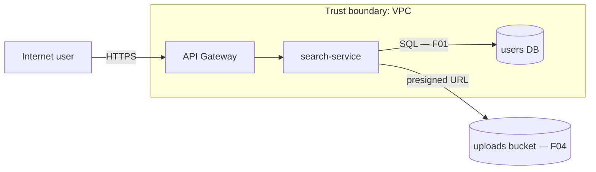

# Output Specification

> *Protocol file — free to load, does not count toward context budget.*

## Directory

Use the output directory confirmed with the user in Step 0 of the Analysis Protocol. Default: `docs/security/` for a private repository, `.memory/local/sar/reports/` for a public one (see [Public repositories](#public-repositories)). Create it if it does not exist. All SAR report files go here. The only other files the skill writes are the findings registry, the `.memory/` ignore entries (see below), and — only after the user approves them — tool outputs under `.memory/local/devsecops/results/<YYYY-MM-DD>/` (the one canonical results location for CLI and container runs) and decisions in `.memory/local/sar/capabilities.json` (see [capabilities.md](capabilities.md)).

## File Naming

By default every report generates **two linked files** (one file when the user asks for a single language):

```text
[YYYY-MM-DD]_[SHORT-TITLE]_EN.md   ← English (en_US)
[YYYY-MM-DD]_[SHORT-TITLE]_ES.md   ← Spanish (es_VE)
```

Dates are ISO 8601 (`YYYY-MM-DD`) so reports sort chronologically. Reports written by 1.x keep their original `DD-MM-YYYY` names; links to them use the name as it exists on disk.

### Title derivation rule — worst finding first

The `[SHORT-TITLE]` **must** reflect the highest-scoring (worst) vulnerability discovered during the assessment. The title is derived from the **#1 finding** (the one with the highest criticality score) using the pattern:

```text
[VULN-TYPE]-[AFFECTED-COMPONENT]
```

| Worst finding | Generated SHORT-TITLE |
|---------------|-----------------------|
| SQL Injection on `/api/users` (score 90) | `SQLI-API-USERS` |
| Public S3 bucket with PII (score 100) | `PUBLIC-S3-PII-EXPOSURE` |
| NoSQL operator injection on login (score 95) | `NOSQL-INJECTION-AUTH-BYPASS` |
| 12 secrets in source control (score 90) | `SECRETS-IN-SOURCE-CONTROL` |
| Critical CVE in express@4.17.1 (score 90) | `CVE-2024-XXXXX-EXPRESS` |
| Mass assignment + IDOR (score 88) | `MASS-ASSIGNMENT-PRIVILEGE-ESCALATION` |
| No findings above 50 (clean assessment) | `CLEAN-ASSESSMENT` |

**Rules**:

- Use SCREAMING-KEBAB-CASE (uppercase, hyphens, no spaces)
- Maximum 50 characters for the SHORT-TITLE
- If the worst finding is a CVE in a dependency, include the CVE ID in the title
- If two findings tie for the highest score, use the higher Confidence (Confirmed > Probable > Possible); if still tied, the lower registry `id`
- The report's `# [Report Title]` heading must also lead with the worst finding: `# [Score] [Vuln Type]: [Component] — Security Assessment Report — [LANG]`

Example with worst-finding title:

```text
docs/security/2026-03-12_SQLI-API-USERS_EN.md
docs/security/2026-03-12_SQLI-API-USERS_ES.md
```

Each file must contain a cross-language link at the top:

```markdown
> 🌐 **Also available in:** [Español (es_VE)](./2026-03-12_SQLI-API-USERS_ES.md)
```

---

## Findings Registry — `.memory/sar/findings.json`

Every SAR generation creates or updates the findings registry at the **project root** (not in the output directory). It holds all findings across assessments — primary findings (score > 50) and warnings (≤ 50).

| Repository | Registry path | Versioned? |
|------------|---------------|------------|
| Private | `.memory/sar/findings.json` | **Yes** — it is the team's shared registry (`status`, `assignee`, `mitigationDate` are edited by the team and committed) |
| Public, or will be public | `.memory/local/sar/findings.json` | **No** — open vulnerabilities must not be published |

- The agent writes files with its normal file-write capability. No scripts, databases, or VCS commands are used.
- Reports (EN/ES Markdown, optional SARIF) stay in the output directory. Each report also carries a **Registry Snapshot** (see below), so the state is readable without opening the JSON.

### Public repositories

Step 0 asks whether the repository is public (or will be). Committing a findings registry or SAR reports to a public repository discloses **unfixed, exploitable vulnerabilities** with their exact location and an attack scenario. Therefore:

- **Public, or unknown in an automated context** (no one can answer) → treat as public: registry at `.memory/local/sar/findings.json`, default output directory `.memory/local/sar/reports/`. Both are ignored by the `.memory/` ignore rule.
- The user may still choose a versioned output directory explicitly; the agent then repeats the disclosure warning once in the closing message and the Appendix.
- **Private** → defaults above (`.memory/sar/findings.json`, `docs/security/`).

If the registry exists at the other path (the repository changed visibility), use the existing file, mention the mismatch in the Appendix, and never move or delete files — the team decides.

### `.memory/` convention — version team state, ignore private state

Shared team state lives in `.memory/<skill>/` (SAR: `.memory/sar/`) and is versioned; agent-private state — tool outputs, caches, recovery files, public-repository registries — lives under `.memory/local/` or uses the `.local.` / `.recovered.json` naming and is never versioned. Before the first write under `.memory/`, ensure `.memory/.gitignore` contains this block (file writes only, never a VCS command; user lines are never removed):

```gitignore
# Managed by carrilloapps/skills — ignores agent-private paths only.
# Shared team state under .memory/<skill>/ stays versioned.
local/
*.local.*
*.recovered.json
```

Mercurial, Fossil, Subversion, and unknown-VCS handling, and the "private path already tracked" warning: ai-rules `frameworks/memory-convention.md` (owner of the rule). SAR additions: record the SVN reminder and any already-tracked private path in the report's Appendix and the closing message.

### Schema

```json
{
  "schemaVersion": 1,
  "findings": [
    {
      "id": "F01",
      "type": "Finding",
      "score": 90,
      "label": "Critical",
      "title": "SQL Injection on public user search",
      "cwe": ["CWE-89"],
      "component": "src/search/search.service.ts",
      "detectionDate": "2026-03-12",
      "mitigationDate": null,
      "status": "Pending",
      "assignee": null,
      "priority": "P0 - Immediate",
      "existingMitigation": "No",
      "lastSeenSar": "2026-03-12_SQLI-API-USERS"
    }
  ]
}
```

### Field definitions

| Field | Owner | Description |
|-------|-------|-------------|
| `id` | Agent (once) | `F01, F02…` for Findings (score > 50), `W01, W02…` for Warnings (≤ 50). Sequential per prefix across the whole file; new entries continue from the highest number used. Permanent — never reassigned. |
| `type` | Agent | `Finding` (> 50) or `Warning` (≤ 50) |
| `score` | Agent | Final score from the SAR (0–100), integer |
| `label` | Agent | `Critical` (≥ 90), `High` (70–89), `Medium` (51–69), `Low` (≤ 50) |
| `title` | Agent | Concise English title — same as the finding heading in the SAR |
| `cwe` | Agent | Array of CWE IDs, **primary CWE first** (e.g., `["CWE-89", "CWE-200"]`). The first element is part of the recurring-match key. |
| `component` | Agent | The file (or IaC resource) containing the **vulnerable call or configuration** — the sink, not the route that reaches it. For systemic findings spanning many files, the shared helper or base class; if there is none, the **first affected file in sorted path order plus a stable `#tag`** naming the pattern (e.g., `skills/a/frameworks/capabilities.md#unpinned-installs`). Path relative to the project root, no line number. Part of the recurring-match key. |
| `detectionDate` | Agent (once) | `YYYY-MM-DD` of the SAR that first detected the finding. Never changed afterwards. |
| `mitigationDate` | **Team** | `null` by default. The agent never sets or changes it. |
| `status` | **Team** (agent sets `Pending` on creation only) | `Pending` · `In Development` · `Processing` · `In QA` · `In Staging` · `Mitigated` |
| `assignee` | **Team** | `null` by default. The agent never sets or changes it. |
| `priority` | Agent | `P0 - Immediate` (≥ 90), `P1 - Urgent` (70–89), `P2 - Planned` (51–69), `P3 - Scheduled` (≤ 50) |
| `existingMitigation` | Agent | Controls that **already exist** (not suggested fixes): `No` = none; a **named control** (`JWT required`, `express-mongo-sanitize`, `Rate limiting on gateway`); or `Partial (…)` listing the controls present when several are expected (e.g., `Partial (JWT only, no RBAC)`). Prefer a named control over `Partial`. |
| `lastSeenSar` | Agent | `[YYYY-MM-DD]_[SHORT-TITLE]` of the most recent SAR in which the finding was still present |

### Update rules

1. **All findings included** — every finding and warning from the SAR.
2. **Sort `findings`**: (1) open entries with score > 50, (2) open entries with score ≤ 50, (3) `Mitigated` entries — score descending within each group; ties by `id` ascending.
3. **New finding** → next free `id`, `status: "Pending"`, `mitigationDate: null`, `assignee: null`, `detectionDate` = today, `lastSeenSar` = this SAR.
4. **Recurring finding** — same **primary CWE** (first element of `cwe`) **and** same `component` as an existing entry. Keep `id`, `detectionDate`, `status`, `assignee`, `mitigationDate`. Update `score`, `label`, `priority`, `type`, `title`, `existingMitigation`, `lastSeenSar`. If unsure whether it is the same finding, create a new entry and note the possible overlap in the Appendix.
5. **Team-managed fields are never written** after creation: `status` (any value other than the initial `Pending`), `assignee`, `mitigationDate`.
6. **Entries are never deleted.** A finding absent from the current assessment keeps its entry unchanged (including `lastSeenSar`). Mitigated entries stay as history.
7. **Score reclassification** — when a recurring score crosses 50, keep the original `id` (e.g., `W03` stays `W03`) and update `type`, `score`, `label`, `priority`. The prefix may no longer match `type`; this preserves traceability.
8. **No extra fields** beyond the schema. Bump `schemaVersion` only through a skill release.

### Validation (after every write)

Re-read the file and confirm: (1) it parses as valid JSON with the schema above, (2) no duplicate `id`, (3) every `status`, `assignee`, and `mitigationDate` from the previous version is unchanged, (4) no entry from the previous version is missing, (5) sort order is correct. If any check fails, fix the file before writing the reports' final version.

If the existing file does not parse, **do not overwrite it**: leave it untouched, write the new registry to `findings.recovered.json` next to it (ignored by the `.memory/` rule), and explain in the Appendix that the team must reconcile the two files.

### One-time migration from `vulnerabilities.csv` (1.x)

If the registry does **not** exist and `vulnerabilities.csv` exists in the output directory:

1. Import every row: `ID → id`, `Type → type`, `Score → score`, `Label → label`, `Title → title`, `Detection Date → detectionDate`, `Mitigation Date → mitigationDate` (empty → `null`), `Status → status`, `Assignee → assignee` (empty → `null`), `Priority → priority`, `Existing Mitigation → existingMitigation`.
2. Fields with no CSV column (`cwe`, `component`, `lastSeenSar`): CSV rows have no CWE/component, so during this first run a row is recurring when its `Title` names the same vulnerability type **and** the same endpoint/component as a current finding. Then fill `cwe`, `component`, and `lastSeenSar` from that finding. Otherwise set `cwe: []`, `component: null`, `lastSeenSar: null`. From the next run on, the normal CWE + `component` match applies.
3. **Leave `vulnerabilities.csv` untouched** — never edit or delete it.
4. Record the migration in the SAR Appendix: rows imported, any rows that could not be parsed (listed verbatim), and the registry path now in use.

If both files exist, use `findings.json` and ignore the CSV. If no registry exists but a previous SAR does (for example, public mode on another machine, where the registry is not versioned), the agent reads the **Registry Snapshot** of the most recent SAR in the output directory and imports it the same way (snapshot rows → entries, keeping `id`, `status`, `assignee`, `mitigationDate`).

### Status lifecycle

```text
Pending → In Development → Processing → In QA → In Staging → Mitigated
```

| Status | Meaning | Set by |
|--------|---------|--------|
| `Pending` | Detected, no remediation started | Agent (on creation) |
| `In Development` | Developer is working on a fix | Team |
| `Processing` | Fix under review (code review, PR) | Team |
| `In QA` | Fix deployed to QA | Team |
| `In Staging` | Fix deployed to staging | Team |
| `Mitigated` | Fix confirmed in production | Team |

---

## Required Document Structure (each file)

Sections marked *(if applicable)* are omitted entirely when empty — never write a section just to say "none". Everything else is mandatory.

```markdown
# [Score] [Vuln Type]: [Component] — Security Assessment Report — [LANG]

> 🌐 Also available in: [link to counterpart]

## Table of Contents
## Executive Summary                 (≤ 5 lines, plain language, verdict first)
## Scope & Methodology
## Out of Scope & Limitations        (mandatory — what was NOT reviewed and why)
## Data Flow & Trust Boundaries      (optional Mermaid diagram)
## Findings                          (ordered 100 → 51, then warnings 50 → 1)
### [SCORE] — [Finding Title]
## Attack Chains                     (if applicable)
## Remediation Roadmap
## Mitigated Findings                (if applicable — from the registry)
## Registry Snapshot                 (mandatory — registry state at assessment time)
## Dependency & Supply Chain Analysis
### Dependency Inventory Summary
### Vulnerable Dependencies (CVE list)
### Integrated Skills/Plugins Evaluation
### CWE Top 25 Coverage Matrix
### OWASP Top 10 Alignment
### CIS Controls v8.1 Alignment
## Security Posture Dashboard
## Compliance Gap Summary
## Appendix
```

---

## Executive Summary (mandatory)

Written for non-technical leadership. **Maximum 5 lines**, no jargon, no CWE IDs, verdict first:

```markdown
## Executive Summary

**Verdict: Not safe to expose publicly.** An anonymous attacker can download the full customer list (50,000+ records with emails and phone numbers) through the search page today.
Fixing it takes about one day of work (F01). Two further issues let any logged-in user change other users' balances (F02) and should be fixed this sprint.
Overall: 2 critical, 1 high, 3 medium findings; 4 warnings. Nothing was found that requires taking the service offline beyond F01.
```

Verdict values: **Not safe to expose publicly** · **Safe with urgent fixes** · **Acceptable with planned fixes** · **No significant findings**.

---

## Per-Finding Block (mandatory fields)

Every primary finding (score > 50) uses this block. Warnings (≤ 50) use the same block but may omit Attack Scenario, CVSS vector (when a gate applies), and Fix diff.

````markdown
### [SCORE] — [Finding Title]

| Field | Value |
|-------|-------|
| Registry ID | F01 (new) / F02 (recurring from YYYY-MM-DD) |
| Score | 90 (Critical) |
| Confidence | Confirmed / Probable (gap: …) / Possible |
| Impact classification | Data exfiltration / Integrity / Dual-vector / Availability-only |
| CVSS v4.0 | `CVSS:4.0/AV:N/AC:L/AT:N/PR:N/UI:N/VC:H/VI:N/VA:N/SC:N/SI:N/SA:N` |
| CWE | CWE-89 |
| MITRE ATT&CK | T1190 |
| Effort | S (< 1 day) / M (1–5 days) / L (> 5 days) |
| Affected | `src/search/search.service.ts:42`, `src/search/search.controller.ts:18` |

**Description** — what is wrong, in two or three sentences.

**Evidence / Trace** — the hop-by-hop trace from entry point to impact, with file:line references.

**Attack Scenario** — numbered, narrative, non-weaponized steps describing what an attacker does and obtains. Use at most a minimal illustrative input (e.g., `q=' OR '1'='1' --`); never a working exploit chain, tool command, or automation script.

**Score Justification**
`Base 80 +5 (full enumeration) +5 (PII) = 90 (cap: none) → Final 90`
One line per factor explaining why it applies.

**Standards Violated** — OWASP, NIST, ISO, PCI-DSS, GDPR… (see compliance-standards.md).

**Fix** — before/after diff (documentation only, not executed by the agent):

```diff
- const rows = await db.query(`SELECT … WHERE full_name LIKE '%${q}%'`);
+ const rows = await db.query('SELECT … WHERE full_name LIKE $1 LIMIT 50', [`%${q}%`]);
```

**How to Verify the Fix** — the test or check the team runs to prove the fix works (e.g., "integration test sends `q=' OR '1'='1' --` and asserts 0 rows and HTTP 200"; "`aws s3api get-public-access-block` shows all four flags true").
````

Rules:

1. **Effort** is the remediation effort for the minimal fix in the diff, not the full hardening list.
2. **Fix diffs** are short (≤ 15 lines), show only the changed lines, and are **syntactically valid** in the target language. A value only obtainable by running a command (an image digest, a generated hash) is written as `<value from: <command>>`. They are report content — the agent never applies them, and never writes or runs scratch files to check them; the How to Verify step proposes the command to the team.
3. **How to Verify** must be observable and repeatable — "review the code" is not a verification.
4. A finding with Confidence **Probable** must name its gap here and in Out of Scope & Limitations.

---

## Scope & Methodology (tools run)

Besides the manual review, list **every tool actually run** — CLI ([capabilities.md](capabilities.md)) or container ([docker-lab.md](docker-lab.md)) — so the evidence is reproducible. Tools suggested but not run go to Out of Scope & Limitations with what they would have covered.

```markdown
## Scope & Methodology

Manual review: 48 endpoints traced (Step 1 count), 6 services, IaC in `infra/`.

| Tool | Version | Route / image digest | Profile | Run date | Result file | Findings ingested |
|------|---------|----------------------|---------|----------|-------------|-------------------|
| Gitleaks | 8.30.1 | docker · `ghcr.io/gitleaks/gitleaks@sha256:c00b6bd0…` | secrets | 2026-10-05 | `results/2026-10-05/gitleaks.json` | 3 candidates → 1 finding (F02), 2 test fixtures |
| njsscan | 1.0.1 | docker · `opensecurity/njsscan@sha256:f071932d…` | nosql | 2026-10-05 | `results/2026-10-05/njsscan.json` | 2 candidates → F01 |
| OSV-Scanner | 2.6.0 | CLI (winget) | — | 2026-10-05 | `.memory/local/devsecops/results/2026-10-05/osv-scanner.json` | 14 CVEs → 3 reachable |
```

Rules: tool versions and digests come from the shared `.memory/devsecops/images.lock` (every lab skill appends its images on the first approved pull; locally built images record their base image digest) or the tool's own `--version` output; scanner severities are never copied as scores; dynamic (DAST) results are marked *dynamic evidence*.

---

## Out of Scope & Limitations (mandatory)

An honest SAR states what it did **not** see. List every area not reviewed and why, plus every trace gap:

```markdown
## Out of Scope & Limitations

| Area | Status | Reason |
|------|--------|--------|
| `services/billing/` (Go) | Not reviewed | Excluded by the user in Step 0 |
| Production IaC (Terraform state) | Not reviewed | Not present in repository |
| Runtime WAF rules | Assumed absent | No config visible — F03 Confidence: Probable |
| Transitive dependencies of `pnpm-lock.yaml` | Reviewed via advisory DB only | No reachability analysis for 14 transitive CVEs |
```

A clean assessment with an empty limitations table is a red flag — almost every assessment has limits.

---

## Data Flow & Trust Boundaries (optional)

When the system has more than one service or trust zone, include a Mermaid diagram marking trust boundaries and where each finding sits:

````markdown

````

---

## Attack Chains (if applicable)

When two or more findings combine into a worse outcome than either alone, document the chain once here and link to each finding:

```markdown
## Attack Chains

### Chain A — Anonymous to admin account takeover
1. [F03 (62) — Username enumeration on /login](#62--username-enumeration-on-login) reveals valid admin emails.
2. [F01 (95) — NoSQL operator injection on /login](#95--nosql-operator-injection-on-login) bypasses the password check for that email.
3. [F05 (58) — Missing re-authentication on /settings/email](#58--missing-re-authentication-on-settingsemail) lets the attacker change the recovery email.

**Combined impact**: persistent admin takeover. **Break the chain at**: F01 (single fix removes the chain).
```

Chains do not change individual scores. They identify the **cheapest link to break**, which goes first in the roadmap.

---

## Remediation Roadmap (mandatory)

Assign each primary finding to a bucket with the bucket rule below, then order **within each bucket** by **Score ÷ Effort weight** (S = 1, M = 2, L = 4), descending; ties by score, then `id`. Chain-breaking fixes go first in their bucket.

```markdown
## Remediation Roadmap

| When | ID | Fix | Score | Effort |
|------|----|-----|-------|--------|
| **This week** | F01 | Parameterize search query + LIMIT | 90 | S |
| **This week** | F02 | Ownership check + field allowlist on PATCH /users/:id | 88 | S |
| **This sprint** | F04 | Block public access, rotate exposed keys | 72 | M |
| **This quarter** | F06 | Migrate secrets to a secrets manager | 58 | L |
```

Bucket rule: Critical (≥ 90) → **This week** regardless of effort; High (70–89) → **This week** if S, else **This sprint**; Medium (51–69) → **This sprint** if S, else **This quarter**. Warnings are not in the roadmap.

---

## Mitigated Findings Section (mandatory when mitigated entries exist)

When the registry contains entries with `status: "Mitigated"`, the SAR includes a **Mitigated Findings** section after the Remediation Roadmap.

```markdown
## Mitigated Findings

> 1 previously reported finding has been mitigated since its initial detection.

### [MITIGATED] — F01 SQL Injection in /api/users endpoint (was: 92 Critical)
- **Detection Date**: 2026-01-15
- **Mitigation Date**: 2026-02-20
- **Original SAR**: [2026-01-15_SQLI-API-USERS_EN.md](./2026-01-15_SQLI-API-USERS_EN.md)
```

Rules:

1. **Source of truth is the findings registry** — mitigation is never inferred from code analysis.
2. Include `id`, `title`, `score`, and `label` from the registry entry.
3. Link to the original SAR if it is still present in the output directory.
4. Order by `mitigationDate` descending (entries with `mitigationDate: null` last, by `id`).
5. Start with the count sentence.
6. No re-analysis — mitigated findings are not re-scored.

---

## Registry Snapshot (mandatory)

Every report carries the registry state at the time of the assessment, so the report alone shows what is open, who owns it, and what was mitigated — even in public mode, where the registry itself is not versioned. List **every** registry entry (open and mitigated), in registry sort order:

```markdown
## Registry Snapshot

> Snapshot of `.memory/sar/findings.json` at 2026-03-12. `status`, `assignee`, and `mitigationDate` are team-managed and copied as-is.

| ID | Title | Score | Status | Assignee | Mitigation Date |
|----|-------|-------|--------|----------|-----------------|
| F01 | SQL Injection on public user search | 90 | Pending | — | — |
| F02 | Mass assignment on PATCH /users/:id | 88 | In QA | j.doe | — |
| W01 | Missing rate limiting on public API | 45 | Pending | — | — |
```

Empty values are written as `—`. The snapshot never changes a registry value.

---

## CWE Top 25 Coverage Matrix — grouping rule

List every Top 25 entry, but rows that cannot apply to the target may be **grouped** into one row with a reason, e.g. `| CWE-79, CWE-352, CWE-434 | N/A — no web UI or upload handler in scope |` or `| CWE-787, CWE-416, CWE-125, CWE-476 | N/A — memory-safe languages only |`. Applicable rows stay individual with their finding IDs or `0 findings`.

---

## Security Posture Dashboard (mandatory — measured metrics only)

The dashboard reports **only what was actually counted**. A metric whose denominator was not enumerated during the assessment is written as `N/A — not measured`. Never estimate, extrapolate, or round up a denominator.

| Metric | Formula | Measured when |
|--------|---------|---------------|
| **Assessment Coverage** | Components/endpoints analyzed ÷ discovered | Always (Step 1 enumerates entry points, or components for targets without a network surface) |
| **Secure Surface** | Endpoints with no finding > 50 ÷ endpoints analyzed | Always |
| **Auth Coverage** | Endpoints with authentication enforced ÷ endpoints analyzed | Each endpoint's auth was traced |
| **Input Validation Coverage** | Endpoints with schema/DTO validation ÷ endpoints accepting input | Each input-accepting endpoint was inspected |
| **Parameterized Query Rate** | Parameterized queries ÷ queries found | All query call sites were enumerated |
| **Secrets Hygiene** | Secrets in a manager ÷ secrets discovered | A secret scan was performed |
| **Dependency Vulnerability Rate** | Dependencies with known CVEs ÷ total dependencies | Lock file was audited |
| **Severity Distribution** | Count per label (Critical / High / Medium / Warning) | Always |

Present as one table plus the severity distribution:

```markdown
## Security Posture Dashboard

| Metric | Value | Rating |
|--------|-------|--------|
| Assessment Coverage | 87% (48/55) | ✅ |
| Secure Surface | 62% (30/48) | ⚠️ |
| Auth Coverage | 91% (44/48) | ✅ |
| Input Validation Coverage | 73% (32/44) | ⚠️ |
| Parameterized Query Rate | N/A — not measured | — |
| Secrets Hygiene | 0% (0/12) | 🟥 |
| Dependency Vulnerability Rate | 4% (9/212) | ✅ |

| Severity | Count |
|----------|-------|
| Critical (90–100) | 2 |
| High (70–89) | 1 |
| Medium (51–69) | 3 |
| Warning (≤ 50) | 4 |
```

Rating: ✅ ≥ 80% · ⚠️ 50–79% · 🟥 < 50% (inverted for rates where lower is better, e.g., Dependency Vulnerability Rate: ✅ ≤ 10% · ⚠️ 11–30% · 🟥 > 30%). Every value shows percentage **and** raw count, e.g., `62% (30/48)`.

---

## Optional SARIF 2.1.0 Export (only when the user asks)

When the user asks for SARIF (e.g., for GitHub Code Scanning), write one additional file to the output directory:

```text
[YYYY-MM-DD]_[SHORT-TITLE].sarif.json
```

It is a **report artifact** — static JSON data, not executable — and contains the same findings as the Markdown report. Minimum mapping:

| SARIF field | Source |
|-------------|--------|
| `runs[0].tool.driver.name` | `sar-cybersecurity` |
| `runs[0].tool.driver.rules[].id` | CWE ID (e.g., `CWE-89`) |
| `results[].ruleId` | CWE ID |
| `results[].level` | `error` (≥ 70) · `warning` (51–69) · `note` (≤ 50) |
| `results[].message.text` | Finding title + registry ID |
| `results[].locations[].physicalLocation` | Affected file + line |
| `results[].properties` | `{ "score": 90, "confidence": "Confirmed", "cvssV4": "CVSS:4.0/…", "registryId": "F01" }` |

The agent writes the file only; it never uploads it or calls any external API.
